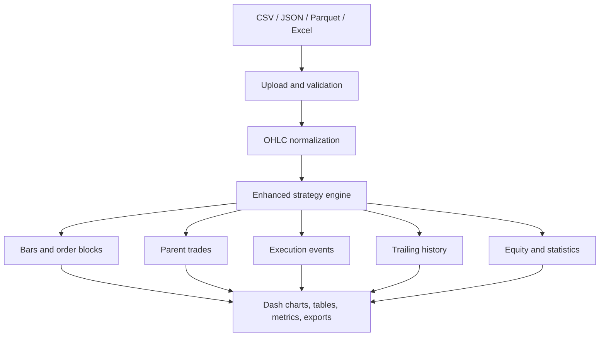

# Shiven Trading Setup

> A local Python backtesting application for a configurable OHLC order-block strategy, with interactive single-file and multi-file Dash dashboards, partial exits, fixed and dynamic trailing stops, execution ledgers, charts, statistics, and data-quality validation.


## Important notice

This repository is research and educational software. It does not connect to a broker, place live orders, provide investment advice, or guarantee future results. Futures and spread trading can create substantial losses. Verify the data, contract specifications, fee assumptions, fills, and every edge case independently before relying on any output.

## Table of contents

- [Project overview](#project-overview)
- [Delivered versions](#delivered-versions)
- [Architecture](#architecture)
- [Repository structure](#repository-structure)
- [Code-by-code explanation](#code-by-code-explanation)
- [Order-block strategy](#order-block-strategy)
- [Trade execution model](#trade-execution-model)
- [Position size and partial booking](#position-size-and-partial-booking)
- [Fixed and dynamic trailing stops](#fixed-and-dynamic-trailing-stops)
- [Fees, slippage, and PnL](#fees-slippage-and-pnl)
- [Data requirements and validation](#data-requirements-and-validation)
- [Single-file dashboard](#single-file-dashboard)
- [Multi-file dashboard](#multi-file-dashboard)
- [Readiness checker](#readiness-checker)
- [Charts and tables](#charts-and-tables)
- [Statistics and output schemas](#statistics-and-output-schemas)
- [Installation](#installation)
- [Running the project](#running-the-project)
- [Testing](#testing)
- [Adding a strategy](#adding-a-strategy)
- [Performance design](#performance-design)
- [Troubleshooting](#troubleshooting)
- [Known limitations](#known-limitations)
- [Suggested future work](#suggested-future-work)

## Project overview

Shiven Trading Setup accepts historical OHLC candle files and detects a two-candle order-block pattern. It enters on the following candle, creates a one-to-one risk/reward target, simulates stops and targets, applies configurable fees and slippage, and produces:

- a parent-trade ledger;
- an event-level execution ledger;
- a trailing-stop history;
- cumulative realized P&L and an equity curve;
- order-block, entry, partial-exit, final-exit, and trailing-stop chart annotations;
- performance and risk statistics;
- file and scenario validation before the run begins; and
- independent or combined multi-file comparisons.

The engine is timeframe-independent. A 5-minute, 15-minute, hourly, or another consistent OHLC series is processed using the interval inferred from its timestamps. Candles are not resampled to a preset timeframe.

## Delivered versions

| Version | Launcher | Port | Main interface | Intended use |
|---|---|---:|---|---|
| V11 fixed | `desktop.py` | 8050 | `GOX25_Z25_multitimeframe_dashboard.py` | Upload and inspect one selected dataset at a time |
| V12 multi-file | `desktop_multifile.py` | 8051 | `GOX25_Z25_multifile_dashboard.py` | Upload many files, apply one scenario, compare or combine results |

Both versions use `enhanced_order_block_engine.py` through `ab.py`. V12 adds `multifile_backend.py` for batch orchestration.

## Architecture



The code is separated into four layers:

1. **Strategy layer** — cleans candles, identifies signals, simulates fills, and calculates results.
2. **Shared service layer** — reads files, validates scenarios, sanitizes lot size, and creates exports.
3. **Batch layer** — validates file compatibility, applies lookback rules, combines files, and aggregates results.
4. **Presentation layer** — Dash layouts, callbacks, charts, tables, colours, readiness status, and launchers.

## Repository structure

```text
shiven-trading-setup/
├── README.md
├── GITHUB_PROJECT_DOCUMENTATION.md
├── USER_GUIDE_V11_V12.md
├── README_dashboard.txt
├── dashboard_requirements.txt
│
├── enhanced_order_block_engine.py
├── dashboard_common.py
├── multifile_backend.py
├── ab.py
├── GOX25_Z25_order_block_backtest.py
│
├── GOX25_Z25_multitimeframe_dashboard.py
├── GOX25_Z25_multifile_dashboard.py
├── desktop.py
├── desktop_multifile.py
│
├── assets/
│   └── dashboard.css
└── tests/
    └── test_backtest_engine.py
```

Market-data files should normally remain local and should not be committed if they are licensed, confidential, or large. A suitable `.gitignore` should exclude datasets, generated reports, virtual environments, caches, and secrets.

## Code-by-code explanation

### `enhanced_order_block_engine.py`

This is the authoritative strategy and simulation engine used by both dashboards.

#### `EngineConfig`

The `EngineConfig` dataclass centralizes contract, execution, partial-booking, trailing, and reporting settings. Defaults include a tick size of `0.25`, a tick value of `$25`, `$2` round-trip fee per lot, one lot, a one-to-three-tick order-block range, and conservative same-candle handling.

#### `Strategy.__init__`

The constructor accepts the same integration contract as the original Trade Tuner sample:

```python
Strategy(parameters, backtest_config, data, data_dict=None)
```

- `parameters` supplies scenario values.
- `backtest_config` is retained for compatibility.
- `data` is the DataFrame being tested.
- `data_dict` is retained for systems that pass several selected files.

It converts raw values into `EngineConfig`, parses partial-target percentages, validates the configuration, and initializes the execution and trailing ledgers.

#### `_validate_config()`

Rejects invalid scenarios before simulation, including:

- non-positive tick size or tick value;
- negative fees or slippage;
- lots below one;
- an invalid order-block range;
- unknown partial or dynamic-trailing modes;
- invalid percentage, ATR, distance, activation, or step values; and
- dynamic minimum distance greater than maximum distance.

#### `_clean()`

Normalizes column names to lowercase, verifies `time/open/high/low/close`, converts timestamps and prices, removes invalid OHLC rows, sorts chronologically, and keeps the last duplicate timestamp.

#### `_infer_bar_delta()`

Finds the most frequently occurring positive timestamp difference. This inferred interval is used to decide whether candles are consecutive. It allows one generic engine to handle 5-minute, 15-minute, hourly, or other data.

#### `_signals()`

Creates:

- `bull_order_block`;
- `bear_order_block`; and
- rolling ATR for ATR-based trailing.

The order-block minimum and maximum are inclusive.

#### `_partial_levels()`

Returns no levels for a single lot or when partial mode is off. Otherwise it creates ordered levels from selected target percentages or consecutive N-tick intervals and limits the list so at least one lot remains for the final exit.

#### `_run_trades()`

Runs the sequential state machine. It manages:

- pending entries;
- one active position at a time;
- initial, partial-adjusted, fixed-trailing, and dynamic-trailing stops;
- same-candle stop/target ambiguity;
- gap exits;
- partial fills;
- final fills;
- event-level fees and P&L;
- source-filename attribution; and
- end-of-data closure.

The nested helpers have distinct responsibilities:

| Helper | Responsibility |
|---|---|
| `add_event` | Adds an auditable entry, partial, trailing-update, or final event |
| `exit_fill` | Applies adverse execution slippage |
| `close_remaining` | Closes the remaining quantity and finalizes the parent trade |
| `book_partials` | Executes eligible partial levels in order, one lot per stage |
| `update_stop` | Moves a stop only in a more protective direction |
| `dynamic_distance_ticks` | Calculates tick, percentage, or ATR trailing distance |

#### `StrategyBuilder()`

This is the public engine method:

```python
bars, trades, equity, stats = strategy.StrategyBuilder()
```

Additional detailed outputs are available on:

```python
strategy.execution_events
strategy.trailing_history
```

#### `_equity_curve()` and `_statistics()`

The equity curve recognizes P&L at final trade exit times. Statistics are calculated from completed parent trades and the event/trailing ledgers.

### `GOX25_Z25_order_block_backtest.py`

This file is retained for backward compatibility and standalone Excel reporting.

- Its older `Strategy` implementation preserves compatibility for code that imports the legacy class directly.
- Its `main()` function now explicitly instantiates the enhanced engine, keeping command-line results aligned with the dashboards.
- `save_excel_report()` produces worksheets and charts for statistics, trades, equity, order blocks, and market data.

This distinction is important: new development should target `enhanced_order_block_engine.py`. The older class should be treated as a compatibility layer, not the primary implementation.

### `ab.py`

This is the compact compatibility entry point:

```python
from enhanced_order_block_engine import Strategy
from GOX25_Z25_order_block_backtest import main
```

Dashboards importing `Strategy` from `ab` receive the enhanced engine. Running `ab.py` directly calls the standalone Excel-report command.

### `dashboard_common.py`

Shared functions used by the dashboards and batch backend:

| Function | Purpose |
|---|---|
| `sanitize_lots` | Accepts positive whole-number lots and returns a safe fallback otherwise |
| `decode_upload` | Decodes Dash base64 upload content |
| `read_market_file` | Reads CSV, JSON, Parquet, XLSX, or XLS |
| `normalized_ohlc` | Standardizes columns and converts price/time fields |
| `infer_interval_minutes` | Detects the modal candle interval |
| `validate_market_data` | Produces readable schema, timestamp, chronology, duplicate, and candle-count checks |
| `validate_scenario` | Validates data selection and all important strategy parameters |
| `scenario_id` | Creates a reproducible short hash for a scenario and its files |
| `dataframe_download_bytes` | Produces CSV, JSON, or Excel export bytes |

### `multifile_backend.py`

This file contains batch logic separately from the V12 Dash presentation.

| Function | Purpose |
|---|---|
| `product_from_data` | Infers a product identifier when available |
| `file_metadata` | Builds date, interval, size, duplicate, missing-candle, and validation metadata |
| `apply_lookback` | Restricts data to all history or the last N calendar months |
| `run_one_file` | Runs a fresh engine instance for one file |
| `compatible_metadata` | Checks product and timeframe compatibility for combination |
| `combine_files` | Concatenates chronologically and applies the chosen duplicate policy |
| `summary_row` | Converts one result into a comparison-table record |
| `aggregate_summary` | Calculates cross-file totals and best/worst file statistics |
| `run_batch` | Coordinates independent or combined execution, progress, errors, and cancellation |

Independent mode resets position, partial, and trailing state for every file. Combined mode can carry state through a chronological combined series only when explicitly enabled.

### `GOX25_Z25_multitimeframe_dashboard.py` — V11

Despite its historical filename, V11 does not combine different timeframes into one strategy calculation. Each uploaded dataset is stored and backtested separately.

Responsibilities include:

- manual upload slots;
- product presets and custom contract values;
- lookback selection;
- lot, partial, fixed trailing, and dynamic trailing controls;
- readiness status and run-button gating;
- data and result caches;
- complete-market candlestick chart;
- order-block rectangles;
- entry, partial, exit, and trailing markers;
- virtualized, scrollable trade table;
- selected-trade detail chart and event ledger; and
- statistics and scenario summaries.

`STRATEGIES` is the strategy registry. It currently contains the enhanced order-block engine and provides the extension point for future engines.

### `GOX25_Z25_multifile_dashboard.py` — V12

V12 is a separate interface for batch work. It provides:

- multiple manual uploads in one action;
- CSV, JSON, Parquet, and Excel support;
- editable inferred product and timeframe fields;
- per-file inclusion selection and row removal;
- independent and combined modes;
- per-file or global-calendar lookback;
- first/last/error duplicate policy;
- optional position carry across combined file boundaries;
- background batch execution;
- progress polling and cancellation between files;
- aggregate cards and per-file comparison rows;
- lazy detail-chart loading only after a file is selected; and
- CSV, JSON, and Excel trade-ledger exports.

The process memory object named `MULTI` holds uploaded DataFrames, metadata, results, status, cancellation state, the worker thread, and the current scenario. This is suitable for a local single-user tool; it is not a multi-user server-side database.

### `desktop.py` and `desktop_multifile.py`

These are minimal launchers:

- `desktop.py` starts V11 on `127.0.0.1:8050`.
- `desktop_multifile.py` starts V12 on `127.0.0.1:8051`.

They keep startup simple and avoid importing dashboard internals from the command line.

### `assets/dashboard.css`

Dash automatically serves files in `assets/`. The stylesheet defines a black-and-white visual system using centralized CSS variables. It covers:

- panels, labels, inputs, buttons, and quantity controls;
- native and Dash dropdown states;
- selected, focused, active, hovered, disabled, and loading states;
- readable table cells and tooltips;
- readiness-state styling; and
- responsive chart/table layout.

The explicit component-state selectors prevent white text from disappearing on white dropdown or input backgrounds.

### `tests/test_backtest_engine.py`

The test suite covers:

1. whole-number lot sanitization and single-lot partial disablement;
2. ordered interval partials and event-to-parent P&L reconciliation;
3. percentage partials and correct remaining-quantity stop closure;
4. monotonic long dynamic trailing;
5. monotonic short dynamic trailing;
6. readiness rejection/acceptance; and
7. independent multi-file state reset and source attribution.

### `dashboard_requirements.txt`

The dependency manifest contains:

```text
dash>=3.0
plotly>=6.0
pandas>=2.2
numpy>=2.0
pyarrow>=18.0
openpyxl>=3.1
pytest>=8.0
```

## Order-block strategy

### Bullish order block

For previous candle `P` and current candle `C`, all conditions must hold:

```text
P.open > P.close
C.open ≈ P.close
minimum_ticks × tick_size <= C.close - P.open <= maximum_ticks × tick_size
P and C are consecutive according to the inferred interval
```

The first condition means the previous candle must be bearish. `≈` uses a very small floating-point tolerance based on tick size.

### Bearish order block

```text
P.open < P.close
C.open ≈ P.close
minimum_ticks × tick_size <= P.open - C.close <= maximum_ticks × tick_size
P and C are consecutive according to the inferred interval
```

The previous candle must be bullish.

### Inclusive minimum and maximum

Both boundaries are included. With minimum `1` and maximum `3`, moves of exactly 1, 2, or 3 ticks qualify. A 0.99-tick or 3.01-tick move does not.

### Signal and entry timing

The order block is known only when the current candle closes. Entry is therefore scheduled for the next candle open, provided that next candle is consecutive. This prevents entering before the signal is observable.

### Initial stop and final target

| Side | Initial stop | Final target |
|---|---|---|
| Long | Previous candle low minus one tick | Entry plus initial risk |
| Short | Previous candle high plus one tick | Entry minus initial risk |

The final target is fixed at 1:1 against the initial stop distance.

## Trade execution model

Only one active position is allowed. New signals are ignored while a position or pending entry already exists.

### Candle evaluation order

For an active trade, each candle is evaluated in this order:

1. opening gap through stop;
2. opening gap through target;
3. intrabar stop and target presence;
4. final exit if either level is hit;
5. partial levels;
6. fixed trailing update;
7. dynamic trailing update.

Trailing changes calculated from a candle protect subsequent evaluation; the engine does not invent an unknown high/low sequence inside that candle.

### Same-candle ambiguity

OHLC data cannot reveal whether the high or low occurred first. If both stop and target are inside the same candle, the default `Conservative_Same_Bar=True` assumes the stop occurred first.

### Gap handling

When a candle opens beyond a stop or target, the raw exit uses that available opening price. Configured slippage is then applied adversely.

### End of data

An open position at the end of the dataset is closed at the final candle close with reason `END_OF_DATA`.

## Position size and partial booking

`Lots` must be a positive whole number. The dashboard uses explicit minus/plus buttons and a sanitizer so browser number-input inconsistencies cannot create fractional quantities.

### Single-lot mode

When `Lots=1`, partial booking is disabled automatically, even if a partial mode was accidentally selected. The only exit is the active stop, final target, or end of data.

### Interval mode

With `Partial_Mode="INTERVAL"`, the engine schedules one-lot exits at consecutive multiples of `Partial_Interval_Ticks`, below the final target.

Example for four lots, a two-tick interval, and a target farther than six ticks:

```text
+2 ticks: exit 1 lot
+4 ticks: exit 1 lot
+6 ticks: exit 1 lot
remaining 1 lot: active stop or final 1:1 target
```

### Percentage mode

With `Partial_Mode="PERCENT"`, each selected percentage is applied to the initial target distance. Dashboard choices are 25%, 33%, 50%, 67%, and 75%.

Each valid stage exits one lot. Duplicate percentages are removed, values are sorted, and levels at or beyond the final target are excluded.

### Stop adjustment after partials

Booked gross ticks are divided across remaining lots:

```text
adjustment_ticks = cumulative_booked_gross_ticks / remaining_lots
```

For a long, this adjustment raises the stop. For a short, it lowers the stop. The engine never moves the stop in a less-protective direction.

### Execution ledger guarantee

Every partial is a separate `PARTIAL_EXIT` event with its own time, price, lot count, fee-inclusive event P&L, remaining lots, stop value, and reason. The sum of all event P&L values for a trade equals its parent `net_pnl`.

## Fixed and dynamic trailing stops

### Fixed trailing

Fixed trailing uses:

- activation/trigger ticks; and
- stop movement per completed trigger step.

The candidate is based on the initial stop plus the number of completed favorable steps. It only replaces the current stop if it is more protective.

### Dynamic trailing

Dynamic trailing supports three distance modes:

| Mode | Distance calculation |
|---|---|
| `TICKS` | Configured dynamic distance in ticks |
| `PERCENT` | Percentage of current close, converted to ticks |
| `ATR` | Rolling ATR × multiplier, converted to ticks |

Available controls include:

- activation ticks;
- initial distance;
- continuing distance;
- minimum and maximum distance bounds;
- favorable-move update step;
- tick, percent, or ATR mode;
- ATR period and multiplier;
- optional profit-based tightening;
- tightening rate;
- every-candle or step-based recalculation; and
- optional activation only after a partial booking.

For a long trade, the dynamic stop can only move upward. For a short trade, it can only move downward. A one-tick market guard keeps a newly calculated stop on the protective side of the current close. Every accepted update appears in both `trailing_history` and the execution-event ledger.

### Fixed and dynamic trailing together

Both may be enabled. Each submits a candidate through the same protective `update_stop` rule. The currently most protective accepted stop remains active.

## Fees, slippage, and PnL

### Contract settings

| Example product | Tick size | Dollar value per tick per lot |
|---|---:|---:|
| GOX | 0.25 | $25.00 |
| Brent / CL | 0.01 | $10.00 |
| RB / HO | 0.0001 | $4.50 |
| Custom | User supplied | User supplied |

Always confirm the actual exchange specification for the instrument or spread.

### Slippage

Slippage is expressed in ticks per execution and is always adverse:

- long entry is increased;
- short entry is decreased;
- long exit is decreased; and
- short exit is increased.

### Event P&L

For an exit event:

```text
direction = +1 for long, -1 for short
gross_ticks = direction × (exit_price - entry_price) / tick_size × exited_lots
gross_pnl = gross_ticks × tick_value
fees = fee_per_round_trip_per_lot × exited_lots
event_pnl = gross_pnl - fees
```

The parent trade fee equals the round-trip fee multiplied by original lots. Entry events and trailing-update events have zero realized P&L; fees are recognized as lots exit.

### Equity and drawdown

The realized equity curve is:

```text
equity = initial_capital + cumulative realized parent-trade P&L
running_peak = cumulative maximum of equity
drawdown = equity - running_peak
```

Drawdown is therefore reported as a non-positive dollar amount. Return percentage is available only when `Initial_Capital` is non-zero.

## Data requirements and validation

### Required columns

| Column | Meaning |
|---|---|
| `time` | Timestamp parseable by pandas |
| `open` | Candle open |
| `high` | Candle high |
| `low` | Candle low |
| `close` | Candle close |

Column matching is case-insensitive after trimming spaces. Extra columns such as product or volume are permitted.

### Supported formats

| Interface | Formats |
|---|---|
| V11 upload slots | Parquet |
| V12 multi-file uploader | Parquet, CSV, JSON, XLSX, XLS |
| Shared reader | Parquet, CSV, JSON, XLSX, XLS |

Parquet requires `pyarrow`. Excel requires `openpyxl`.

### Cleaning rules

- invalid timestamps become missing;
- OHLC fields are converted to numeric values;
- invalid OHLC rows are excluded from simulation;
- rows are sorted chronologically; and
- duplicate timestamps keep the last value.

### Validation information

The application reports or checks:

- readable file;
- OHLC schema;
- invalid timestamps;
- chronological order;
- duplicate timestamps;
- source and valid row count;
- first and last valid timestamp;
- inferred interval;
- missing-candle estimate; and
- product/timeframe compatibility for combination.

The app never manufactures OHLC candles to fill missing periods. Charts use the valid sequential observations, eliminating closed-market time from the visible sequence, while day-open separators identify session changes.

## Single-file dashboard

### Workflow

1. Start `desktop.py`.
2. Upload a dataset into the appropriate slot.
3. select the file shown in the dashboard;
4. select all history or the final 1–10 calendar months;
5. select a product preset or enter tick values manually;
6. enter inclusive order-block minimum and maximum ticks;
7. choose whole-number lots;
8. configure partial and trailing behaviour;
9. review readiness;
10. press **Run Backtest**; and
11. inspect statistics, chart, trade table, and selected-trade details.

### Lookback

The cutoff is measured from the final valid timestamp:

```text
cutoff = final_valid_time - DateOffset(months=N)
```

This avoids dependence on the computer's current date.

## Multi-file dashboard

### Independent mode

Each included file receives a new engine instance. State never leaks between files. Files with different products or timeframes may be compared independently, subject to correct scenario values.

### Combined chronological mode

Files must have the same confirmed product and timeframe. The upload metadata grid allows these inferred fields to be corrected manually.

Duplicate policies:

- `LAST`: keep the last row at an overlapping timestamp;
- `FIRST`: keep the first row; or
- `ERROR`: block the run if overlap exists.

If cross-boundary carrying is enabled, the combined series is processed by one engine and positions may continue across source-file boundaries. If disabled, files remain isolated even when using the combined workflow.

### Lookback rules

- **Per file:** each file's N months are measured from that file's end.
- **Global calendar:** all included files use a cutoff based on the latest end timestamp across the batch.

### Background execution and cancellation

V12 runs the batch in a daemon worker thread so the UI can poll status approximately every 800 ms. Cancellation is cooperative and checked between files. It does not interrupt an individual engine in the middle of a file.

### Failure isolation

In independent mode, one file failure creates a failed summary row while other files continue. The summary records the filename, execution status, and error message.

## Readiness checker

The Run button remains disabled while blocking checks exist. Readiness states include:

| State | Meaning |
|---|---|
| Not Ready | Missing file, invalid data, or invalid parameter |
| Warning | Runnable, but a non-blocking issue needs attention |
| Ready | All blocking checks pass |
| Running | A run is active |
| Completed | The latest run completed |
| Failed | The latest run raised an error |

Core checks cover file selection, OHLC schema, timestamp validity, candle count, strategy selection, whole-number lots, tick size/value, fees, slippage, order-block range, partial configuration, dynamic distances, and date range.

## Charts and tables

### Main candlestick chart

The chart can display:

- the complete valid candle sequence;
- bullish and bearish order-block regions;
- long-entry upward triangles;
- short-entry downward triangles;
- partial-exit diamonds;
- final-exit crosses/stars;
- trailing-stop paths and updates; and
- daily market-open vertical separators.

Closed-market timestamp gaps are removed visually so the candle sequence remains continuous.

### Trade ledger

The table is virtualized and vertically scrollable to reduce browser load. Trade P&L is the third data column after trade ID and lots. Entire rows are coloured by P&L:

- green for profit;
- red for loss; and
- neutral grey for breakeven.

Cumulative P&L is included.

### Selected-trade detail

Clicking a trade row or chart marker loads the trade separately, including entry, partial fills, final exit, trailing path, prices, timestamps, reasons, remaining lots, and event P&L.

### Multi-file lazy details

V12 initially renders only the summary. The detailed chart and ledgers are generated after selecting a completed file row, reducing initial load and lag.

## Statistics and output schemas

### Statistics

The engine returns one statistics row containing:

- data start/end and valid bars;
- bullish/bearish order blocks;
- total, winning, losing, and breakeven trades;
- winning long and winning short trades;
- win rate;
- stop-loss and take-profit hits;
- gross profit, gross loss, gross P&L, fees, and net P&L;
- return percentage when initial capital is supplied;
- profit factor and average trade;
- maximum trade profit/loss;
- maximum winning/losing streak;
- maximum drawdown;
- daily realized-P&L Sharpe ratio;
- partial-booking count;
- trailing updates and trailing-stop executions;
- contract and scenario settings;
- overnight exclusion count; and
- inferred candle interval.

### Parent-trade ledger

Important fields include:

```text
trade_id, source_filename, side, signal_time,
entry_time, entry_price, initial_stop_price, target_price,
exit_time, exit_price, exit_reason, lots,
remaining_lots_at_exit, stop_ticks, take_profit_ticks,
final_stop_price, partial_bookings_count, partial_exit_details,
trailing_stop_updates, gross_ticks, gross_pnl, fees,
net_pnl, cumulative_pnl, bars_held
```

### Execution-event ledger

```text
event_id, parent_trade_id, source_filename, event_time,
event_type, direction, lots, execution_price, event_pnl,
cumulative_trade_pnl, remaining_lots, stop_value, trigger_reason
```

Event types are `ENTRY`, `PARTIAL_EXIT`, `TRAILING_UPDATE`, and `FINAL_EXIT`.

### Trailing history

```text
parent_trade_id, source_filename, time,
old_stop, new_stop, trailing_type, remaining_lots
```

### Equity curve

```text
time, realized_pnl, equity, running_peak, drawdown
```

### Exit reasons

| Pattern | Meaning |
|---|---|
| `TP` | Final 1:1 target reached |
| `SL` | Active non-trailing stop reached |
| `*_GAP` | Candle opened through the relevant level |
| `*_SAME_BAR` | Stop and target were both inside one candle |
| `FIXED_TRAILING_SL*` | Fixed trailing stop caused the exit |
| `DYNAMIC_TRAILING_SL*` | Dynamic trailing stop caused the exit |
| `END_OF_DATA` | Open position was closed at the final close |

## Installation

### Prerequisites

- Python 3.10 or newer;
- VS Code or another editor;
- a modern web browser; and
- local OHLC data.

### Windows / VS Code

Open the repository folder in VS Code, then open **Terminal → New Terminal**:

```powershell
cd C:\Users\shiven.goyal\Desktop\go
& "C:\Program Files\Python314\python.exe" -m pip install -r dashboard_requirements.txt
```

If that Python path is different:

```powershell
where.exe python
```

Use the returned executable consistently for installation and execution. This prevents `ModuleNotFoundError` caused by installing packages into a different interpreter.

### Virtual environment option

```powershell
cd C:\Users\shiven.goyal\Desktop\go
py -m venv .venv
.\.venv\Scripts\Activate.ps1
python -m pip install --upgrade pip
python -m pip install -r dashboard_requirements.txt
```

### macOS / Linux

```bash
python3 -m venv .venv
source .venv/bin/activate
python -m pip install --upgrade pip
python -m pip install -r dashboard_requirements.txt
```

## Running the project

### V11 single-file dashboard

```powershell
& "C:\Program Files\Python314\python.exe" desktop.py
```

Open [http://127.0.0.1:8050](http://127.0.0.1:8050).

### V12 multi-file dashboard

```powershell
& "C:\Program Files\Python314\python.exe" desktop_multifile.py
```

Open [http://127.0.0.1:8051](http://127.0.0.1:8051).

### Standalone Excel backtest

```powershell
& "C:\Program Files\Python314\python.exe" ab.py --input "GOX25-Z25_5 min.parquet" --output-dir "GOX25_Z25_backtest_results" --tick-value 25
```

Stop a running dashboard with `Ctrl+C` in its terminal.

## Testing

Run from the repository root:

```powershell
& "C:\Program Files\Python314\python.exe" -m pytest -q
```

Expected result for the delivered suite:

```text
7 passed
```

Useful additional verification before release:

```powershell
& "C:\Program Files\Python314\python.exe" -m py_compile enhanced_order_block_engine.py dashboard_common.py multifile_backend.py GOX25_Z25_multitimeframe_dashboard.py GOX25_Z25_multifile_dashboard.py ab.py desktop.py desktop_multifile.py
```

## Adding a strategy

The V11 selector is driven by a strategy registry. A new engine should follow this interface:

```python
class MyStrategy:
    def __init__(self, parameters, backtest_config, data, data_dict=None):
        ...

    def StrategyBuilder(self):
        # Return compatible DataFrames.
        return bars, trades, equity, stats
```

Register it in the dashboard:

```python
STRATEGIES["MY_STRATEGY"] = {
    "label": "My Strategy",
    "engine": MyStrategy,
}
```

If its bars, trades, or statistics use different column names, either adapt the engine to the common contract or add strategy-specific chart/table adapters. Add focused fixtures for signals, fills, gaps, partials, and trailing before exposing it in the dashboard.

## Performance design

The project reduces lag through:

- normalized data stored once per upload;
- backtest results cached by selected dataset;
- Plotly figure reuse where practical;
- candle-window controls;
- continuous-index charting instead of rendering closed-market gaps;
- virtualized trade tables;
- fixed-height vertical scrolling;
- lazy per-file detail rendering in V12;
- background batch processing; and
- summary-first rendering rather than drawing every file at once.

Large candlestick charts still have a browser-side cost. For millions of rows, server-side downsampling or WebGL-specific visualization would be a separate architectural step.

## Troubleshooting

### `ModuleNotFoundError: No module named 'numpy'` or another package

Install with the exact Python executable used to launch the dashboard:

```powershell
& "C:\Program Files\Python314\python.exe" -m pip install -r dashboard_requirements.txt
```

### `Could not open requirements file`

The terminal is not in the repository directory:

```powershell
cd C:\Users\shiven.goyal\Desktop\go
Get-ChildItem dashboard_requirements.txt
```

### `No module named 'GOX25_Z25_order_block_backtest'`

Keep all project `.py` files in the same repository folder. Do not copy only `desktop.py` to another directory.

### Parquet magic bytes/footer error

The file is incomplete, corrupted, mislabeled, or not a real Parquet file. A valid Parquet file normally begins and ends with `PAR1`. Re-export or re-download it; changing the extension does not repair it.

### Dashboard values are invisible

Confirm `assets/dashboard.css` exists under the repository root and perform a hard refresh with `Ctrl+F5`.

### Port already in use

Stop the old terminal with `Ctrl+C`, or change the launcher port and use the matching browser URL.

### Zero trades

Zero can be correct. Verify:

- enough valid candles exist in the selected lookback;
- tick size matches the instrument;
- the minimum/maximum tick range is appropriate;
- the previous-candle direction is correct;
- current open matches previous close within tolerance;
- current close crosses the previous open by the selected inclusive range;
- candles are consecutive according to the inferred interval; and
- a consecutive next candle exists for entry.

### Sparse or incorrect-looking chart

Inspect source rows, valid rows, blank OHLC values, duplicates, one-price bars, timestamp timezone, and interval inference. The chart deliberately does not manufacture prices during market closures.

### Multi-file combined run is blocked

Confirm or edit product and timeframe values in the upload table. Combined mode requires compatible selected files. Independent mode does not require them to match.

## Known limitations

- OHLC bars do not reveal the exact intrabar price path.
- The default same-bar rule is conservative, but it remains an assumption.
- Slippage is a fixed number of ticks, not an order-book or liquidity model.
- Fees are fixed round-trip dollars per exited lot.
- Only one position is active at a time.
- Overnight exclusion removes completed overnight trades from reported results; it does not implement exchange-session forced liquidation.
- Sharpe uses daily realized P&L, not continuous mark-to-market returns.
- Uploaded data and results live in process memory and disappear when the server stops.
- V12 background state is global to the process and is designed for one local user.
- Cancellation occurs between files, not within one file.
- The Dash development server is for local use, not direct public deployment.
- The current registry exposes the order-block strategy only.
- No broker/API/live-order functionality is included.

## Suggested future work

- persist scenarios and result metadata to SQLite;
- add configurable exchange session calendars and forced intraday liquidation;
- add bid/ask, variable slippage, and liquidity constraints;
- add portfolio-level capital and margin accounting;
- add walk-forward, out-of-sample, and parameter-sweep modules;
- add session/time-of-day filters;
- add reusable strategy-builder components for EMA, RSI, Bollinger, and custom candle patterns;
- add authentication before any remote deployment;
- add CI for linting and pytest; and
- add synthetic fixtures for every exit-reason branch.

## GitHub publishing checklist

Before publishing:

1. add a license appropriate to the intended use;
2. add `.gitignore` entries for `.venv/`, `__pycache__/`, `.pytest_cache/`, datasets, generated reports, and secrets;
3. do not commit API keys or licensed market data;
4. run `pytest` and `py_compile`;
5. capture dashboard screenshots using non-confidential sample data;
6. tag releases separately for V11 and V12; and
7. document any strategy or accounting change in release notes.

## Disclaimer

Backtests are sensitive to data integrity, contract rollover, timestamp conventions, missing bars, fees, tick definitions, execution assumptions, and parameter selection. Results should be reproduced independently and checked trade by trade. This software is provided without warranty and should not be treated as financial advice.
