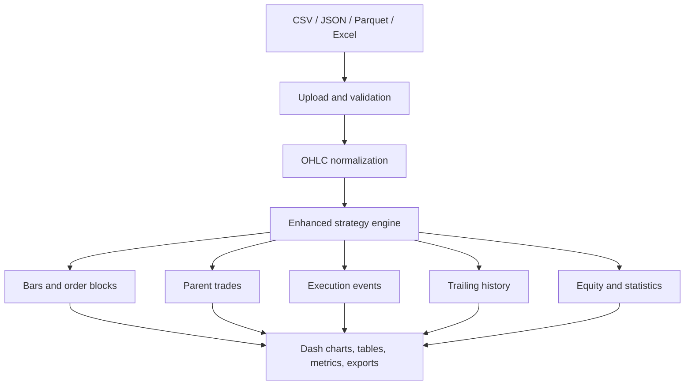

# Shiven Trading Setup

> A local Python backtesting application for a configurable OHLC order-block strategy, with interactive single-file and multi-file Dash dashboards, partial exits, fixed and dynamic trailing stops, execution ledgers, charts, statistics, and data-quality validation.


## Important notice

This repository is research and educational software. It does not connect to a broker, place live orders, provide investment advice, or guarantee future results. Futures and spread trading can create substantial losses. Verify the data, contract specifications, fee assumptions, fills, and every edge case independently before relying on any output.

## Table of contents

- [Project overview](#project-overview)
- [Delivered versions](#delivered-versions)
- [Architecture](#architecture)
- [Repository structure](#repository-structure)
- [Code-by-code explanation](#code-by-code-explanation)
- [Order-block strategy](#order-block-strategy)
- [Trade execution model](#trade-execution-model)
- [Position size and partial booking](#position-size-and-partial-booking)
- [Fixed and dynamic trailing stops](#fixed-and-dynamic-trailing-stops)
- [Fees, slippage, and PnL](#fees-slippage-and-pnl)
- [Data requirements and validation](#data-requirements-and-validation)
- [Single-file dashboard](#single-file-dashboard)
- [Multi-file dashboard](#multi-file-dashboard)
- [Readiness checker](#readiness-checker)
- [Charts and tables](#charts-and-tables)
- [Statistics and output schemas](#statistics-and-output-schemas)
- [Installation](#installation)
- [Running the project](#running-the-project)
- [Testing](#testing)
- [Adding a strategy](#adding-a-strategy)
- [Performance design](#performance-design)
- [Troubleshooting](#troubleshooting)
- [Known limitations](#known-limitations)
- [Suggested future work](#suggested-future-work)

## Project overview

Shiven Trading Setup accepts historical OHLC candle files and detects a two-candle order-block pattern. It enters on the following candle, creates a one-to-one risk/reward target, simulates stops and targets, applies configurable fees and slippage, and produces:

- a parent-trade ledger;
- an event-level execution ledger;
- a trailing-stop history;
- cumulative realized P&L and an equity curve;
- order-block, entry, partial-exit, final-exit, and trailing-stop chart annotations;
- performance and risk statistics;
- file and scenario validation before the run begins; and
- independent or combined multi-file comparisons.

The engine is timeframe-independent. A 5-minute, 15-minute, hourly, or another consistent OHLC series is processed using the interval inferred from its timestamps. Candles are not resampled to a preset timeframe.

## Delivered versions

| Version | Launcher | Port | Main interface | Intended use |
|---|---|---:|---|---|
| V11 fixed | `desktop.py` | 8050 | `GOX25_Z25_multitimeframe_dashboard.py` | Upload and inspect one selected dataset at a time |
| V12 multi-file | `desktop_multifile.py` | 8051 | `GOX25_Z25_multifile_dashboard.py` | Upload many files, apply one scenario, compare or combine results |

Both versions use `enhanced_order_block_engine.py` through `ab.py`. V12 adds `multifile_backend.py` for batch orchestration.

## Architecture



The code is separated into four layers:

1. **Strategy layer** — cleans candles, identifies signals, simulates fills, and calculates results.
2. **Shared service layer** — reads files, validates scenarios, sanitizes lot size, and creates exports.
3. **Batch layer** — validates file compatibility, applies lookback rules, combines files, and aggregates results.
4. **Presentation layer** — Dash layouts, callbacks, charts, tables, colours, readiness status, and launchers.

## Repository structure

```text
shiven-trading-setup/
├── README.md
├── GITHUB_PROJECT_DOCUMENTATION.md
├── USER_GUIDE_V11_V12.md
├── README_dashboard.txt
├── dashboard_requirements.txt
│
├── enhanced_order_block_engine.py
├── dashboard_common.py
├── multifile_backend.py
├── ab.py
├── GOX25_Z25_order_block_backtest.py
│
├── GOX25_Z25_multitimeframe_dashboard.py
├── GOX25_Z25_multifile_dashboard.py
├── desktop.py
├── desktop_multifile.py
│
├── assets/
│   └── dashboard.css
└── tests/
    └── test_backtest_engine.py
```

Market-data files should normally remain local and should not be committed if they are licensed, confidential, or large. A suitable `.gitignore` should exclude datasets, generated reports, virtual environments, caches, and secrets.

## Code-by-code explanation

### `enhanced_order_block_engine.py`

This is the authoritative strategy and simulation engine used by both dashboards.

#### `EngineConfig`

The `EngineConfig` dataclass centralizes contract, execution, partial-booking, trailing, and reporting settings. Defaults include a tick size of `0.25`, a tick value of `$25`, `$2` round-trip fee per lot, one lot, a one-to-three-tick order-block range, and conservative same-candle handling.

#### `Strategy.__init__`

The constructor accepts the same integration contract as the original Trade Tuner sample:

```python
Strategy(parameters, backtest_config, data, data_dict=None)
```

- `parameters` supplies scenario values.
- `backtest_config` is retained for compatibility.
- `data` is the DataFrame being tested.
- `data_dict` is retained for systems that pass several selected files.

It converts raw values into `EngineConfig`, parses partial-target percentages, validates the configuration, and initializes the execution and trailing ledgers.

#### `_validate_config()`

Rejects invalid scenarios before simulation, including:

- non-positive tick size or tick value;
- negative fees or slippage;
- lots below one;
- an invalid order-block range;
- unknown partial or dynamic-trailing modes;
- invalid percentage, ATR, distance, activation, or step values; and
- dynamic minimum distance greater than maximum distance.

#### `_clean()`

Normalizes column names to lowercase, verifies `time/open/high/low/close`, converts timestamps and prices, removes invalid OHLC rows, sorts chronologically, and keeps the last duplicate timestamp.

#### `_infer_bar_delta()`

Finds the most frequently occurring positive timestamp difference. This inferred interval is used to decide whether candles are consecutive. It allows one generic engine to handle 5-minute, 15-minute, hourly, or other data.

#### `_signals()`

Creates:

- `bull_order_block`;
- `bear_order_block`; and
- rolling ATR for ATR-based trailing.

The order-block minimum and maximum are inclusive.

#### `_partial_levels()`

Returns no levels for a single lot or when partial mode is off. Otherwise it creates ordered levels from selected target percentages or consecutive N-tick intervals and limits the list so at least one lot remains for the final exit.

#### `_run_trades()`

Runs the sequential state machine. It manages:

- pending entries;
- one active position at a time;
- initial, partial-adjusted, fixed-trailing, and dynamic-trailing stops;
- same-candle stop/target ambiguity;
- gap exits;
- partial fills;
- final fills;
- event-level fees and P&L;
- source-filename attribution; and
- end-of-data closure.

The nested helpers have distinct responsibilities:

| Helper | Responsibility |
|---|---|
| `add_event` | Adds an auditable entry, partial, trailing-update, or final event |
| `exit_fill` | Applies adverse execution slippage |
| `close_remaining` | Closes the remaining quantity and finalizes the parent trade |
| `book_partials` | Executes eligible partial levels in order, one lot per stage |
| `update_stop` | Moves a stop only in a more protective direction |
| `dynamic_distance_ticks` | Calculates tick, percentage, or ATR trailing distance |

#### `StrategyBuilder()`

This is the public engine method:

```python
bars, trades, equity, stats = strategy.StrategyBuilder()
```

Additional detailed outputs are available on:

```python
strategy.execution_events
strategy.trailing_history
```

#### `_equity_curve()` and `_statistics()`

The equity curve recognizes P&L at final trade exit times. Statistics are calculated from completed parent trades and the event/trailing ledgers.

### `GOX25_Z25_order_block_backtest.py`

This file is retained for backward compatibility and standalone Excel reporting.

- Its older `Strategy` implementation preserves compatibility for code that imports the legacy class directly.
- Its `main()` function now explicitly instantiates the enhanced engine, keeping command-line results aligned with the dashboards.
- `save_excel_report()` produces worksheets and charts for statistics, trades, equity, order blocks, and market data.

This distinction is important: new development should target `enhanced_order_block_engine.py`. The older class should be treated as a compatibility layer, not the primary implementation.

### `ab.py`

This is the compact compatibility entry point:

```python
from enhanced_order_block_engine import Strategy
from GOX25_Z25_order_block_backtest import main
```

Dashboards importing `Strategy` from `ab` receive the enhanced engine. Running `ab.py` directly calls the standalone Excel-report command.

### `dashboard_common.py`

Shared functions used by the dashboards and batch backend:

| Function | Purpose |
|---|---|
| `sanitize_lots` | Accepts positive whole-number lots and returns a safe fallback otherwise |
| `decode_upload` | Decodes Dash base64 upload content |
| `read_market_file` | Reads CSV, JSON, Parquet, XLSX, or XLS |
| `normalized_ohlc` | Standardizes columns and converts price/time fields |
| `infer_interval_minutes` | Detects the modal candle interval |
| `validate_market_data` | Produces readable schema, timestamp, chronology, duplicate, and candle-count checks |
| `validate_scenario` | Validates data selection and all important strategy parameters |
| `scenario_id` | Creates a reproducible short hash for a scenario and its files |
| `dataframe_download_bytes` | Produces CSV, JSON, or Excel export bytes |

### `multifile_backend.py`

This file contains batch logic separately from the V12 Dash presentation.

| Function | Purpose |
|---|---|
| `product_from_data` | Infers a product identifier when available |
| `file_metadata` | Builds date, interval, size, duplicate, missing-candle, and validation metadata |
| `apply_lookback` | Restricts data to all history or the last N calendar months |
| `run_one_file` | Runs a fresh engine instance for one file |
| `compatible_metadata` | Checks product and timeframe compatibility for combination |
| `combine_files` | Concatenates chronologically and applies the chosen duplicate policy |
| `summary_row` | Converts one result into a comparison-table record |
| `aggregate_summary` | Calculates cross-file totals and best/worst file statistics |
| `run_batch` | Coordinates independent or combined execution, progress, errors, and cancellation |

Independent mode resets position, partial, and trailing state for every file. Combined mode can carry state through a chronological combined series only when explicitly enabled.

### `GOX25_Z25_multitimeframe_dashboard.py` — V11

Despite its historical filename, V11 does not combine different timeframes into one strategy calculation. Each uploaded dataset is stored and backtested separately.

Responsibilities include:

- manual upload slots;
- product presets and custom contract values;
- lookback selection;
- lot, partial, fixed trailing, and dynamic trailing controls;
- readiness status and run-button gating;
- data and result caches;
- complete-market candlestick chart;
- order-block rectangles;
- entry, partial, exit, and trailing markers;
- virtualized, scrollable trade table;
- selected-trade detail chart and event ledger; and
- statistics and scenario summaries.

`STRATEGIES` is the strategy registry. It currently contains the enhanced order-block engine and provides the extension point for future engines.

### `GOX25_Z25_multifile_dashboard.py` — V12

V12 is a separate interface for batch work. It provides:

- multiple manual uploads in one action;
- CSV, JSON, Parquet, and Excel support;
- editable inferred product and timeframe fields;
- per-file inclusion selection and row removal;
- independent and combined modes;
- per-file or global-calendar lookback;
- first/last/error duplicate policy;
- optional position carry across combined file boundaries;
- background batch execution;
- progress polling and cancellation between files;
- aggregate cards and per-file comparison rows;
- lazy detail-chart loading only after a file is selected; and
- CSV, JSON, and Excel trade-ledger exports.

The process memory object named `MULTI` holds uploaded DataFrames, metadata, results, status, cancellation state, the worker thread, and the current scenario. This is suitable for a local single-user tool; it is not a multi-user server-side database.

### `desktop.py` and `desktop_multifile.py`

These are minimal launchers:

- `desktop.py` starts V11 on `127.0.0.1:8050`.
- `desktop_multifile.py` starts V12 on `127.0.0.1:8051`.

They keep startup simple and avoid importing dashboard internals from the command line.

### `assets/dashboard.css`

Dash automatically serves files in `assets/`. The stylesheet defines a black-and-white visual system using centralized CSS variables. It covers:

- panels, labels, inputs, buttons, and quantity controls;
- native and Dash dropdown states;
- selected, focused, active, hovered, disabled, and loading states;
- readable table cells and tooltips;
- readiness-state styling; and
- responsive chart/table layout.

The explicit component-state selectors prevent white text from disappearing on white dropdown or input backgrounds.

### `tests/test_backtest_engine.py`

The test suite covers:

1. whole-number lot sanitization and single-lot partial disablement;
2. ordered interval partials and event-to-parent P&L reconciliation;
3. percentage partials and correct remaining-quantity stop closure;
4. monotonic long dynamic trailing;
5. monotonic short dynamic trailing;
6. readiness rejection/acceptance; and
7. independent multi-file state reset and source attribution.

### `dashboard_requirements.txt`

The dependency manifest contains:

```text
dash>=3.0
plotly>=6.0
pandas>=2.2
numpy>=2.0
pyarrow>=18.0
openpyxl>=3.1
pytest>=8.0
```

## Order-block strategy

### Bullish order block

For previous candle `P` and current candle `C`, all conditions must hold:

```text
P.open > P.close
C.open ≈ P.close
minimum_ticks × tick_size <= C.close - P.open <= maximum_ticks × tick_size
P and C are consecutive according to the inferred interval
```

The first condition means the previous candle must be bearish. `≈` uses a very small floating-point tolerance based on tick size.

### Bearish order block

```text
P.open < P.close
C.open ≈ P.close
minimum_ticks × tick_size <= P.open - C.close <= maximum_ticks × tick_size
P and C are consecutive according to the inferred interval
```

The previous candle must be bullish.

### Inclusive minimum and maximum

Both boundaries are included. With minimum `1` and maximum `3`, moves of exactly 1, 2, or 3 ticks qualify. A 0.99-tick or 3.01-tick move does not.

### Signal and entry timing

The order block is known only when the current candle closes. Entry is therefore scheduled for the next candle open, provided that next candle is consecutive. This prevents entering before the signal is observable.

### Initial stop and final target

| Side | Initial stop | Final target |
|---|---|---|
| Long | Previous candle low minus one tick | Entry plus initial risk |
| Short | Previous candle high plus one tick | Entry minus initial risk |

The final target is fixed at 1:1 against the initial stop distance.

## Trade execution model

Only one active position is allowed. New signals are ignored while a position or pending entry already exists.

### Candle evaluation order

For an active trade, each candle is evaluated in this order:

1. opening gap through stop;
2. opening gap through target;
3. intrabar stop and target presence;
4. final exit if either level is hit;
5. partial levels;
6. fixed trailing update;
7. dynamic trailing update.

Trailing changes calculated from a candle protect subsequent evaluation; the engine does not invent an unknown high/low sequence inside that candle.

### Same-candle ambiguity

OHLC data cannot reveal whether the high or low occurred first. If both stop and target are inside the same candle, the default `Conservative_Same_Bar=True` assumes the stop occurred first.

### Gap handling

When a candle opens beyond a stop or target, the raw exit uses that available opening price. Configured slippage is then applied adversely.

### End of data

An open position at the end of the dataset is closed at the final candle close with reason `END_OF_DATA`.

## Position size and partial booking

`Lots` must be a positive whole number. The dashboard uses explicit minus/plus buttons and a sanitizer so browser number-input inconsistencies cannot create fractional quantities.

### Single-lot mode

When `Lots=1`, partial booking is disabled automatically, even if a partial mode was accidentally selected. The only exit is the active stop, final target, or end of data.

### Interval mode

With `Partial_Mode="INTERVAL"`, the engine schedules one-lot exits at consecutive multiples of `Partial_Interval_Ticks`, below the final target.

Example for four lots, a two-tick interval, and a target farther than six ticks:

```text
+2 ticks: exit 1 lot
+4 ticks: exit 1 lot
+6 ticks: exit 1 lot
remaining 1 lot: active stop or final 1:1 target
```

### Percentage mode

With `Partial_Mode="PERCENT"`, each selected percentage is applied to the initial target distance. Dashboard choices are 25%, 33%, 50%, 67%, and 75%.

Each valid stage exits one lot. Duplicate percentages are removed, values are sorted, and levels at or beyond the final target are excluded.

### Stop adjustment after partials

Booked gross ticks are divided across remaining lots:

```text
adjustment_ticks = cumulative_booked_gross_ticks / remaining_lots
```

For a long, this adjustment raises the stop. For a short, it lowers the stop. The engine never moves the stop in a less-protective direction.

### Execution ledger guarantee

Every partial is a separate `PARTIAL_EXIT` event with its own time, price, lot count, fee-inclusive event P&L, remaining lots, stop value, and reason. The sum of all event P&L values for a trade equals its parent `net_pnl`.

## Fixed and dynamic trailing stops

### Fixed trailing

Fixed trailing uses:

- activation/trigger ticks; and
- stop movement per completed trigger step.

The candidate is based on the initial stop plus the number of completed favorable steps. It only replaces the current stop if it is more protective.

### Dynamic trailing

Dynamic trailing supports three distance modes:

| Mode | Distance calculation |
|---|---|
| `TICKS` | Configured dynamic distance in ticks |
| `PERCENT` | Percentage of current close, converted to ticks |
| `ATR` | Rolling ATR × multiplier, converted to ticks |

Available controls include:

- activation ticks;
- initial distance;
- continuing distance;
- minimum and maximum distance bounds;
- favorable-move update step;
- tick, percent, or ATR mode;
- ATR period and multiplier;
- optional profit-based tightening;
- tightening rate;
- every-candle or step-based recalculation; and
- optional activation only after a partial booking.

For a long trade, the dynamic stop can only move upward. For a short trade, it can only move downward. A one-tick market guard keeps a newly calculated stop on the protective side of the current close. Every accepted update appears in both `trailing_history` and the execution-event ledger.

### Fixed and dynamic trailing together

Both may be enabled. Each submits a candidate through the same protective `update_stop` rule. The currently most protective accepted stop remains active.

## Fees, slippage, and PnL

### Contract settings

| Example product | Tick size | Dollar value per tick per lot |
|---|---:|---:|
| GOX | 0.25 | $25.00 |
| Brent / CL | 0.01 | $10.00 |
| RB / HO | 0.0001 | $4.50 |
| Custom | User supplied | User supplied |

Always confirm the actual exchange specification for the instrument or spread.

### Slippage

Slippage is expressed in ticks per execution and is always adverse:

- long entry is increased;
- short entry is decreased;
- long exit is decreased; and
- short exit is increased.

### Event P&L

For an exit event:

```text
direction = +1 for long, -1 for short
gross_ticks = direction × (exit_price - entry_price) / tick_size × exited_lots
gross_pnl = gross_ticks × tick_value
fees = fee_per_round_trip_per_lot × exited_lots
event_pnl = gross_pnl - fees
```

The parent trade fee equals the round-trip fee multiplied by original lots. Entry events and trailing-update events have zero realized P&L; fees are recognized as lots exit.

### Equity and drawdown

The realized equity curve is:

```text
equity = initial_capital + cumulative realized parent-trade P&L
running_peak = cumulative maximum of equity
drawdown = equity - running_peak
```

Drawdown is therefore reported as a non-positive dollar amount. Return percentage is available only when `Initial_Capital` is non-zero.

## Data requirements and validation

### Required columns

| Column | Meaning |
|---|---|
| `time` | Timestamp parseable by pandas |
| `open` | Candle open |
| `high` | Candle high |
| `low` | Candle low |
| `close` | Candle close |

Column matching is case-insensitive after trimming spaces. Extra columns such as product or volume are permitted.

### Supported formats

| Interface | Formats |
|---|---|
| V11 upload slots | Parquet |
| V12 multi-file uploader | Parquet, CSV, JSON, XLSX, XLS |
| Shared reader | Parquet, CSV, JSON, XLSX, XLS |

Parquet requires `pyarrow`. Excel requires `openpyxl`.

### Cleaning rules

- invalid timestamps become missing;
- OHLC fields are converted to numeric values;
- invalid OHLC rows are excluded from simulation;
- rows are sorted chronologically; and
- duplicate timestamps keep the last value.

### Validation information

The application reports or checks:

- readable file;
- OHLC schema;
- invalid timestamps;
- chronological order;
- duplicate timestamps;
- source and valid row count;
- first and last valid timestamp;
- inferred interval;
- missing-candle estimate; and
- product/timeframe compatibility for combination.

The app never manufactures OHLC candles to fill missing periods. Charts use the valid sequential observations, eliminating closed-market time from the visible sequence, while day-open separators identify session changes.

## Single-file dashboard

### Workflow

1. Start `desktop.py`.
2. Upload a dataset into the appropriate slot.
3. select the file shown in the dashboard;
4. select all history or the final 1–10 calendar months;
5. select a product preset or enter tick values manually;
6. enter inclusive order-block minimum and maximum ticks;
7. choose whole-number lots;
8. configure partial and trailing behaviour;
9. review readiness;
10. press **Run Backtest**; and
11. inspect statistics, chart, trade table, and selected-trade details.

### Lookback

The cutoff is measured from the final valid timestamp:

```text
cutoff = final_valid_time - DateOffset(months=N)
```

This avoids dependence on the computer's current date.

## Multi-file dashboard

### Independent mode

Each included file receives a new engine instance. State never leaks between files. Files with different products or timeframes may be compared independently, subject to correct scenario values.

### Combined chronological mode

Files must have the same confirmed product and timeframe. The upload metadata grid allows these inferred fields to be corrected manually.

Duplicate policies:

- `LAST`: keep the last row at an overlapping timestamp;
- `FIRST`: keep the first row; or
- `ERROR`: block the run if overlap exists.

If cross-boundary carrying is enabled, the combined series is processed by one engine and positions may continue across source-file boundaries. If disabled, files remain isolated even when using the combined workflow.

### Lookback rules

- **Per file:** each file's N months are measured from that file's end.
- **Global calendar:** all included files use a cutoff based on the latest end timestamp across the batch.

### Background execution and cancellation

V12 runs the batch in a daemon worker thread so the UI can poll status approximately every 800 ms. Cancellation is cooperative and checked between files. It does not interrupt an individual engine in the middle of a file.

### Failure isolation

In independent mode, one file failure creates a failed summary row while other files continue. The summary records the filename, execution status, and error message.

## Readiness checker

The Run button remains disabled while blocking checks exist. Readiness states include:

| State | Meaning |
|---|---|
| Not Ready | Missing file, invalid data, or invalid parameter |
| Warning | Runnable, but a non-blocking issue needs attention |
| Ready | All blocking checks pass |
| Running | A run is active |
| Completed | The latest run completed |
| Failed | The latest run raised an error |

Core checks cover file selection, OHLC schema, timestamp validity, candle count, strategy selection, whole-number lots, tick size/value, fees, slippage, order-block range, partial configuration, dynamic distances, and date range.

## Charts and tables

### Main candlestick chart

The chart can display:

- the complete valid candle sequence;
- bullish and bearish order-block regions;
- long-entry upward triangles;
- short-entry downward triangles;
- partial-exit diamonds;
- final-exit crosses/stars;
- trailing-stop paths and updates; and
- daily market-open vertical separators.

Closed-market timestamp gaps are removed visually so the candle sequence remains continuous.

### Trade ledger

The table is virtualized and vertically scrollable to reduce browser load. Trade P&L is the third data column after trade ID and lots. Entire rows are coloured by P&L:

- green for profit;
- red for loss; and
- neutral grey for breakeven.

Cumulative P&L is included.

### Selected-trade detail

Clicking a trade row or chart marker loads the trade separately, including entry, partial fills, final exit, trailing path, prices, timestamps, reasons, remaining lots, and event P&L.

### Multi-file lazy details

V12 initially renders only the summary. The detailed chart and ledgers are generated after selecting a completed file row, reducing initial load and lag.

## Statistics and output schemas

### Statistics

The engine returns one statistics row containing:

- data start/end and valid bars;
- bullish/bearish order blocks;
- total, winning, losing, and breakeven trades;
- winning long and winning short trades;
- win rate;
- stop-loss and take-profit hits;
- gross profit, gross loss, gross P&L, fees, and net P&L;
- return percentage when initial capital is supplied;
- profit factor and average trade;
- maximum trade profit/loss;
- maximum winning/losing streak;
- maximum drawdown;
- daily realized-P&L Sharpe ratio;
- partial-booking count;
- trailing updates and trailing-stop executions;
- contract and scenario settings;
- overnight exclusion count; and
- inferred candle interval.

### Parent-trade ledger

Important fields include:

```text
trade_id, source_filename, side, signal_time,
entry_time, entry_price, initial_stop_price, target_price,
exit_time, exit_price, exit_reason, lots,
remaining_lots_at_exit, stop_ticks, take_profit_ticks,
final_stop_price, partial_bookings_count, partial_exit_details,
trailing_stop_updates, gross_ticks, gross_pnl, fees,
net_pnl, cumulative_pnl, bars_held
```

### Execution-event ledger

```text
event_id, parent_trade_id, source_filename, event_time,
event_type, direction, lots, execution_price, event_pnl,
cumulative_trade_pnl, remaining_lots, stop_value, trigger_reason
```

Event types are `ENTRY`, `PARTIAL_EXIT`, `TRAILING_UPDATE`, and `FINAL_EXIT`.

### Trailing history

```text
parent_trade_id, source_filename, time,
old_stop, new_stop, trailing_type, remaining_lots
```

### Equity curve

```text
time, realized_pnl, equity, running_peak, drawdown
```

### Exit reasons

| Pattern | Meaning |
|---|---|
| `TP` | Final 1:1 target reached |
| `SL` | Active non-trailing stop reached |
| `*_GAP` | Candle opened through the relevant level |
| `*_SAME_BAR` | Stop and target were both inside one candle |
| `FIXED_TRAILING_SL*` | Fixed trailing stop caused the exit |
| `DYNAMIC_TRAILING_SL*` | Dynamic trailing stop caused the exit |
| `END_OF_DATA` | Open position was closed at the final close |

## Installation

### Prerequisites

- Python 3.10 or newer;
- VS Code or another editor;
- a modern web browser; and
- local OHLC data.

### Windows / VS Code

Open the repository folder in VS Code, then open **Terminal → New Terminal**:

```powershell
cd C:\Users\shiven.goyal\Desktop\go
& "C:\Program Files\Python314\python.exe" -m pip install -r dashboard_requirements.txt
```

If that Python path is different:

```powershell
where.exe python
```

Use the returned executable consistently for installation and execution. This prevents `ModuleNotFoundError` caused by installing packages into a different interpreter.

### Virtual environment option

```powershell
cd C:\Users\shiven.goyal\Desktop\go
py -m venv .venv
.\.venv\Scripts\Activate.ps1
python -m pip install --upgrade pip
python -m pip install -r dashboard_requirements.txt
```

### macOS / Linux

```bash
python3 -m venv .venv
source .venv/bin/activate
python -m pip install --upgrade pip
python -m pip install -r dashboard_requirements.txt
```

## Running the project

### V11 single-file dashboard

```powershell
& "C:\Program Files\Python314\python.exe" desktop.py
```

Open [http://127.0.0.1:8050](http://127.0.0.1:8050).

### V12 multi-file dashboard

```powershell
& "C:\Program Files\Python314\python.exe" desktop_multifile.py
```

Open [http://127.0.0.1:8051](http://127.0.0.1:8051).

### Standalone Excel backtest

```powershell
& "C:\Program Files\Python314\python.exe" ab.py --input "GOX25-Z25_5 min.parquet" --output-dir "GOX25_Z25_backtest_results" --tick-value 25
```

Stop a running dashboard with `Ctrl+C` in its terminal.

## Testing

Run from the repository root:

```powershell
& "C:\Program Files\Python314\python.exe" -m pytest -q
```

Expected result for the delivered suite:

```text
7 passed
```

Useful additional verification before release:

```powershell
& "C:\Program Files\Python314\python.exe" -m py_compile enhanced_order_block_engine.py dashboard_common.py multifile_backend.py GOX25_Z25_multitimeframe_dashboard.py GOX25_Z25_multifile_dashboard.py ab.py desktop.py desktop_multifile.py
```

## Adding a strategy

The V11 selector is driven by a strategy registry. A new engine should follow this interface:

```python
class MyStrategy:
    def __init__(self, parameters, backtest_config, data, data_dict=None):
        ...

    def StrategyBuilder(self):
        # Return compatible DataFrames.
        return bars, trades, equity, stats
```

Register it in the dashboard:

```python
STRATEGIES["MY_STRATEGY"] = {
    "label": "My Strategy",
    "engine": MyStrategy,
}
```

If its bars, trades, or statistics use different column names, either adapt the engine to the common contract or add strategy-specific chart/table adapters. Add focused fixtures for signals, fills, gaps, partials, and trailing before exposing it in the dashboard.

## Performance design

The project reduces lag through:

- normalized data stored once per upload;
- backtest results cached by selected dataset;
- Plotly figure reuse where practical;
- candle-window controls;
- continuous-index charting instead of rendering closed-market gaps;
- virtualized trade tables;
- fixed-height vertical scrolling;
- lazy per-file detail rendering in V12;
- background batch processing; and
- summary-first rendering rather than drawing every file at once.

Large candlestick charts still have a browser-side cost. For millions of rows, server-side downsampling or WebGL-specific visualization would be a separate architectural step.

## Troubleshooting

### `ModuleNotFoundError: No module named 'numpy'` or another package

Install with the exact Python executable used to launch the dashboard:

```powershell
& "C:\Program Files\Python314\python.exe" -m pip install -r dashboard_requirements.txt
```

### `Could not open requirements file`

The terminal is not in the repository directory:

```powershell
cd C:\Users\shiven.goyal\Desktop\go
Get-ChildItem dashboard_requirements.txt
```

### `No module named 'GOX25_Z25_order_block_backtest'`

Keep all project `.py` files in the same repository folder. Do not copy only `desktop.py` to another directory.

### Parquet magic bytes/footer error

The file is incomplete, corrupted, mislabeled, or not a real Parquet file. A valid Parquet file normally begins and ends with `PAR1`. Re-export or re-download it; changing the extension does not repair it.

### Dashboard values are invisible

Confirm `assets/dashboard.css` exists under the repository root and perform a hard refresh with `Ctrl+F5`.

### Port already in use

Stop the old terminal with `Ctrl+C`, or change the launcher port and use the matching browser URL.

### Zero trades

Zero can be correct. Verify:

- enough valid candles exist in the selected lookback;
- tick size matches the instrument;
- the minimum/maximum tick range is appropriate;
- the previous-candle direction is correct;
- current open matches previous close within tolerance;
- current close crosses the previous open by the selected inclusive range;
- candles are consecutive according to the inferred interval; and
- a consecutive next candle exists for entry.

### Sparse or incorrect-looking chart

Inspect source rows, valid rows, blank OHLC values, duplicates, one-price bars, timestamp timezone, and interval inference. The chart deliberately does not manufacture prices during market closures.

### Multi-file combined run is blocked

Confirm or edit product and timeframe values in the upload table. Combined mode requires compatible selected files. Independent mode does not require them to match.

## Known limitations

- OHLC bars do not reveal the exact intrabar price path.
- The default same-bar rule is conservative, but it remains an assumption.
- Slippage is a fixed number of ticks, not an order-book or liquidity model.
- Fees are fixed round-trip dollars per exited lot.
- Only one position is active at a time.
- Overnight exclusion removes completed overnight trades from reported results; it does not implement exchange-session forced liquidation.
- Sharpe uses daily realized P&L, not continuous mark-to-market returns.
- Uploaded data and results live in process memory and disappear when the server stops.
- V12 background state is global to the process and is designed for one local user.
- Cancellation occurs between files, not within one file.
- The Dash development server is for local use, not direct public deployment.
- The current registry exposes the order-block strategy only.
- No broker/API/live-order functionality is included.

## Suggested future work

- persist scenarios and result metadata to SQLite;
- add configurable exchange session calendars and forced intraday liquidation;
- add bid/ask, variable slippage, and liquidity constraints;
- add portfolio-level capital and margin accounting;
- add walk-forward, out-of-sample, and parameter-sweep modules;
- add session/time-of-day filters;
- add reusable strategy-builder components for EMA, RSI, Bollinger, and custom candle patterns;
- add authentication before any remote deployment;
- add CI for linting and pytest; and
- add synthetic fixtures for every exit-reason branch.

## GitHub publishing checklist

Before publishing:

1. add a license appropriate to the intended use;
2. add `.gitignore` entries for `.venv/`, `__pycache__/`, `.pytest_cache/`, datasets, generated reports, and secrets;
3. do not commit API keys or licensed market data;
4. run `pytest` and `py_compile`;
5. capture dashboard screenshots using non-confidential sample data;
6. tag releases separately for V11 and V12; and
7. document any strategy or accounting change in release notes.

## Disclaimer

Backtests are sensitive to data integrity, contract rollover, timestamp conventions, missing bars, fees, tick definitions, execution assumptions, and parameter selection. Results should be reproduced independently and checked trade by trade. This software is provided without warranty and should not be treated as financial advice.

---

# Complete source-code reference

This appendix contains the complete delivered source in one file. Each source block is copyable and is preceded by its responsibility and Python API index where applicable.

## Source manifest

| File | Responsibility | Lines |
|---|---|---:|
| `enhanced_order_block_engine.py` | Primary generic strategy and execution engine. | 479 |
| `dashboard_common.py` | Shared upload, normalization, validation, and export helpers. | 172 |
| `multifile_backend.py` | Independent and combined multi-file orchestration. | 174 |
| `GOX25_Z25_multitimeframe_dashboard.py` | V11 single-file Dash application. | 946 |
| `GOX25_Z25_multifile_dashboard.py` | V12 multi-file Dash application. | 340 |
| `GOX25_Z25_order_block_backtest.py` | Legacy compatibility engine and Excel-report command. | 588 |
| `ab.py` | Compatibility import and standalone command entry point. | 17 |
| `desktop.py` | V11 local launcher on port 8050. | 7 |
| `desktop_multifile.py` | V12 local launcher on port 8051. | 8 |
| `assets/dashboard.css` | Black-and-white Dash component styling. | 97 |
| `dashboard_requirements.txt` | Pinned minimum Python package requirements. | 7 |
| `tests/test_backtest_engine.py` | Automated regression tests. | 117 |

## How to reconstruct the repository

Create each file at the heading's exact relative path and copy only the contents inside its fenced block. Preserve the `assets/` and `tests/` directories. Then install `dashboard_requirements.txt`, run the tests, and start the desired launcher.

## 1. `enhanced_order_block_engine.py`

Primary generic strategy and execution engine.

### Classes and functions

- Class `EngineConfig`
- Class `Strategy`
  - Method `__init__(self, parameters, backtest_config, data, data_dict=None)`
  - Method `_validate_config(self)`
  - Method `_clean(self)`
  - Method `_infer_bar_delta(df)`
  - Method `_signals(self, df)`
  - Method `_partial_levels(self, risk_ticks)`
  - Method `_run_trades(self, df)`
  - Method `StrategyBuilder(self)`
  - Method `_equity_curve(self, bars, trades)`
  - Method `_max_streak(values, winning)`
  - Method `_statistics(self, bars, trades, equity, events, trailing)`

### Complete source

```python
"""Deterministic order-block engine with execution-event and trailing ledgers."""

from __future__ import annotations

from dataclasses import dataclass
import json

import numpy as np
import pandas as pd


@dataclass
class EngineConfig:
    tick_size: float = 0.25
    tick_value: float = 25.0
    fees_per_round_trip: float = 2.0
    slippage_ticks: float = 0.0
    lots: int = 1
    initial_capital: float = 0.0
    minimum_move_ticks: float = 1.0
    maximum_move_ticks: float = 3.0
    conservative_same_bar: bool = True
    partial_mode: str = "OFF"
    partial_interval_ticks: float = 2.0
    fixed_trailing_enabled: bool = False
    fixed_trailing_trigger_ticks: float = 2.0
    fixed_trailing_step_ticks: float = 1.0
    dynamic_trailing_enabled: bool = False
    dynamic_activation_ticks: float = 4.0
    dynamic_initial_distance_ticks: float = 4.0
    dynamic_distance_ticks: float = 3.0
    dynamic_min_distance_ticks: float = 1.0
    dynamic_max_distance_ticks: float = 20.0
    dynamic_update_step_ticks: float = 1.0
    dynamic_mode: str = "TICKS"
    dynamic_percentage: float = 0.5
    dynamic_atr_period: int = 14
    dynamic_atr_multiplier: float = 2.0
    dynamic_profit_tightening: bool = False
    dynamic_tighten_rate: float = 0.25
    dynamic_every_candle: bool = False
    dynamic_after_partial: bool = False
    exclude_overnight_trades: bool = False
    source_filename: str = "uploaded_data"


class Strategy:
    """Generic OHLC order-block backtest; candle interval is inferred from data."""

    def __init__(self, parameters, backtest_config, data, data_dict=None):
        p = parameters or {}
        self.parameters = p
        self.backtest_config = backtest_config or {}
        self.data = data.copy()
        self.data_dict = data_dict or {}
        self.cfg = EngineConfig(
            tick_size=float(p.get("Tick_Size", 0.25)),
            tick_value=float(p.get("Tick_Value", 25.0)),
            fees_per_round_trip=float(p.get("Fees", 2.0)),
            slippage_ticks=float(p.get("Slippage_Ticks", 0.0)),
            lots=int(p.get("Lots", 1)),
            initial_capital=float(p.get("Initial_Capital", 0.0)),
            minimum_move_ticks=float(p.get("Minimum_Move_Ticks", 1.0)),
            maximum_move_ticks=float(p.get("Maximum_Move_Ticks", 3.0)),
            conservative_same_bar=bool(p.get("Conservative_Same_Bar", True)),
            partial_mode=str(p.get("Partial_Mode", "OFF")).upper(),
            partial_interval_ticks=float(p.get("Partial_Interval_Ticks", 2.0)),
            fixed_trailing_enabled=bool(p.get("Trailing_SL_Enabled", False)),
            fixed_trailing_trigger_ticks=float(p.get("Fixed_Trailing_Trigger_Ticks", 2.0)),
            fixed_trailing_step_ticks=float(p.get("Fixed_Trailing_Step_Ticks", 1.0)),
            dynamic_trailing_enabled=bool(p.get("Dynamic_Trailing_Enabled", False)),
            dynamic_activation_ticks=float(p.get("Dynamic_Activation_Ticks", 4.0)),
            dynamic_initial_distance_ticks=float(p.get("Dynamic_Initial_Distance_Ticks", 4.0)),
            dynamic_distance_ticks=float(p.get("Dynamic_Distance_Ticks", 3.0)),
            dynamic_min_distance_ticks=float(p.get("Dynamic_Min_Distance_Ticks", 1.0)),
            dynamic_max_distance_ticks=float(p.get("Dynamic_Max_Distance_Ticks", 20.0)),
            dynamic_update_step_ticks=float(p.get("Dynamic_Update_Step_Ticks", 1.0)),
            dynamic_mode=str(p.get("Dynamic_Mode", "TICKS")).upper(),
            dynamic_percentage=float(p.get("Dynamic_Percentage", 0.5)),
            dynamic_atr_period=int(p.get("Dynamic_ATR_Period", 14)),
            dynamic_atr_multiplier=float(p.get("Dynamic_ATR_Multiplier", 2.0)),
            dynamic_profit_tightening=bool(p.get("Dynamic_Profit_Tightening", False)),
            dynamic_tighten_rate=float(p.get("Dynamic_Tighten_Rate", 0.25)),
            dynamic_every_candle=bool(p.get("Dynamic_Every_Candle", False)),
            dynamic_after_partial=bool(p.get("Dynamic_After_Partial", False)),
            exclude_overnight_trades=bool(p.get("Exclude_Overnight_Trades", False)),
            source_filename=str(p.get("Source_Filename", "uploaded_data")),
        )
        raw_percentages = p.get("Partial_Target_Percentages", [25, 50, 75])
        if isinstance(raw_percentages, str):
            raw_percentages = [value.strip() for value in raw_percentages.split(",") if value.strip()]
        self.partial_percentages = sorted({float(value) for value in raw_percentages})
        self._validate_config()
        self.bar_delta = None
        self.overnight_trades_removed = 0
        self.execution_events = pd.DataFrame()
        self.trailing_history = pd.DataFrame()

    def _validate_config(self):
        c = self.cfg
        if c.tick_size <= 0 or c.tick_value <= 0:
            raise ValueError("Tick size and tick value must be positive")
        if c.fees_per_round_trip < 0 or c.slippage_ticks < 0:
            raise ValueError("Fees and slippage cannot be negative")
        if c.lots < 1:
            raise ValueError("Lots must be a whole number of at least 1")
        if c.minimum_move_ticks <= 0 or c.maximum_move_ticks < c.minimum_move_ticks:
            raise ValueError("Order-block tick range must satisfy 0 < minimum <= maximum")
        if c.partial_mode not in {"OFF", "INTERVAL", "PERCENT"}:
            raise ValueError("Partial mode must be OFF, INTERVAL, or PERCENT")
        if c.partial_mode == "INTERVAL" and c.partial_interval_ticks <= 0:
            raise ValueError("Partial-booking interval must be positive")
        if c.partial_mode == "PERCENT" and (not self.partial_percentages or
                                             not all(0 < value < 100 for value in self.partial_percentages)):
            raise ValueError("Partial percentages must be between 0 and 100")
        if c.fixed_trailing_enabled and (c.fixed_trailing_trigger_ticks <= 0 or
                                         c.fixed_trailing_step_ticks <= 0):
            raise ValueError("Fixed trailing trigger and step must be positive")
        if c.dynamic_trailing_enabled:
            positives = [c.dynamic_activation_ticks, c.dynamic_initial_distance_ticks,
                         c.dynamic_distance_ticks, c.dynamic_min_distance_ticks,
                         c.dynamic_max_distance_ticks, c.dynamic_update_step_ticks]
            if any(value <= 0 for value in positives):
                raise ValueError("Dynamic trailing distances, activation, and step must be positive")
            if c.dynamic_min_distance_ticks > c.dynamic_max_distance_ticks:
                raise ValueError("Dynamic minimum distance cannot exceed maximum distance")
            if c.dynamic_mode not in {"TICKS", "PERCENT", "ATR"}:
                raise ValueError("Dynamic mode must be TICKS, PERCENT, or ATR")
            if c.dynamic_mode == "PERCENT" and c.dynamic_percentage <= 0:
                raise ValueError("Dynamic percentage must be positive")
            if c.dynamic_mode == "ATR" and (c.dynamic_atr_period < 1 or c.dynamic_atr_multiplier <= 0):
                raise ValueError("ATR period and multiplier must be positive")
            if c.dynamic_profit_tightening and c.dynamic_tighten_rate <= 0:
                raise ValueError("Profit-tightening rate must be positive")

    def _clean(self):
        df = self.data.copy()
        df.columns = [str(column).strip().lower() for column in df.columns]
        required = {"time", "open", "high", "low", "close"}
        missing = required.difference(df.columns)
        if missing:
            raise ValueError(f"Missing required OHLC columns: {sorted(missing)}")
        df["time"] = pd.to_datetime(df["time"], errors="coerce")
        for column in ["open", "high", "low", "close"]:
            df[column] = pd.to_numeric(df[column], errors="coerce")
        return (df.dropna(subset=["time", "open", "high", "low", "close"])
                  .sort_values("time").drop_duplicates("time", keep="last").reset_index(drop=True))

    @staticmethod
    def _infer_bar_delta(df):
        differences = df["time"].diff().dropna()
        differences = differences[differences > pd.Timedelta(0)]
        if differences.empty:
            raise ValueError("At least two valid candles are required")
        return differences.value_counts().idxmax()

    def _signals(self, df):
        tick = self.cfg.tick_size
        previous_open, previous_close = df["open"].shift(1), df["close"].shift(1)
        self.bar_delta = self._infer_bar_delta(df)
        contiguous = df["time"].diff().eq(self.bar_delta)
        same_open = np.isclose(df["open"], previous_close, atol=tick * 1e-6, rtol=0)
        bullish_move = df["close"] - previous_open
        bearish_move = previous_open - df["close"]
        df["bull_order_block"] = (contiguous & same_open & (previous_open > previous_close)
                                  & (bullish_move >= self.cfg.minimum_move_ticks * tick)
                                  & (bullish_move <= self.cfg.maximum_move_ticks * tick))
        df["bear_order_block"] = (contiguous & same_open & (previous_open < previous_close)
                                  & (bearish_move >= self.cfg.minimum_move_ticks * tick)
                                  & (bearish_move <= self.cfg.maximum_move_ticks * tick))
        previous = df["close"].shift(1)
        true_range = pd.concat([(df["high"] - df["low"]),
                                (df["high"] - previous).abs(),
                                (df["low"] - previous).abs()], axis=1).max(axis=1)
        df["atr"] = true_range.rolling(self.cfg.dynamic_atr_period, min_periods=1).mean()
        return df

    def _partial_levels(self, risk_ticks):
        if self.cfg.lots <= 1 or self.cfg.partial_mode == "OFF":
            return []
        if self.cfg.partial_mode == "PERCENT":
            levels = [risk_ticks * value / 100 for value in self.partial_percentages]
        else:
            levels = [self.cfg.partial_interval_ticks * number for number in range(1, self.cfg.lots)]
        return [float(level) for level in levels if level < risk_ticks - 1e-9][:self.cfg.lots - 1]

    def _run_trades(self, df):
        trades, events, trailing = [], [], []
        position = pending = None
        trade_id = event_id = 0
        tick, c = self.cfg.tick_size, self.cfg

        def add_event(pos, bar_time, event_type, lots, price, event_pnl, remaining, reason, stop_value=np.nan):
            nonlocal event_id
            event_id += 1
            events.append({
                "event_id": event_id, "parent_trade_id": pos["trade_id"],
                "source_filename": pos["source_filename"], "event_time": pd.Timestamp(bar_time),
                "event_type": event_type, "direction": pos["side"], "lots": int(lots),
                "execution_price": float(price) if pd.notna(price) else np.nan,
                "event_pnl": float(event_pnl), "cumulative_trade_pnl": float(pos["realized_net_pnl"]),
                "remaining_lots": int(remaining), "stop_value": float(stop_value) if pd.notna(stop_value) else np.nan,
                "trigger_reason": reason,
            })

        def exit_fill(raw_price, direction):
            return float(raw_price - direction * c.slippage_ticks * tick)

        def close_remaining(pos, bar, index, raw_price, reason):
            remaining = pos["remaining_lots"]
            price = exit_fill(raw_price, pos["direction"])
            ticks = pos["direction"] * (price - pos["entry_price"]) / tick * remaining
            gross = ticks * c.tick_value
            fee = c.fees_per_round_trip * remaining
            event_net = gross - fee
            pos["realized_net_pnl"] += event_net
            pos["gross_ticks"] += ticks
            pos["gross_pnl"] += gross
            add_event(pos, bar.time, "FINAL_EXIT", remaining, price, event_net, 0, reason, pos["stop_price"])
            fills = pos["partial_fills"]
            pos.update({
                "source_filename": pos["source_filename"], "exit_time": bar.time,
                "exit_price": price, "exit_reason": reason, "lots": c.lots,
                "remaining_lots_at_exit": remaining, "fees": c.fees_per_round_trip * c.lots,
                "net_pnl": pos["realized_net_pnl"], "bars_held": index - pos["entry_index"] + 1,
                "stop_ticks": pos["risk_price"] / tick, "take_profit_ticks": pos["risk_price"] / tick,
                "final_stop_price": pos["stop_price"], "partial_bookings_count": len(fills),
                "partial_exit_details": " | ".join(
                    f"1 lot @ {fill['price']:.8g} ({fill['ticks']:.4g} ticks, {fill['time']})"
                    for fill in fills) or "None",
                "trailing_stop_updates": pos["trailing_stop_updates"],
            })
            for key in ["partial_levels_ticks", "next_partial_index", "partial_fills",
                        "last_dynamic_favorable", "dynamic_started"]:
                pos.pop(key, None)
            trades.append(pos)

        def book_partials(pos, bar, favorable_ticks):
            while pos["remaining_lots"] > 1 and pos["next_partial_index"] < len(pos["partial_levels_ticks"]):
                level = pos["partial_levels_ticks"][pos["next_partial_index"]]
                if favorable_ticks + 1e-9 < level:
                    break
                raw_price = pos["entry_price"] + pos["direction"] * level * tick
                price = exit_fill(raw_price, pos["direction"])
                actual_ticks = pos["direction"] * (price - pos["entry_price"]) / tick
                gross = actual_ticks * c.tick_value
                net = gross - c.fees_per_round_trip
                pos["realized_net_pnl"] += net
                pos["gross_ticks"] += actual_ticks
                pos["gross_pnl"] += gross
                pos["remaining_lots"] -= 1
                pos["partial_lots_booked"] += 1
                pos["partial_exit_time"] = bar.time
                pos["partial_exit_price"] = price
                pos["partial_profit_ticks"] = actual_ticks
                pos["partial_gross_ticks"] = pos["gross_ticks"]
                pos["partial_gross_pnl"] += gross
                pos["next_partial_index"] += 1
                pos["partial_fills"].append({"time": bar.time, "price": price, "ticks": actual_ticks})
                adjustment_ticks = pos["gross_ticks"] / pos["remaining_lots"]
                pos["partial_stop_adjustment_ticks"] = adjustment_ticks
                adjusted = pos["initial_stop_price"] + pos["direction"] * adjustment_ticks * tick
                if ((pos["direction"] == 1 and adjusted > pos["stop_price"])
                        or (pos["direction"] == -1 and adjusted < pos["stop_price"])):
                    pos["stop_price"], pos["stop_type"] = adjusted, "PARTIAL_ADJUSTED"
                add_event(pos, bar.time, "PARTIAL_EXIT", 1, price, net, pos["remaining_lots"],
                          f"PARTIAL_{pos['next_partial_index']}", pos["stop_price"])

        def update_stop(pos, bar, candidate, stop_type, reason):
            market_guard = bar.close - tick if pos["direction"] == 1 else bar.close + tick
            candidate = min(candidate, market_guard) if pos["direction"] == 1 else max(candidate, market_guard)
            tighter = candidate > pos["stop_price"] if pos["direction"] == 1 else candidate < pos["stop_price"]
            if not tighter:
                return
            old = pos["stop_price"]
            pos["stop_price"], pos["stop_type"] = float(candidate), stop_type
            pos["trailing_stop_updates"] += 1
            trailing.append({"parent_trade_id": pos["trade_id"], "source_filename": pos["source_filename"],
                             "time": bar.time, "old_stop": old, "new_stop": candidate,
                             "trailing_type": stop_type, "remaining_lots": pos["remaining_lots"]})
            add_event(pos, bar.time, "TRAILING_UPDATE", 0, np.nan, 0, pos["remaining_lots"], reason, candidate)

        def dynamic_distance_ticks(pos, bar, favorable):
            if not pos["dynamic_started"]:
                distance = c.dynamic_initial_distance_ticks
            elif c.dynamic_mode == "PERCENT":
                distance = abs(bar.close) * c.dynamic_percentage / 100 / tick
            elif c.dynamic_mode == "ATR":
                distance = float(bar.atr) * c.dynamic_atr_multiplier / tick
            else:
                distance = c.dynamic_distance_ticks
            if c.dynamic_profit_tightening:
                extra = max(0.0, favorable - c.dynamic_activation_ticks)
                distance -= extra * c.dynamic_tighten_rate
            return min(c.dynamic_max_distance_ticks, max(c.dynamic_min_distance_ticks, distance))

        for i, bar in df.iterrows():
            if pending and i == pending["entry_index"]:
                direction = pending["direction"]
                entry = float(bar.open + direction * c.slippage_ticks * tick)
                stop = pending["stop"]
                risk = entry - stop if direction == 1 else stop - entry
                if risk > 0:
                    trade_id += 1
                    position = {
                        "trade_id": trade_id, "side": "LONG" if direction == 1 else "SHORT",
                        "source_filename": str(getattr(bar, "source_filename", c.source_filename)),
                        "direction": direction, "signal_time": pending["signal_time"],
                        "entry_time": bar.time, "entry_price": entry, "initial_stop_price": stop,
                        "stop_price": stop, "stop_type": "INITIAL_SL",
                        "target_price": entry + direction * risk, "risk_price": risk, "entry_index": i,
                        "remaining_lots": c.lots, "partial_lots_booked": 0,
                        "partial_exit_time": pd.NaT, "partial_exit_price": np.nan,
                        "partial_profit_ticks": np.nan, "partial_gross_ticks": 0.0,
                        "partial_gross_pnl": 0.0, "partial_stop_adjustment_ticks": 0.0,
                        "partial_levels_ticks": self._partial_levels(risk / tick), "next_partial_index": 0,
                        "partial_fills": [], "trailing_stop_updates": 0, "max_favorable_ticks": 0.0,
                        "last_dynamic_favorable": 0.0, "dynamic_started": False,
                        "realized_net_pnl": 0.0, "gross_ticks": 0.0, "gross_pnl": 0.0,
                    }
                    add_event(position, bar.time, "ENTRY", c.lots, entry, 0, c.lots, "ORDER_BLOCK_ENTRY", stop)
                pending = None

            if position:
                d, stop, target = position["direction"], position["stop_price"], position["target_price"]
                exit_price = reason = None
                stop_reason = ({"DYNAMIC": "DYNAMIC_TRAILING_SL", "FIXED": "FIXED_TRAILING_SL"}
                               .get(position["stop_type"], "SL"))
                if (d == 1 and bar.open <= stop) or (d == -1 and bar.open >= stop):
                    exit_price, reason = float(bar.open), stop_reason + "_GAP"
                elif (d == 1 and bar.open >= target) or (d == -1 and bar.open <= target):
                    exit_price, reason = float(bar.open), "TP_GAP"
                else:
                    stop_hit = bar.low <= stop if d == 1 else bar.high >= stop
                    target_hit = bar.high >= target if d == 1 else bar.low <= target
                    if stop_hit and target_hit:
                        if c.conservative_same_bar:
                            exit_price, reason = stop, stop_reason + "_SAME_BAR"
                        else:
                            book_partials(position, bar, position["risk_price"] / tick)
                            exit_price, reason = target, "TP_SAME_BAR"
                    elif stop_hit:
                        exit_price, reason = stop, stop_reason
                    elif target_hit:
                        book_partials(position, bar, position["risk_price"] / tick)
                        exit_price, reason = target, "TP"
                if exit_price is not None:
                    close_remaining(position, bar, i, exit_price, reason)
                    position = None

                if position:
                    favorable = ((bar.high - position["entry_price"]) / tick if d == 1
                                 else (position["entry_price"] - bar.low) / tick)
                    position["max_favorable_ticks"] = max(position["max_favorable_ticks"], favorable)
                    book_partials(position, bar, position["max_favorable_ticks"])
                    if c.fixed_trailing_enabled:
                        steps = int(np.floor((position["max_favorable_ticks"] + 1e-9)
                                             / c.fixed_trailing_trigger_ticks))
                        if steps > 0:
                            candidate = position["initial_stop_price"] + d * steps * c.fixed_trailing_step_ticks * tick
                            update_stop(position, bar, candidate, "FIXED", "FIXED_TRAILING_UPDATE")
                    dynamic_allowed = (c.dynamic_trailing_enabled
                                       and position["max_favorable_ticks"] >= c.dynamic_activation_ticks
                                       and (not c.dynamic_after_partial or position["partial_lots_booked"] > 0))
                    step_reached = (position["max_favorable_ticks"] - position["last_dynamic_favorable"]
                                    >= c.dynamic_update_step_ticks - 1e-9)
                    if dynamic_allowed and (c.dynamic_every_candle or step_reached or not position["dynamic_started"]):
                        distance = dynamic_distance_ticks(position, bar, position["max_favorable_ticks"])
                        extreme = bar.high if d == 1 else bar.low
                        candidate = extreme - d * distance * tick
                        update_stop(position, bar, candidate, "DYNAMIC", "DYNAMIC_TRAILING_UPDATE")
                        position["dynamic_started"] = True
                        position["last_dynamic_favorable"] = position["max_favorable_ticks"]

            if position is None and pending is None and i + 1 < len(df):
                next_contiguous = df.at[i + 1, "time"] - bar.time == self.bar_delta
                if next_contiguous and (bar.bull_order_block or bar.bear_order_block):
                    direction = 1 if bar.bull_order_block else -1
                    reference = df.iloc[i - 1]
                    stop = float(reference.low - tick if direction == 1 else reference.high + tick)
                    pending = {"direction": direction, "stop": stop, "signal_time": bar.time,
                               "entry_index": i + 1}

        if position:
            close_remaining(position, df.iloc[-1], len(df) - 1, float(df.iloc[-1].close), "END_OF_DATA")
        return pd.DataFrame(trades), pd.DataFrame(events), pd.DataFrame(trailing)

    def StrategyBuilder(self):
        bars = self._signals(self._clean())
        trades, events, trailing = self._run_trades(bars)
        if self.cfg.exclude_overnight_trades and not trades.empty:
            intraday = pd.to_datetime(trades.entry_time).dt.normalize().eq(
                pd.to_datetime(trades.exit_time).dt.normalize())
            removed_ids = set(trades.loc[~intraday, "trade_id"])
            self.overnight_trades_removed = len(removed_ids)
            trades = trades.loc[intraday].reset_index(drop=True)
            events = events.loc[~events.parent_trade_id.isin(removed_ids)].reset_index(drop=True)
            trailing = trailing.loc[~trailing.parent_trade_id.isin(removed_ids)].reset_index(drop=True)
        if not trades.empty:
            trades["cumulative_pnl"] = trades["net_pnl"].cumsum()
        self.execution_events, self.trailing_history = events, trailing
        equity = self._equity_curve(bars, trades)
        stats = self._statistics(bars, trades, equity, events, trailing)
        return bars, trades, equity, stats

    def _equity_curve(self, bars, trades):
        curve = bars[["time"]].copy()
        realized = trades.groupby("exit_time")["net_pnl"].sum() if not trades.empty else pd.Series(dtype=float)
        curve["realized_pnl"] = curve.time.map(realized).fillna(0.0)
        curve["equity"] = self.cfg.initial_capital + curve.realized_pnl.cumsum()
        curve["running_peak"] = curve.equity.cummax()
        curve["drawdown"] = curve.equity - curve.running_peak
        return curve

    @staticmethod
    def _max_streak(values, winning):
        best = current = 0
        for value in values:
            match = value > 0 if winning else value < 0
            current = current + 1 if match else 0
            best = max(best, current)
        return best

    def _statistics(self, bars, trades, equity, events, trailing):
        pnl = trades.net_pnl if not trades.empty else pd.Series(dtype=float)
        daily = equity.set_index("time").realized_pnl.resample("D").sum()
        sharpe = np.sqrt(252) * daily.mean() / daily.std(ddof=1) if daily.std(ddof=1) > 0 else np.nan
        wins, losses = int((pnl > 0).sum()), int((pnl < 0).sum())
        gross_profit = float(pnl[pnl > 0].sum())
        gross_loss = float(pnl[pnl < 0].sum())
        profit_factor = gross_profit / abs(gross_loss) if gross_loss < 0 else np.nan
        return_pct = 100 * pnl.sum() / self.cfg.initial_capital if self.cfg.initial_capital else np.nan
        return pd.DataFrame([{
            "data_start": bars.time.min(), "data_end": bars.time.max(), "valid_bars": len(bars),
            "bull_order_blocks": int(bars.bull_order_block.sum()),
            "bear_order_blocks": int(bars.bear_order_block.sum()), "total_trades": len(trades),
            "profitable_trades": wins, "losing_trades": losses,
            "winning_long_trades": int(((trades.side == "LONG") & (pnl > 0)).sum()) if len(trades) else 0,
            "winning_short_trades": int(((trades.side == "SHORT") & (pnl > 0)).sum()) if len(trades) else 0,
            "breakeven_trades": int((pnl == 0).sum()),
            "win_rate_pct": 100 * wins / len(trades) if len(trades) else np.nan,
            "stop_loss_hits": int(trades.exit_reason.str.contains("SL").sum()) if len(trades) else 0,
            "take_profit_hits": int(trades.exit_reason.str.startswith("TP").sum()) if len(trades) else 0,
            "gross_profit": gross_profit, "gross_loss": gross_loss,
            "gross_pnl": float(trades.gross_pnl.sum()) if len(trades) else 0.0,
            "total_fees": float(trades.fees.sum()) if len(trades) else 0.0,
            "slippage_ticks": self.cfg.slippage_ticks, "net_pnl": float(pnl.sum()),
            "return_pct": return_pct, "profit_factor": profit_factor,
            "average_trade": float(pnl.mean()) if len(trades) else np.nan,
            "max_trade_profit": float(pnl.max()) if len(trades) else np.nan,
            "max_trade_loss": float(pnl.min()) if len(trades) else np.nan,
            "max_profit_streak": self._max_streak(pnl, True),
            "max_loss_streak": self._max_streak(pnl, False),
            "max_drawdown": float(equity.drawdown.min()), "daily_sharpe_ratio": sharpe,
            "partial_bookings": int((events.event_type == "PARTIAL_EXIT").sum()) if len(events) else 0,
            "trailing_stop_updates": len(trailing),
            "trailing_stop_executions": int(trades.exit_reason.str.contains("TRAILING").sum()) if len(trades) else 0,
            "tick_size": self.cfg.tick_size, "tick_value_dollars": self.cfg.tick_value,
            "fees_per_round_trip": self.cfg.fees_per_round_trip, "lots": self.cfg.lots,
            "minimum_move_ticks": self.cfg.minimum_move_ticks,
            "maximum_move_ticks": self.cfg.maximum_move_ticks, "fixed_tp_sl_ratio": "1:1",
            "partial_mode": self.cfg.partial_mode,
            "partial_interval_ticks": self.cfg.partial_interval_ticks,
            "partial_target_percentages": ", ".join(f"{value:g}%" for value in self.partial_percentages),
            "fixed_trailing_enabled": self.cfg.fixed_trailing_enabled,
            "dynamic_trailing_enabled": self.cfg.dynamic_trailing_enabled,
            "dynamic_trailing_summary": json.dumps({
                "mode": self.cfg.dynamic_mode, "activation_ticks": self.cfg.dynamic_activation_ticks,
                "initial_distance_ticks": self.cfg.dynamic_initial_distance_ticks,
                "dynamic_distance_ticks": self.cfg.dynamic_distance_ticks,
                "min_distance_ticks": self.cfg.dynamic_min_distance_ticks,
                "max_distance_ticks": self.cfg.dynamic_max_distance_ticks,
                "update_step_ticks": self.cfg.dynamic_update_step_ticks,
                "after_partial": self.cfg.dynamic_after_partial,
            }),
            "exclude_overnight_trades": self.cfg.exclude_overnight_trades,
            "overnight_trades_removed": self.overnight_trades_removed,
            "inferred_bar_minutes": self.bar_delta.total_seconds() / 60,
        }])
```

## 2. `dashboard_common.py`

Shared upload, normalization, validation, and export helpers.

### Classes and functions

- Function `sanitize_lots(value, default=1)`
- Function `decode_upload(contents)`
- Function `read_market_file(file_or_bytes, filename)`
- Function `normalized_ohlc(data)`
- Function `infer_interval_minutes(valid)`
- Function `validate_market_data(data, filename='uploaded file', minimum_candles=2)`
- Function `validate_scenario(raw_files, selected_key, strategy_key, lookback, values)`
- Function `scenario_id(configuration, file_names)`
- Function `dataframe_download_bytes(frame, fmt, sheet_name='Results')`

### Complete source

```python
"""Shared validation, upload, scenario, and export helpers for Dash builds."""

from __future__ import annotations

import base64
import hashlib
import io
import json
from pathlib import Path

import numpy as np
import pandas as pd

REQUIRED_OHLC = {"time", "open", "high", "low", "close"}
SUPPORTED_EXTENSIONS = {".parquet", ".csv", ".json", ".xlsx", ".xls"}


def sanitize_lots(value, default=1):
    """Return a safe whole-number lot count; never return less than one."""
    try:
        numeric = float(value)
        if not np.isfinite(numeric) or numeric < 1 or not numeric.is_integer():
            return int(default)
        return int(numeric)
    except (TypeError, ValueError):
        return int(default)


def decode_upload(contents):
    if not contents or "," not in contents:
        raise ValueError("The uploaded file payload is empty")
    return base64.b64decode(contents.split(",", 1)[1])


def read_market_file(file_or_bytes, filename):
    extension = Path(filename).suffix.lower()
    if extension not in SUPPORTED_EXTENSIONS:
        raise ValueError(f"Unsupported format {extension}; use CSV, JSON, Parquet, or Excel")
    source = io.BytesIO(file_or_bytes) if isinstance(file_or_bytes, (bytes, bytearray)) else file_or_bytes
    if extension == ".parquet":
        return pd.read_parquet(source)
    if extension == ".csv":
        return pd.read_csv(source)
    if extension == ".json":
        return pd.read_json(source)
    return pd.read_excel(source)


def normalized_ohlc(data):
    df = data.copy()
    df.columns = [str(column).strip().lower() for column in df.columns]
    missing = REQUIRED_OHLC.difference(df.columns)
    if missing:
        raise ValueError(f"Missing required OHLC columns: {sorted(missing)}")
    df["time"] = pd.to_datetime(df["time"], errors="coerce")
    for column in ["open", "high", "low", "close"]:
        df[column] = pd.to_numeric(df[column], errors="coerce")
    return df


def infer_interval_minutes(valid):
    differences = valid.time.sort_values().diff().dropna()
    differences = differences[differences > pd.Timedelta(0)]
    return differences.value_counts().idxmax().total_seconds() / 60 if not differences.empty else np.nan


def validate_market_data(data, filename="uploaded file", minimum_candles=2):
    checks, metadata = [], {"filename": filename, "status": "Not Ready"}
    try:
        raw = normalized_ohlc(data)
    except Exception as exc:
        return [{"level": "fail", "name": "OHLC schema", "message": str(exc)}], metadata
    invalid_time = int(raw.time.isna().sum())
    duplicate_count = int(raw.time.duplicated(keep=False).sum())
    was_sorted = bool(raw.time.dropna().is_monotonic_increasing)
    valid = (raw.dropna(subset=["time", "open", "high", "low", "close"])
             .sort_values("time").drop_duplicates("time", keep="last").reset_index(drop=True))
    checks.append({"level": "pass", "name": "Readable file", "message": f"{filename} loaded"})
    checks.append({"level": "pass", "name": "OHLC schema", "message": "time/open/high/low/close found"})
    checks.append({"level": "fail" if invalid_time else "pass", "name": "Timestamps",
                   "message": f"{invalid_time} invalid timestamp(s)" if invalid_time else "Timestamps are valid"})
    checks.append({"level": "warning" if not was_sorted else "pass", "name": "Chronology",
                   "message": "Rows will be sorted before testing" if not was_sorted else "Already chronological"})
    checks.append({"level": "warning" if duplicate_count else "pass", "name": "Duplicates",
                   "message": f"{duplicate_count} duplicate row(s); last values are retained" if duplicate_count else "No duplicate timestamps"})
    checks.append({"level": "fail" if len(valid) < minimum_candles else "pass", "name": "Candle count",
                   "message": f"{len(valid):,} valid candle(s)"})
    interval = infer_interval_minutes(valid) if len(valid) >= 2 else np.nan
    metadata.update({
        "status": "Ready" if len(valid) >= minimum_candles and not invalid_time else "Not Ready",
        "valid_rows": len(valid), "source_rows": len(raw), "duplicates": duplicate_count,
        "invalid_timestamps": invalid_time, "sorted": was_sorted,
        "start": valid.time.min() if len(valid) else pd.NaT,
        "end": valid.time.max() if len(valid) else pd.NaT,
        "interval_minutes": interval,
    })
    return checks, metadata


def validate_scenario(raw_files, selected_key, strategy_key, lookback, values):
    checks = []
    if not raw_files:
        checks.append({"level": "fail", "name": "Manual data file", "message": "Upload at least one market-data file"})
    elif selected_key not in raw_files:
        checks.append({"level": "fail", "name": "Selected file", "message": "Select one uploaded file"})
    else:
        data_checks, _ = validate_market_data(raw_files[selected_key], selected_key)
        checks.extend(data_checks)
    checks.append({"level": "pass" if strategy_key else "fail", "name": "Strategy",
                   "message": "Strategy selected" if strategy_key else "Select a strategy"})
    lots = sanitize_lots(values.get("lots"), 0)
    valid_lots = values.get("lots") is not None and lots >= 1 and float(values.get("lots")) == lots
    checks.append({"level": "pass" if valid_lots else "fail", "name": "Total Lots",
                   "message": f"{lots} lot(s)" if valid_lots else "Enter a whole number of at least 1"})
    for key, label in [("tick_size", "Tick size"), ("tick_value", "Tick value")]:
        value = values.get(key)
        checks.append({"level": "pass" if value is not None and value > 0 else "fail", "name": label,
                       "message": str(value) if value is not None and value > 0 else f"{label} must be positive"})
    fees, slippage = values.get("fees", 0), values.get("slippage", 0)
    checks.append({"level": "pass" if fees is not None and fees >= 0 else "fail", "name": "Fees",
                   "message": "Valid" if fees is not None and fees >= 0 else "Fees cannot be negative"})
    checks.append({"level": "pass" if slippage is not None and slippage >= 0 else "fail", "name": "Slippage",
                   "message": "Valid" if slippage is not None and slippage >= 0 else "Slippage cannot be negative"})
    minimum, maximum = values.get("minimum_move"), values.get("maximum_move")
    range_ok = minimum is not None and maximum is not None and minimum > 0 and maximum >= minimum
    checks.append({"level": "pass" if range_ok else "fail", "name": "Order-block range",
                   "message": f"{minimum} to {maximum} ticks" if range_ok else "Require 0 < minimum <= maximum"})
    partial_mode = values.get("partial_mode", "OFF")
    if lots == 1 and partial_mode != "OFF":
        checks.append({"level": "warning", "name": "Partial booking",
                       "message": "Single-lot mode will disable partial booking"})
    elif partial_mode == "PERCENT" and not values.get("partial_percentages"):
        checks.append({"level": "fail", "name": "Partial booking", "message": "Select at least one target percentage"})
    elif partial_mode == "INTERVAL" and not (values.get("partial_interval", 0) > 0):
        checks.append({"level": "fail", "name": "Partial booking", "message": "Interval must be positive"})
    else:
        checks.append({"level": "pass", "name": "Partial booking", "message": "Configuration is consistent"})
    if values.get("dynamic_enabled"):
        minimum_d, maximum_d = values.get("dynamic_min"), values.get("dynamic_max")
        dynamic_values = [values.get("dynamic_activation"), values.get("dynamic_initial"),
                          values.get("dynamic_distance"), minimum_d, maximum_d,
                          values.get("dynamic_step")]
        valid_dynamic = all(value is not None and value > 0 for value in dynamic_values)
        valid_dynamic = valid_dynamic and minimum_d <= maximum_d
        checks.append({"level": "pass" if valid_dynamic else "fail", "name": "Dynamic trailing",
                       "message": "Configuration is valid" if valid_dynamic else "Use positive distances and minimum <= maximum"})
    else:
        checks.append({"level": "pass", "name": "Dynamic trailing", "message": "Disabled"})
    checks.append({"level": "pass" if lookback else "fail", "name": "Date range",
                   "message": "Lookback selected" if lookback else "Select a date range"})
    blocking = sum(check["level"] == "fail" for check in checks)
    warnings = sum(check["level"] == "warning" for check in checks)
    status = "Not Ready" if blocking else ("Warning" if warnings else "Ready")
    return status, checks


def scenario_id(configuration, file_names):
    payload = json.dumps({"configuration": configuration, "files": sorted(file_names)},
                         sort_keys=True, default=str).encode()
    return hashlib.sha256(payload).hexdigest()[:16]


def dataframe_download_bytes(frame, fmt, sheet_name="Results"):
    if fmt == "csv":
        return frame.to_csv(index=False).encode()
    if fmt == "json":
        return frame.to_json(orient="records", date_format="iso", indent=2).encode()
    buffer = io.BytesIO()
    with pd.ExcelWriter(buffer, engine="openpyxl") as writer:
        frame.to_excel(writer, sheet_name=sheet_name[:31], index=False)
    return buffer.getvalue()
```

## 3. `multifile_backend.py`

Independent and combined multi-file orchestration.

### Classes and functions

- Function `product_from_data(data, fallback='Unknown')`
- Function `file_metadata(data, filename, size_bytes=0, file_hash='')`
- Function `apply_lookback(data, lookback='ALL', global_end=None)`
- Function `run_one_file(data, filename, scenario, lookback='ALL', global_end=None)`
- Function `compatible_metadata(metadata)`
- Function `combine_files(files, metadata, duplicate_policy='LAST')`
- Function `summary_row(filename, result)`
- Function `aggregate_summary(summary)`
- Function `run_batch(files, metadata, scenario, mode='INDEPENDENT', lookback='ALL', lookback_rule='PER_FILE', duplicate_policy='LAST', carry_contract_positions=False, cancelled=lambda: False, progress=lambda *_: None)`

### Complete source

```python
"""Deterministic manual multi-file backtesting backend."""

from __future__ import annotations

from copy import deepcopy
import hashlib

import numpy as np
import pandas as pd

from dashboard_common import infer_interval_minutes, normalized_ohlc, validate_market_data
from enhanced_order_block_engine import Strategy


def product_from_data(data, fallback="Unknown"):
    for column in ["product", "symbol", "instrument", "ticker"]:
        if column in data.columns:
            values = data[column].dropna()
            if not values.empty:
                return str(values.iloc[0])
    return fallback


def file_metadata(data, filename, size_bytes=0, file_hash=""):
    checks, meta = validate_market_data(data, filename)
    valid = normalized_ohlc(data).dropna(subset=["time", "open", "high", "low", "close"])
    interval = infer_interval_minutes(valid) if len(valid) >= 2 else np.nan
    missing = 0
    if len(valid) >= 2 and pd.notna(interval) and interval > 0:
        expected = int((valid.time.max() - valid.time.min()).total_seconds() / 60 / interval) + 1
        missing = max(0, expected - len(valid))
    return {
        "id": hashlib.sha1((filename + file_hash).encode()).hexdigest()[:12],
        "filename": filename, "product": product_from_data(data),
        "timeframe_minutes": round(interval, 5) if pd.notna(interval) else None,
        "start": meta.get("start"), "end": meta.get("end"), "source_rows": meta.get("source_rows", len(data)),
        "valid_rows": meta.get("valid_rows", 0), "file_size_bytes": size_bytes,
        "missing_candles": missing, "duplicate_timestamps": meta.get("duplicates", 0),
        "validation_status": meta.get("status"), "validation_checks": checks, "file_hash": file_hash,
    }


def apply_lookback(data, lookback="ALL", global_end=None):
    normalized = normalized_ohlc(data).dropna(subset=["time", "open", "high", "low", "close"])
    if normalized.empty or lookback == "ALL":
        return normalized.reset_index(drop=True)
    end = global_end if global_end is not None else normalized.time.max()
    cutoff = end - pd.DateOffset(months=int(lookback))
    return normalized.loc[normalized.time >= cutoff].reset_index(drop=True)


def run_one_file(data, filename, scenario, lookback="ALL", global_end=None):
    tested = apply_lookback(data, lookback, global_end)
    if len(tested) < 2:
        raise ValueError("No usable candles inside the selected date range")
    params = deepcopy(scenario)
    params["Source_Filename"] = filename
    engine = Strategy(params, {}, tested)
    bars, trades, equity, stats = engine.StrategyBuilder()
    stats = stats.copy()
    stats.insert(0, "filename", filename)
    return {"bars": bars, "trades": trades, "events": engine.execution_events,
            "trailing": engine.trailing_history, "equity": equity, "stats": stats,
            "scenario": params, "status": "Completed"}


def compatible_metadata(metadata):
    included = [item for item in metadata if item.get("included", True)]
    if not included:
        return False, "No files are included"
    products = {item.get("product") for item in included if item.get("product") not in {None, "Unknown"}}
    timeframes = {item.get("timeframe_minutes") for item in included if item.get("timeframe_minutes") is not None}
    if len(products) > 1:
        return False, "Files use different products/symbols"
    if len(timeframes) > 1:
        return False, "Files use different inferred timeframes"
    if any(item.get("validation_status") != "Ready" for item in included):
        return False, "One or more files failed validation"
    return True, "Compatible schemas, product, and timeframe"


def combine_files(files, metadata, duplicate_policy="LAST"):
    chunks = []
    for item in metadata:
        if not item.get("included", True):
            continue
        frame = normalized_ohlc(files[item["id"]]).dropna(subset=["time", "open", "high", "low", "close"])
        frame["source_filename"] = item["filename"]
        chunks.append(frame)
    if not chunks:
        raise ValueError("No included files")
    combined = pd.concat(chunks, ignore_index=True).sort_values("time", kind="stable")
    duplicate_count = int(combined.time.duplicated(keep=False).sum())
    if duplicate_count and duplicate_policy == "ERROR":
        raise ValueError(f"Combined data has {duplicate_count} overlapping timestamp rows")
    if duplicate_policy in {"FIRST", "LAST"}:
        combined = combined.drop_duplicates("time", keep=duplicate_policy.lower())
    gaps = combined.time.diff()
    interval = infer_interval_minutes(combined) if len(combined) > 1 else np.nan
    gap_count = int(gaps.gt(pd.Timedelta(minutes=interval * 1.5)).sum()) if pd.notna(interval) else 0
    return combined.reset_index(drop=True), {"duplicates": duplicate_count, "gaps": gap_count,
                                             "interval_minutes": interval}


def summary_row(filename, result):
    s = result["stats"].iloc[0]
    return {
        "id": filename, "filename": filename, "product": result["scenario"].get("Product", "Unknown"),
        "timeframe_minutes": s.inferred_bar_minutes, "data_start": s.data_start, "data_end": s.data_end,
        "candles": int(s.valid_bars), "trades": int(s.total_trades),
        "partial_executions": int(s.partial_bookings), "trailing_updates": int(s.trailing_stop_updates),
        "trailing_executions": int(s.trailing_stop_executions), "winning_trades": int(s.profitable_trades),
        "losing_trades": int(s.losing_trades), "win_rate_pct": s.win_rate_pct, "gross_profit": s.gross_profit,
        "gross_loss": s.gross_loss, "net_pnl": s.net_pnl, "return_pct": s.return_pct,
        "max_drawdown": s.max_drawdown, "profit_factor": s.profit_factor, "average_trade": s.average_trade,
        "largest_win": s.max_trade_profit, "largest_loss": s.max_trade_loss, "fees": s.total_fees,
        "slippage_ticks": s.slippage_ticks, "execution_status": result["status"], "error": "",
    }


def aggregate_summary(summary):
    finished = summary.loc[summary.execution_status == "Completed"] if not summary.empty else summary
    if finished.empty:
        return {"total_files": len(summary), "successful_files": 0, "failed_files": len(summary)}
    return {
        "total_files": len(summary), "successful_files": len(finished),
        "failed_files": int((summary.execution_status == "Failed").sum()),
        "total_trades": int(finished.trades.sum()), "total_partial_executions": int(finished.partial_executions.sum()),
        "total_trailing_updates": int(finished.trailing_updates.sum()),
        "total_trailing_executions": int(finished.trailing_executions.sum()),
        "combined_net_pnl": float(finished.net_pnl.sum()), "average_file_pnl": float(finished.net_pnl.mean()),
        "median_file_pnl": float(finished.net_pnl.median()), "best_file": str(finished.loc[finished.net_pnl.idxmax(), "filename"]),
        "worst_file": str(finished.loc[finished.net_pnl.idxmin(), "filename"]),
        "average_win_rate": float(finished.win_rate_pct.mean()), "worst_drawdown": float(finished.max_drawdown.min()),
    }


def run_batch(files, metadata, scenario, mode="INDEPENDENT", lookback="ALL", lookback_rule="PER_FILE",
              duplicate_policy="LAST", carry_contract_positions=False, cancelled=lambda: False, progress=lambda *_: None):
    selected = [item for item in metadata if item.get("included", True)]
    outputs, rows = {}, []
    global_end = None
    if lookback_rule == "GLOBAL" and selected:
        global_end = max(pd.to_datetime(item["end"]) for item in selected if pd.notna(item["end"]))
    if mode == "COMBINED":
        compatible, message = compatible_metadata(selected)
        if not compatible:
            raise ValueError(message)
        combined, preview = combine_files(files, selected, duplicate_policy)
        if carry_contract_positions:
            result = run_one_file(combined, "COMBINED_CHRONOLOGICAL", scenario, lookback, global_end)
            outputs["COMBINED_CHRONOLOGICAL"] = result
            rows.append(summary_row("COMBINED_CHRONOLOGICAL", result))
        else:
            # No cross-boundary positions: each contract/file is isolated but shown in chronological combined mode.
            mode = "INDEPENDENT"
    if mode == "INDEPENDENT":
        for index, item in enumerate(selected, start=1):
            if cancelled():
                rows.append({"id": item["id"], "filename": item["filename"], "execution_status": "Skipped", "error": "Cancelled"})
                continue
            progress(index, len(selected), item["filename"])
            try:
                result = run_one_file(files[item["id"]], item["filename"], scenario, lookback, global_end)
                outputs[item["id"]] = result
                row = summary_row(item["filename"], result)
                row["id"] = item["id"]
                rows.append(row)
            except Exception as exc:
                rows.append({"id": item["id"], "filename": item["filename"], "execution_status": "Failed", "error": str(exc)})
        preview = {"duplicates": None, "gaps": None, "interval_minutes": None}
    summary = pd.DataFrame(rows)
    return outputs, summary, aggregate_summary(summary), preview
```

## 4. `GOX25_Z25_multitimeframe_dashboard.py`

V11 single-file Dash application.

### Classes and functions

- Function `normalize_ohlc(data: pd.DataFrame)`
- Function `process_timeframe(data: pd.DataFrame, label: str, source: str, tick_size: float, tick_value: float, minimum_move_ticks: float, maximum_move_ticks: float, lots: int, partial_mode: str, partial_percentages, partial_interval_ticks: float, trailing_enabled: bool, exclude_overnight: bool, strategy_key: str='ORDER_BLOCK', lookback_months: str='ALL', execution_config=None)`
- Function `empty_figure(message='Load a parquet file to begin.')`
- Function `chart_bars_with_window(all_bars: pd.DataFrame, candle_limit)`
- Function `order_block_polygon_trace(frame, bullish)`
- Function `build_market_figure(label: str, candle_limit)`
- Function `metrics(stats)`
- Function `scenario_summary(result)`
- Function `trade_records(trades)`
- Function `dataset_information()`
- Function `selected_trade_detail(trade_key)`
- Function `apply_product_preset(preset)`
- Function `change_lots(_, __, current_value)`
- Function `readiness_component(status, checks, state_message=None)`
- Function `update_readiness(_, label, strategy_key, lookback, tick_size, tick_value, fees, slippage, minimum, maximum, lots, partial_mode, percentages, interval, dynamic_enabled, activation, initial, distance, dynamic_min, dynamic_max, dynamic_step, run_state)`
- Function `load_data(_, contents_5m, contents_15m, contents_1h, name_5m, name_15m, name_1h, current_selection)`
- Function `update_dataset_information(_, __)`
- Function `run_selected_backtest(n_clicks, strategy_key, label, lookback_months, tick_size, tick_value, fees, slippage, minimum_move_ticks, maximum_move_ticks, lots, partial_mode, partial_percentages, partial_interval_ticks, trailing_enabled, fixed_trigger, fixed_step, dynamic_enabled, dynamic_activation, dynamic_initial, dynamic_distance, dynamic_min, dynamic_max, dynamic_step, dynamic_mode, dynamic_percentage, dynamic_atr_period, dynamic_atr_multiplier, dynamic_tightening, dynamic_tighten_rate, dynamic_recalculation, dynamic_partial_timing, exclude_overnight)`
- Function `update_view(version, label, window_label)`
- Function `show_trade(selected_ids, click_data)`

### Complete source

```python
"""Fast 5-minute, 15-minute and 1-hour GOX25-Z25 strategy dashboard.

Place this file, GOX25_Z25_order_block_backtest.py, and the parquet file in the
same folder. Run this file and open http://127.0.0.1:8050.
"""

from __future__ import annotations

import base64
import io
from pathlib import Path
from time import time

import pandas as pd
import plotly.graph_objects as go
from dash import Dash, Input, Output, State, callback_context, dash_table, dcc, html, no_update

from ab import Strategy
from dashboard_common import sanitize_lots, validate_scenario


SCRIPT_DIR = Path(__file__).resolve().parent
DEFAULT_FILES = {
    "5m": ["GOX25-Z25_5 min.parquet", "GOX25-Z25_5min.parquet"],
    "15m": ["GOX25-Z25_15 min.parquet", "GOX25-Z25_15min.parquet"],
    "1h": ["GOX25-Z25_1 hour.parquet", "GOX25-Z25_1hr.parquet", "GOX25-Z25_60 min.parquet"],
}
TIMEFRAMES = {"5m": 5, "15m": 15, "1h": 60}
WINDOWS = {"500 candles": 500, "2,000 candles": 2000,
           "5,000 candles": 5000, "Entire history": None}
LOOKBACK_OPTIONS = ([{"label": "Entire available history", "value": "ALL"}] +
                    [{"label": f"Last {month} month" + ("" if month == 1 else "s"),
                      "value": str(month)} for month in range(1, 11)])
STRATEGIES = {
    "ORDER_BLOCK": {"label": "Order Block (current strategy)", "engine": Strategy},
}
BASE_PARAMETERS = {"Tick_Size": 0.25, "Tick_Value": 25.0, "Fees": 2.0, "Lots": 1}
PRODUCT_PRESETS = {
    "GOX (current)": (0.25, 25.0),
    "Brent / CL": (0.01, 10.0),
    "RB / HO": (0.0001, 4.5),
    "Custom": None,
}
CACHE = {
    "raw": {}, "results": {}, "sources": {}, "chart_frames": {}, "figures": {},
    "version": 0, "tick_size": 0.25, "tick_value": 25.0, "run_state": "Not Ready",
}

COLORS = {
    "navy": "#183B56", "blue": "#1479FF", "green": "#159A6C",
    "red": "#D64545", "purple": "#7B61A8", "orange": "#EF8A17",
    "muted": "#657786",
}


def normalize_ohlc(data: pd.DataFrame) -> pd.DataFrame:
    df = data.copy()
    df.columns = [str(c).strip().lower() for c in df.columns]
    required = {"time", "open", "high", "low", "close"}
    missing = required.difference(df.columns)
    if missing:
        raise ValueError(f"Missing columns: {sorted(missing)}")
    df["time"] = pd.to_datetime(df["time"], errors="coerce")
    for col in ["open", "high", "low", "close"]:
        df[col] = pd.to_numeric(df[col], errors="coerce")
    return (df.dropna(subset=["time", "open", "high", "low", "close"])
              .sort_values("time").drop_duplicates("time", keep="last"))


def process_timeframe(data: pd.DataFrame, label: str, source: str,
                      tick_size: float, tick_value: float,
                      minimum_move_ticks: float, maximum_move_ticks: float,
                      lots: int, partial_mode: str, partial_percentages,
                      partial_interval_ticks: float, trailing_enabled: bool,
                      exclude_overnight: bool, strategy_key: str = "ORDER_BLOCK",
                      lookback_months: str = "ALL", execution_config=None):
    """Run one native-timeframe file without resampling it."""
    candles = normalize_ohlc(data).reset_index(drop=True)
    if candles.empty:
        raise ValueError("The selected file has no valid OHLC candles")
    full_start, full_end = candles["time"].min(), candles["time"].max()
    if lookback_months != "ALL":
        cutoff = full_end - pd.DateOffset(months=int(lookback_months))
        candles = candles.loc[candles["time"] >= cutoff].reset_index(drop=True)
    if len(candles) < 2:
        raise ValueError("The selected lookback period contains fewer than two valid candles")
    if strategy_key not in STRATEGIES:
        raise ValueError(f"Unknown strategy: {strategy_key}")
    parameters = {
        **BASE_PARAMETERS,
        "Tick_Size": float(tick_size),
        "Tick_Value": float(tick_value),
        "Minimum_Move_Ticks": float(minimum_move_ticks),
        "Maximum_Move_Ticks": float(maximum_move_ticks),
        "Lots": int(lots),
        "Partial_Mode": partial_mode,
        "Partial_Target_Percentages": partial_percentages or [],
        "Partial_Interval_Ticks": float(partial_interval_ticks),
        "Trailing_SL_Enabled": bool(trailing_enabled),
        "Exclude_Overnight_Trades": bool(exclude_overnight),
        "Source_Filename": source,
    }
    parameters.update(execution_config or {})
    engine = STRATEGIES[strategy_key]["engine"]
    strategy_instance = engine(parameters, {}, candles)
    bars, trades, equity, stats = strategy_instance.StrategyBuilder()
    if not trades.empty:
        trades = trades.copy()
        trades.insert(0, "timeframe", label)
        trades["id"] = label + "-" + trades["trade_id"].astype(int).astype(str)
    stats = stats.copy()
    stats.insert(0, "timeframe", label)
    stats.insert(1, "strategy", STRATEGIES[strategy_key]["label"])
    stats.insert(2, "lookback_months", lookback_months)
    stats["full_data_start"] = full_start
    stats["full_data_end"] = full_end
    CACHE["results"][label] = {
        "bars": bars, "trades": trades, "equity": equity, "stats": stats,
        "events": strategy_instance.execution_events,
        "trailing": strategy_instance.trailing_history,
        "scenario": parameters,
    }
    CACHE["raw"][label] = data.copy()
    CACHE["sources"][label] = source
    CACHE["tick_size"] = float(tick_size)
    CACHE["tick_value"] = float(tick_value)
    CACHE["chart_frames"].clear()
    CACHE["figures"].clear()
    CACHE["version"] = int(time() * 1000)
    return CACHE["version"]


def empty_figure(message="Load a parquet file to begin."):
    fig = go.Figure()
    fig.add_annotation(text=message, x=.5, y=.5, xref="paper", yref="paper",
                       showarrow=False, font={"size": 16, "color": COLORS["muted"]})
    fig.update_layout(template="plotly_dark", paper_bgcolor="#000000",
                      plot_bgcolor="#090909", height=680)
    return fig


def chart_bars_with_window(all_bars: pd.DataFrame, candle_limit):
    """Use sequential candle numbers so closed-market time disappears."""
    if all_bars.empty:
        return all_bars.copy(), None
    bars = all_bars.copy().reset_index(drop=True)
    bars["chart_x"] = range(len(bars))
    initial_range = None
    if candle_limit:
        initial_range = [max(-0.5, len(bars) - candle_limit - 0.5), len(bars) - 0.5]
    return bars, initial_range


def order_block_polygon_trace(frame, bullish):
    selected = frame.loc[frame["bull_order_block"] if bullish else frame["bear_order_block"]]
    if selected.empty:
        return None
    xs, ys = [], []
    for row in selected.itertuples():
        xs.extend([row.chart_x-0.45, row.chart_x+0.45, row.chart_x+0.45,
                   row.chart_x-0.45, row.chart_x-0.45, None])
        ys.extend([row.low, row.low, row.high, row.high, row.low, None])
    color = COLORS["green"] if bullish else COLORS["red"]
    fill = "rgba(21,154,108,.18)" if bullish else "rgba(214,69,69,.18)"
    return go.Scatter(x=xs, y=ys, mode="lines", fill="toself", fillcolor=fill,
                      line={"color": color, "width": 1}, hoverinfo="skip",
                      name="Bull order blocks" if bullish else "Bear order blocks")


def build_market_figure(label: str, candle_limit):
    result = CACHE["results"].get(label)
    if not result:
        return empty_figure()
    all_bars, all_trades = result["bars"], result["trades"]
    cache_key = (CACHE["version"], label, candle_limit)
    if cache_key in CACHE["figures"]:
        return CACHE["figures"][cache_key]
    if cache_key not in CACHE["chart_frames"]:
        CACHE["chart_frames"][cache_key] = chart_bars_with_window(all_bars, candle_limit)
    bars, initial_range = CACHE["chart_frames"][cache_key]
    if bars.empty:
        return empty_figure("No candles are available for this timeframe.")
    start, end = bars["time"].iloc[0], bars["time"].iloc[-1]

    candle_hover = (
        bars["time"].dt.strftime("%Y-%m-%d %H:%M")
        + "<br>Open: " + bars["open"].map(lambda value: f"{value:g}")
        + "<br>High: " + bars["high"].map(lambda value: f"{value:g}")
        + "<br>Low: " + bars["low"].map(lambda value: f"{value:g}")
        + "<br>Close: " + bars["close"].map(lambda value: f"{value:g}")
    )
    fig = go.Figure(go.Candlestick(
        x=bars.chart_x, open=bars.open, high=bars.high, low=bars.low, close=bars.close,
        text=candle_hover, hoverinfo="text",
        name=f"{CACHE['sources'].get(label, 'Market data')} {label}", increasing_line_color=COLORS["green"],
        decreasing_line_color=COLORS["red"],
    ))
    # A bar with O=H=L=C has no visible candle body or wick. Plot a small dot so
    # sparse trade-only files still show every genuine observation accurately.
    flat_mask = (bars["open"].eq(bars["high"]) & bars["high"].eq(bars["low"])
                 & bars["low"].eq(bars["close"]))
    if flat_mask.any():
        fig.add_trace(go.Scattergl(
            x=bars.loc[flat_mask, "chart_x"], y=bars.loc[flat_mask, "close"],
            mode="markers", name="One-price bars",
            marker={"size": 5, "color": "#F5B942", "opacity": .8},
            text=bars.loc[flat_mask, "time"].dt.strftime("%Y-%m-%d %H:%M"),
            hovertemplate="%{text}<br>O=H=L=C: %{y:g}<extra>One-price bar</extra>",
        ))
    for bullish in [True, False]:
        trace = order_block_polygon_trace(bars, bullish)
        if trace:
            fig.add_trace(trace)

    # One lightweight trace marks only the first available candle of each date.
    # This avoids treating every missing trade in a sparse file as a market open.
    trading_date = bars["time"].dt.normalize()
    reopen_mask = trading_date.ne(trading_date.shift(1))
    daily_opens = bars.loc[reopen_mask, "chart_x"]
    y_min, y_max = float(bars["low"].min()), float(bars["high"].max())
    open_x, open_y = [], []
    for open_time in daily_opens:
        open_x.extend([open_time, open_time, None])
        open_y.extend([y_min, y_max, None])
    fig.add_trace(go.Scatter(
        x=open_x, y=open_y, mode="lines", name="Daily market open",
        line={"color": "rgba(101,119,134,.45)", "width": 1, "dash": "dot"},
        hoverinfo="skip",
    ))

    if not all_trades.empty:
        trades = all_trades.copy()
        time_to_x = pd.Series(bars["chart_x"].values, index=bars["time"]).to_dict()
        marker_specs = [
            (trades.loc[trades.side == "LONG"], "entry_time", "entry_price", "Long entry", "triangle-up", COLORS["blue"]),
            (trades.loc[trades.side == "SHORT"], "entry_time", "entry_price", "Short entry", "triangle-down", COLORS["red"]),
            (trades, "exit_time", "exit_price", "Exit", "triangle-left", COLORS["purple"]),
        ]
        for frame, x_col, y_col, name, symbol, color in marker_specs:
            if frame.empty:
                continue
            marker_x = pd.to_datetime(frame[x_col]).map(time_to_x)
            valid = marker_x.notna()
            fig.add_trace(go.Scatter(
                x=marker_x.loc[valid], y=frame.loc[valid, y_col], mode="markers", name=name,
                marker={"symbol": symbol, "size": 11, "color": color,
                        "line": {"color": "white", "width": 1}},
                customdata=frame.loc[valid, ["id", x_col]].astype(str).values,
                hovertemplate="Trade %{customdata[0]}<br>%{customdata[1]}<br>Price %{y:.2f}<extra>"+name+"</extra>",
            ))
        events = result.get("events", pd.DataFrame())
        if not events.empty:
            partials = events.loc[events.event_type == "PARTIAL_EXIT"].copy()
            if not partials.empty:
                partial_x = pd.to_datetime(partials.event_time).map(time_to_x)
                valid = partial_x.notna()
                keys = label + "-" + partials.loc[valid, "parent_trade_id"].astype(int).astype(str)
                custom = pd.DataFrame({
                    "key": keys, "time": partials.loc[valid, "event_time"].astype(str),
                    "lots": partials.loc[valid, "lots"], "pnl": partials.loc[valid, "event_pnl"],
                    "remaining": partials.loc[valid, "remaining_lots"],
                }).values
                fig.add_trace(go.Scatter(
                    x=partial_x.loc[valid], y=partials.loc[valid, "execution_price"],
                    mode="markers", name="Partial exits",
                    marker={"symbol": "diamond", "size": 10, "color": COLORS["orange"],
                            "line": {"color": "white", "width": 1}}, customdata=custom,
                    hovertemplate=("Trade %{customdata[0]}<br>%{customdata[1]}<br>Partial %{y}"
                                   "<br>Lots %{customdata[2]}<br>P&L $%{customdata[3]}"
                                   "<br>Remaining %{customdata[4]}<extra></extra>")))
        trailing_frame = result.get("trailing", pd.DataFrame())
        if not trailing_frame.empty:
            for trade_number, path in trailing_frame.groupby("parent_trade_id"):
                trail_x = pd.to_datetime(path.time).map(time_to_x)
                valid = trail_x.notna()
                fig.add_trace(go.Scatter(
                    x=trail_x.loc[valid], y=path.loc[valid, "new_stop"], mode="lines+markers",
                    name="Trailing stop" if trade_number == trailing_frame.parent_trade_id.iloc[0] else None,
                    showlegend=trade_number == trailing_frame.parent_trade_id.iloc[0],
                    line={"color": "#FFFFFF", "width": 1, "dash": "dot"},
                    marker={"symbol": "circle-open", "size": 6},
                    customdata=path.loc[valid, ["trailing_type", "remaining_lots"]].astype(str).values,
                    hovertemplate="Stop %{y}<br>%{customdata[0]}<br>Remaining %{customdata[1]}<extra></extra>"))

    visible_text = "entire history" if candle_limit is None else f"{candle_limit:,}-candle viewing window"
    # Keep enough date labels in every selected viewing window, even though all
    # candles remain loaded and scrollable in the range slider.
    tick_step = max(1, int((candle_limit or len(bars)) / 8))
    tick_values = list(range(0, len(bars), tick_step))
    if tick_values[-1] != len(bars) - 1:
        tick_values.append(len(bars) - 1)
    tick_text = bars.loc[tick_values, "time"].dt.strftime("%Y-%m-%d").tolist()
    raw = CACHE["raw"].get(label)
    raw_rows = len(raw) if raw is not None else len(bars)
    missing_rows = max(0, raw_rows - len(bars))
    quality_note = (f"{visible_text} · {missing_rows:,} blank OHLC rows excluded"
                    if missing_rows else visible_text)
    fig.update_layout(
        title={"text": f"{CACHE['sources'].get(label, 'Market data')} — {label}",
               "x": .01, "xanchor": "left", "y": .98, "yanchor": "top"},
        template="plotly_dark", paper_bgcolor="#000000", plot_bgcolor="#090909",
        font={"color": "#FFFFFF"}, height=700,
        hovermode="closest", uirevision=f"{CACHE['version']}-{label}-{candle_limit}",
        margin={"l": 55, "r": 190, "t": 90, "b": 55},
        xaxis={
            "rangeslider": {"visible": True, "bgcolor": "#111111"}, "type": "linear", "range": initial_range,
            "tickmode": "array", "tickvals": tick_values, "ticktext": tick_text,
            "title": "Continuous candle sequence (closed-market time removed)",
        },
        yaxis={"title": "Spread price", "gridcolor": "#333333"},
        legend={"orientation": "v", "y": 1, "x": 1.01, "xanchor": "left"},
    )
    fig.add_annotation(text=quality_note, x=.01, y=1.035, xref="paper", yref="paper",
                       showarrow=False, xanchor="left", font={"size": 11, "color": "#AEB9C7"})
    CACHE["figures"][cache_key] = fig
    return fig


def metrics(stats):
    if stats.empty:
        return []
    s = stats.iloc[0]
    values = [
        ("Full data start", pd.Timestamp(s.full_data_start).strftime("%Y-%m-%d")),
        ("Full data end", pd.Timestamp(s.full_data_end).strftime("%Y-%m-%d")),
        ("Backtest start", pd.Timestamp(s.data_start).strftime("%Y-%m-%d")),
        ("Backtest end", pd.Timestamp(s.data_end).strftime("%Y-%m-%d")),
        ("Net P&L", f"${s.net_pnl:,.0f}"), ("Win rate", f"{s.win_rate_pct:.2f}%"),
        ("Trades", f"{int(s.total_trades):,}"), ("TP / SL", f"{int(s.take_profit_hits)} / {int(s.stop_loss_hits)}"),
        ("Winning longs", f"{int(s.winning_long_trades):,}"),
        ("Winning shorts", f"{int(s.winning_short_trades):,}"),
        ("Max drawdown", f"${s.max_drawdown:,.0f}"),
        ("Sharpe", "N/A" if pd.isna(s.daily_sharpe_ratio) else f"{s.daily_sharpe_ratio:.2f}"),
        ("Largest profit", f"${s.max_trade_profit:,.0f}"), ("Largest loss", f"${s.max_trade_loss:,.0f}"),
        ("Win streak", f"{int(s.max_profit_streak)}"), ("Loss streak", f"{int(s.max_loss_streak)}"),
        ("Gross P&L", f"${s.gross_pnl:,.0f}"), ("Fees", f"${s.total_fees:,.0f}"),
        ("Order-block move", f"{s.minimum_move_ticks:g} to {s.maximum_move_ticks:g} ticks"),
        ("TP/SL ratio", "Fixed 1:1"),
        ("Lots", f"{int(s.lots)}"),
        ("Partial mode", str(s.partial_mode).title()),
        ("Partial bookings", f"{int(s.partial_bookings):,}"),
        ("Trailing updates", f"{int(s.trailing_stop_updates):,}"),
        ("Trailing exits", f"{int(s.trailing_stop_executions):,}"),
        ("Dynamic trailing", "Enabled" if bool(s.dynamic_trailing_enabled) else "Disabled"),
        ("Overnight trades removed", f"{int(s.overnight_trades_removed):,}"),
    ]
    return [html.Div([html.Div(a, className="metric-label"), html.Div(b, className="metric-value")],
                     className="metric-card") for a, b in values]


def scenario_summary(result):
    s = result["stats"].iloc[0]
    config = result.get("scenario", {})
    fixed = (f"enabled: activate every {config.get('Fixed_Trailing_Trigger_Ticks', 2):g} favourable ticks, "
             f"move {config.get('Fixed_Trailing_Step_Ticks', 1):g} tick(s)" if s.fixed_trailing_enabled else "disabled")
    dynamic = (s.dynamic_trailing_summary if s.dynamic_trailing_enabled else "disabled")
    return html.Div([
        html.H3("Active backtest scenario"),
        html.P(f"Fixed 1:1 target · partial mode: {s.partial_mode} · fixed trailing: {fixed}"),
        html.P(f"Dynamic trailing: {dynamic}"),
        html.P(f"Fees: ${config.get('Fees', 2):g}/lot round trip · slippage: {config.get('Slippage_Ticks', 0):g} ticks/execution"),
    ], className="panel scenario-summary")


def trade_records(trades):
    if trades.empty:
        return []
    frame = trades.copy()
    for col in ["signal_time", "entry_time", "partial_exit_time", "exit_time"]:
        frame[col] = pd.to_datetime(frame[col]).dt.strftime("%Y-%m-%d %H:%M")
    for col in ["entry_price", "initial_stop_price", "stop_price", "final_stop_price",
                "target_price", "partial_exit_price", "exit_price",
                "gross_pnl", "fees", "net_pnl", "cumulative_pnl",
                "stop_ticks", "take_profit_ticks", "partial_gross_pnl"]:
        if col not in frame:
            continue
        frame[col] = frame[col].round(2)
    return frame.to_dict("records")


def dataset_information():
    """Summarize every uploaded file and any completed order-block run."""
    rows = []
    for label in TIMEFRAMES:
        if label not in CACHE["raw"]:
            continue
        candles = normalize_ohlc(CACHE["raw"][label]).reset_index(drop=True)
        raw_rows = len(CACHE["raw"][label])
        blank_rows = raw_rows - len(candles)
        flat_bars = int((candles.open.eq(candles.high) & candles.high.eq(candles.low)
                         & candles.low.eq(candles.close)).sum())
        interval = Strategy._infer_bar_delta(candles).total_seconds() / 60
        result = CACHE["results"].get(label)
        bull = int(result["bars"]["bull_order_block"].sum()) if result else None
        bear = int(result["bars"]["bear_order_block"].sum()) if result else None
        result_stats = result["stats"].iloc[0] if result else None
        rows.append({
            "slot": label,
            "filename": CACHE["sources"][label],
            "start_date": candles["time"].min().strftime("%Y-%m-%d %H:%M"),
            "end_date": candles["time"].max().strftime("%Y-%m-%d %H:%M"),
            "inferred_minutes": round(interval, 4),
            "candles": len(candles),
            "source_rows": raw_rows,
            "blank_ohlc_rows": blank_rows,
            "one_price_bars": flat_bars,
            "strategy": result_stats.strategy if result is not None else None,
            "lookback_months": result_stats.lookback_months if result is not None else None,
            "backtest_start": (pd.Timestamp(result_stats.data_start).strftime("%Y-%m-%d %H:%M")
                               if result is not None else None),
            "backtest_end": (pd.Timestamp(result_stats.data_end).strftime("%Y-%m-%d %H:%M")
                             if result is not None else None),
            "bull_order_blocks": bull,
            "bear_order_blocks": bear,
            "total_order_blocks": None if result is None else bull + bear,
        })
    return rows


def selected_trade_detail(trade_key):
    if not trade_key or "-" not in str(trade_key):
        return html.Div("Select a table row or chart triangle.", className="notice")
    label, number = str(trade_key).split("-", 1)
    result = CACHE["results"].get(label)
    if not result:
        return html.Div("Trade not found.", className="notice")
    match = result["trades"].loc[result["trades"].trade_id == int(number)]
    if match.empty:
        return html.Div("Trade not found.", className="notice")
    t = match.iloc[0]
    trade_events = result.get("events", pd.DataFrame())
    if not trade_events.empty:
        trade_events = trade_events.loc[trade_events.parent_trade_id == int(t.trade_id)].copy()
    trail = result.get("trailing", pd.DataFrame())
    if not trail.empty:
        trail = trail.loc[trail.parent_trade_id == int(t.trade_id)].copy()
    fields = [
        ("Trade", trade_key), ("Side", t.side), ("Entry", f"{t.entry_time} at {t.entry_price:.2f}"),
        ("Exit", f"{t.exit_time} at {t.exit_price:.2f}"),
        ("Initial stop", f"{t.initial_stop_price:.2f}"),
        ("Final stop", f"{t.final_stop_price:.2f}"),
        ("Stop distance", f"{t.stop_ticks:,.2f} ticks"),
        ("Target", f"{t.target_price:.2f}"),
        ("Target distance", f"{t.take_profit_ticks:,.2f} ticks"),
        ("Reason", t.exit_reason),
        ("Lots", int(t.lots)),
        ("Partial bookings", t.partial_exit_details),
        ("Gross P&L", f"${t.gross_pnl:,.2f}"), ("Fees", f"${t.fees:,.2f}"),
        ("Net P&L", f"${t.net_pnl:,.2f}"), ("Cumulative P&L", f"${t.cumulative_pnl:,.2f}"),
    ]
    cards = html.Div([html.Div([html.Div(k, className="detail-label"),
                                html.Div(str(v), className="detail-value")], className="detail-item")
                      for k, v in fields], className="detail-grid")
    bars = result["bars"]
    minutes = float(result["stats"].iloc[0].inferred_bar_minutes)
    window = bars.loc[bars.time.between(pd.Timestamp(t.entry_time)-pd.Timedelta(minutes=minutes*10),
                                        pd.Timestamp(t.exit_time)+pd.Timedelta(minutes=minutes*10))]
    fig = go.Figure(go.Candlestick(x=window.time, open=window.open, high=window.high,
                                   low=window.low, close=window.close, name="Price"))
    fig.add_trace(go.Scatter(x=[t.entry_time], y=[t.entry_price], mode="markers", name="Entry",
                             marker={"symbol": "triangle-up" if t.side == "LONG" else "triangle-down",
                                     "size": 14, "color": COLORS["blue"] if t.side == "LONG" else COLORS["red"]}))
    if not trade_events.empty:
        partials = trade_events.loc[trade_events.event_type == "PARTIAL_EXIT"]
        if not partials.empty:
            display_times = pd.to_datetime(partials.event_time) + pd.to_timedelta(range(len(partials)), unit="s")
            fig.add_trace(go.Scatter(
                x=display_times, y=partials.execution_price, mode="markers", name="Partial exit",
                marker={"symbol": "diamond", "size": 12, "color": COLORS["orange"],
                        "line": {"color": "white", "width": 1}},
                customdata=partials[["event_time", "lots", "event_pnl", "remaining_lots", "trigger_reason"]].astype(str).values,
                hovertemplate=("Partial exit<br>Time %{customdata[0]}<br>Price %{y}<br>Lots %{customdata[1]}"
                               "<br>P&L $%{customdata[2]}<br>Remaining %{customdata[3]}"
                               "<br>%{customdata[4]}<extra></extra>")))
    if not trail.empty:
        fig.add_trace(go.Scatter(x=trail.time, y=trail.new_stop, mode="lines+markers",
                                 name="Trailing-stop path", line={"color": "#FFFFFF", "dash": "dot"},
                                 marker={"symbol": "circle-open", "size": 8},
                                 customdata=trail[["trailing_type", "remaining_lots"]].astype(str).values,
                                 hovertemplate="%{x}<br>Stop %{y}<br>%{customdata[0]}<br>Remaining %{customdata[1]}<extra></extra>"))
    exit_symbol = "x" if "SL" in str(t.exit_reason) else "star"
    exit_color = COLORS["red"] if "SL" in str(t.exit_reason) else COLORS["green"]
    fig.add_trace(go.Scatter(x=[t.exit_time], y=[t.exit_price], mode="markers", name=f"Final exit: {t.exit_reason}",
                             marker={"symbol": exit_symbol, "size": 15, "color": exit_color}))
    fig.add_hline(y=t.stop_price, line_dash="dash", line_color=COLORS["red"], annotation_text="Stop")
    fig.add_hline(y=t.target_price, line_dash="dash", line_color=COLORS["green"], annotation_text="Target")
    fig.update_layout(template="plotly_dark", paper_bgcolor="#000000", plot_bgcolor="#090909",
                      height=420, title=f"Trade {trade_key}",
                      xaxis_rangeslider_visible=False, margin={"l": 50, "r": 20, "t": 55, "b": 35})
    event_table = html.Div()
    if not trade_events.empty:
        event_columns = ["parent_trade_id", "event_time", "event_type", "direction", "lots",
                         "execution_price", "event_pnl", "cumulative_trade_pnl", "remaining_lots",
                         "stop_value", "trigger_reason", "source_filename"]
        display_events = trade_events[event_columns].copy()
        display_events["event_time"] = pd.to_datetime(display_events.event_time).dt.strftime("%Y-%m-%d %H:%M:%S")
        event_table = html.Div([html.H3("Execution events"), dash_table.DataTable(
            data=display_events.to_dict("records"),
            columns=[{"name": column.replace("_", " ").title(), "id": column} for column in event_columns],
            page_size=10, sort_action="native", style_table={"overflowX": "auto"},
            style_header={"backgroundColor": "#000", "color": "#fff"},
            style_cell={"backgroundColor": "#111", "color": "#fff", "padding": "7px"},
        )])
    return html.Div([cards, dcc.Graph(figure=fig, config={"displaylogo": False}), event_table])


app = Dash(__name__)
app.title = "Shiven Trading Setup"

trade_column_ids = ["id", "lots", "net_pnl", "side", "entry_time", "entry_price", "initial_stop_price", "stop_ticks",
                    "target_price", "take_profit_ticks", "partial_bookings_count", "partial_exit_details",
                    "partial_gross_pnl", "final_stop_price", "exit_time", "exit_price",
                    "exit_reason", "cumulative_pnl"]
trade_columns = [
    {"name": "Trade P&L ($)" if column == "net_pnl"
             else "Cumulative P&L ($)" if column == "cumulative_pnl"
             else column.replace("_", " ").title(),
     "id": column}
    for column in trade_column_ids
]
app.layout = html.Div([
    dcc.Interval(id="startup", interval=100, max_intervals=1),
    dcc.Store(id="cache-version"), dcc.Store(id="files-version"),
    dcc.Store(id="run-state", data={"state": "Not Ready", "message": "Upload a file"}),
    html.Div([html.H1("Shiven Trading Setup"),
              html.P("Native-data backtests with automatically inferred candle intervals")], className="header"),
    html.Div([
        html.Div([html.Label("5-minute parquet"), dcc.Upload(
            id="upload-5m", children=html.Div(["Drop or ", html.B("select 5m file")]),
            accept=".parquet", multiple=False, className="upload")]),
        html.Div([html.Label("15-minute parquet"), dcc.Upload(
            id="upload-15m", children=html.Div(["Drop or ", html.B("select 15m file")]),
            accept=".parquet", multiple=False, className="upload")]),
        html.Div([html.Label("1-hour parquet"), dcc.Upload(
            id="upload-1h", children=html.Div(["Drop or ", html.B("select 1h file")]),
            accept=".parquet", multiple=False, className="upload")]),
        html.Div(id="upload-status", className="file-status upload-status"),
    ], className="multi-upload panel"),
    html.Div([html.H2("Data files"), dash_table.DataTable(
        id="dataset-info",
        columns=[{"name": column.replace("_", " ").title(), "id": column} for column in
                 ["slot", "filename", "start_date", "end_date", "inferred_minutes", "candles",
                  "source_rows", "blank_ohlc_rows", "one_price_bars",
                  "strategy", "lookback_months", "backtest_start", "backtest_end",
                  "bull_order_blocks", "bear_order_blocks", "total_order_blocks"]],
        style_table={"overflowX": "auto"},
        style_header={"backgroundColor": "#000000", "color": "white", "fontWeight": "bold"},
        style_cell={"padding": "9px", "textAlign": "right", "backgroundColor": "#101010",
                    "color": "#FFFFFF", "border": "1px solid #333333"},
        style_cell_conditional=[{"if": {"column_id": column}, "textAlign": "left"}
                                for column in ["slot", "filename", "start_date", "end_date",
                                               "strategy", "backtest_start", "backtest_end"]],
    )], className="panel"),
    html.Div([
        html.Div([html.Label("Product preset"), dcc.Dropdown(
            id="product-preset", options=list(PRODUCT_PRESETS),
            value="GOX (current)", clearable=False)]),
        html.Div([html.Label("Tick size"), dcc.Input(
            id="tick-size", type="number", value=0.25, min=0.00000001, step="any", debounce=True)]),
        html.Div([html.Label("Tick value ($ per tick per lot)"), dcc.Input(
            id="tick-value", type="number", value=25.0, min=0.00000001, step="any", debounce=True)]),
        html.Div([html.Label("Round-trip fee ($ per lot)"), dcc.Input(
            id="fees", type="number", value=2.0, min=0, step="any", debounce=True)]),
        html.Div([html.Label("Slippage (ticks per execution)"), dcc.Input(
            id="slippage", type="number", value=0.0, min=0, step="any", debounce=True)]),
        html.Div([html.Label("Minimum order-block move (ticks)"), dcc.Input(
            id="minimum-move-ticks", type="number", value=1, min=0.00000001,
            step="any", debounce=True)]),
        html.Div([html.Label("Maximum order-block move (ticks)"), dcc.Input(
            id="maximum-move-ticks", type="number", value=3, min=0.00000001,
            step="any", debounce=True)]),
        html.Div([html.Label("Total lots"), html.Div([
            html.Button("−", id="lots-minus", n_clicks=0, className="quantity-button",
                        **{"aria-label": "Decrease Total Lots"}),
            dcc.Input(id="lots", type="text", value="1", inputMode="numeric",
                      className="quantity-input", debounce=False),
            html.Button("+", id="lots-plus", n_clicks=0, className="quantity-button",
                        **{"aria-label": "Increase Total Lots"}),
        ], className="quantity-control")]),
        html.Div([html.Label("Partial-booking method"), dcc.Dropdown(
            id="partial-mode", options=[
                {"label": "Off / single exit", "value": "OFF"},
                {"label": "Every N profit ticks", "value": "INTERVAL"},
                {"label": "Percentages of final TP", "value": "PERCENT"},
            ], value="OFF", clearable=False)]),
        html.Div([html.Label("Target percentages (one lot each)"), dcc.Dropdown(
            id="partial-percentages", multi=True,
            options=[{"label": f"{value}% of TP", "value": value}
                     for value in [25, 33, 50, 67, 75]],
            value=[25, 50, 75])]),
        html.Div([html.Label("Consecutive booking interval (ticks)"), dcc.Input(
            id="partial-interval-ticks", type="number", value=2, min=0.00000001,
            step="any", debounce=True)]),
        html.Div([html.Label("Fixed trailing stop"), dcc.Checklist(
            id="trailing-enabled",
            options=[{"label": " Enable fixed trailing", "value": "enabled"}],
            value=[])]),
        html.Div([html.Label("Fixed activation interval (profit ticks)"), dcc.Input(
            id="fixed-trigger", type="number", value=2, min=0.00000001, step="any")]),
        html.Div([html.Label("Fixed stop movement (ticks)"), dcc.Input(
            id="fixed-step", type="number", value=1, min=0.00000001, step="any")]),
        html.Div([html.Label("Trade holding"), dcc.Checklist(
            id="exclude-overnight",
            options=[{"label": " Exclude trades carried overnight", "value": "exclude"}],
            value=[])]),
    ], className="parameter-controls panel"),
    html.Details([
        html.Summary("Dynamic Trailing Stop", className="details-summary"),
        html.Div([
            html.Div([html.Label("Dynamic trailing"), dcc.Checklist(
                id="dynamic-enabled", options=[{"label": " Enable dynamic trailing", "value": "enabled"}],
                value=[])]),
            html.Div([html.Label("Activation threshold (ticks)"), dcc.Input(
                id="dynamic-activation", type="number", value=4, min=0.00000001, step="any")]),
            html.Div([html.Label("Initial trailing distance (ticks)"), dcc.Input(
                id="dynamic-initial", type="number", value=4, min=0.00000001, step="any")]),
            html.Div([html.Label("Dynamic trailing distance (ticks)"), dcc.Input(
                id="dynamic-distance", type="number", value=3, min=0.00000001, step="any")]),
            html.Div([html.Label("Minimum distance (ticks)"), dcc.Input(
                id="dynamic-min", type="number", value=1, min=0.00000001, step="any")]),
            html.Div([html.Label("Maximum distance (ticks)"), dcc.Input(
                id="dynamic-max", type="number", value=20, min=0.00000001, step="any")]),
            html.Div([html.Label("Update step (favourable ticks)"), dcc.Input(
                id="dynamic-step", type="number", value=1, min=0.00000001, step="any")]),
            html.Div([html.Label("Distance method"), dcc.Dropdown(id="dynamic-mode", clearable=False,
                options=[{"label": "Fixed ticks", "value": "TICKS"},
                         {"label": "Percentage of price", "value": "PERCENT"},
                         {"label": "ATR volatility", "value": "ATR"}], value="TICKS")]),
            html.Div([html.Label("Percentage distance (%)"), dcc.Input(
                id="dynamic-percentage", type="number", value=.5, min=0.00000001, step="any")]),
            html.Div([html.Label("ATR period"), dcc.Input(
                id="dynamic-atr-period", type="number", value=14, min=1, step=1)]),
            html.Div([html.Label("ATR multiplier"), dcc.Input(
                id="dynamic-atr-multiplier", type="number", value=2, min=0.00000001, step="any")]),
            html.Div([html.Label("Profit-based tightening"), dcc.Checklist(
                id="dynamic-tightening", options=[{"label": " Tighten as profit grows", "value": "enabled"}], value=[])]),
            html.Div([html.Label("Tightening rate"), dcc.Input(
                id="dynamic-tighten-rate", type="number", value=.25, min=0.00000001, step="any")]),
            html.Div([html.Label("Update timing"), dcc.RadioItems(id="dynamic-recalculation",
                options=[{"label": " Step threshold", "value": "STEP"},
                         {"label": " Every candle", "value": "EVERY"}], value="STEP")]),
            html.Div([html.Label("Activation relative to partials"), dcc.RadioItems(id="dynamic-partial-timing",
                options=[{"label": " Before or after partials", "value": "ANY"},
                         {"label": " Only after first partial", "value": "AFTER"}], value="ANY")]),
        ], className="parameter-controls dynamic-panel"),
        html.P("Dynamic stops close only the remaining open quantity. Stops may tighten but never loosen.",
               className="help-text"),
    ], className="panel dynamic-section"),
    html.Div([
        html.Div([html.Label("Backtest strategy"), dcc.Dropdown(
            id="strategy-selector",
            options=[{"label": config["label"], "value": key}
                     for key, config in STRATEGIES.items()],
            value="ORDER_BLOCK", clearable=False)]),
        html.Div([html.Label("File to backtest"), dcc.Dropdown(
            id="dataset-to-run", options=[], value=None, clearable=False)]),
        html.Div([html.Label("Backtest history from data end"), dcc.Dropdown(
            id="lookback-months", options=LOOKBACK_OPTIONS,
            value="ALL", clearable=False)]),
        html.Div([html.Label("Chart window"), dcc.Dropdown(
            id="window", options=list(WINDOWS), value="2,000 candles", clearable=False)]),
        html.Div([html.Div(id="readiness-panel", className="readiness-panel"),
                  html.Button("Run Backtest", id="run-backtest", n_clicks=0,
                              className="run-button", disabled=True)], className="run-area"),
        html.Div(id="run-status", className="file-status run-status"),
    ],
             className="controls panel"),
    html.Div(id="metrics", className="metrics-grid"),
    html.Div(id="scenario-summary"),
    html.Div(dcc.Loading(dcc.Graph(id="market-chart", figure=empty_figure(),
                                  config={"displaylogo": False, "scrollZoom": True}), type="circle"), className="panel"),
    html.Div([html.H2("Trades"), dash_table.DataTable(
        id="trades", columns=trade_columns,
        row_selectable="single", selected_row_ids=[], sort_action="native", filter_action="native",
        page_action="none", virtualization=True, fixed_rows={"headers": True},
        style_table={"overflowX": "auto", "overflowY": "auto", "height": "560px"},
        style_header={"backgroundColor": "#000000", "color": "#FFFFFF", "fontWeight": "bold"},
        style_filter={"backgroundColor": "#FFFFFF", "color": "#000000"},
        style_cell={"padding": "8px", "fontSize": 13, "textAlign": "right",
                    "backgroundColor": "#101010", "color": "#FFFFFF",
                    "border": "1px solid #333333", "minWidth": "90px",
                    "width": "125px", "maxWidth": "200px", "overflow": "hidden",
                    "textOverflow": "ellipsis"},
        style_data_conditional=[
            {"if": {"filter_query": "{net_pnl} > 0"},
             "color": "#06150C", "backgroundColor": "#BDF7CF", "fontWeight": "bold"},
            {"if": {"filter_query": "{net_pnl} < 0"},
             "color": "#210507", "backgroundColor": "#FFC7CC", "fontWeight": "bold"},
            {"if": {"filter_query": "{net_pnl} = 0"},
             "color": "#111111", "backgroundColor": "#F2F2F2"},
            {"if": {"column_id": "partial_exit_details"}, "minWidth": "300px", "maxWidth": "420px",
             "whiteSpace": "normal", "height": "auto"}],
    )], className="panel"),
    html.Div([html.H2("Selected trade"), html.Div(id="trade-detail")], className="panel"),
], className="page")


@app.callback(Output("tick-size", "value"), Output("tick-value", "value"),
              Input("product-preset", "value"))
def apply_product_preset(preset):
    values = PRODUCT_PRESETS.get(preset)
    return values if values is not None else (no_update, no_update)


@app.callback(Output("lots", "value"),
              Input("lots-minus", "n_clicks"), Input("lots-plus", "n_clicks"),
              State("lots", "value"), prevent_initial_call=True)
def change_lots(_, __, current_value):
    """Browser-independent whole-lot control shared by plus and minus buttons."""
    current = sanitize_lots(current_value, 1)
    if callback_context.triggered_id == "lots-plus":
        return str(current + 1)
    return str(max(1, current - 1))


def readiness_component(status, checks, state_message=None):
    symbols = {"pass": "✓", "warning": "!", "fail": "×"}
    items = [html.Li([html.Span(symbols[item["level"]], className=f"check-symbol {item['level']}"),
                      html.Strong(item["name"] + ": "), item["message"]]) for item in checks]
    return html.Div([
        html.Div(status, className="readiness-title"),
        html.Div(state_message or "Continuous validation", className="readiness-message"),
        html.Ul(items, className="readiness-checks"),
    ])


@app.callback(
    Output("readiness-panel", "children"), Output("readiness-panel", "className"),
    Output("run-backtest", "disabled"),
    Input("files-version", "data"), Input("dataset-to-run", "value"),
    Input("strategy-selector", "value"), Input("lookback-months", "value"),
    Input("tick-size", "value"), Input("tick-value", "value"), Input("fees", "value"),
    Input("slippage", "value"), Input("minimum-move-ticks", "value"),
    Input("maximum-move-ticks", "value"), Input("lots", "value"),
    Input("partial-mode", "value"), Input("partial-percentages", "value"),
    Input("partial-interval-ticks", "value"), Input("dynamic-enabled", "value"),
    Input("dynamic-activation", "value"), Input("dynamic-initial", "value"),
    Input("dynamic-distance", "value"), Input("dynamic-min", "value"),
    Input("dynamic-max", "value"), Input("dynamic-step", "value"),
    Input("run-state", "data"),
)
def update_readiness(_, label, strategy_key, lookback, tick_size, tick_value, fees,
                     slippage, minimum, maximum, lots, partial_mode, percentages,
                     interval, dynamic_enabled, activation, initial, distance,
                     dynamic_min, dynamic_max, dynamic_step, run_state):
    values = {"lots": lots, "tick_size": tick_size, "tick_value": tick_value,
              "fees": fees, "slippage": slippage, "minimum_move": minimum,
              "maximum_move": maximum, "partial_mode": partial_mode,
              "partial_percentages": percentages, "partial_interval": interval,
              "dynamic_enabled": "enabled" in (dynamic_enabled or []),
              "dynamic_activation": activation, "dynamic_initial": initial,
              "dynamic_distance": distance, "dynamic_min": dynamic_min,
              "dynamic_max": dynamic_max, "dynamic_step": dynamic_step}
    status, checks = validate_scenario(CACHE["raw"], label, strategy_key, lookback, values)
    saved_state = (run_state or {}).get("state")
    if callback_context.triggered_id == "run-state" and saved_state in {"Running", "Completed", "Failed"}:
        display_status = saved_state
        state_message = (run_state or {}).get("message")
    else:
        display_status, state_message = status, None
    blocking = any(item["level"] == "fail" for item in checks)
    return (readiness_component(display_status, checks, state_message),
            f"readiness-panel status-{display_status.lower().replace(' ', '-')}", blocking)


@app.callback(
    Output("dataset-to-run", "options"), Output("dataset-to-run", "value"),
    Output("upload-status", "children"), Output("files-version", "data"),
    Input("startup", "n_intervals"),
    Input("upload-5m", "contents"), Input("upload-15m", "contents"), Input("upload-1h", "contents"),
    State("upload-5m", "filename"), State("upload-15m", "filename"), State("upload-1h", "filename"),
    State("dataset-to-run", "value"),
)
def load_data(_, contents_5m, contents_15m, contents_1h,
              name_5m, name_15m, name_1h, current_selection):
    try:
        uploads = {
            "5m": (contents_5m, name_5m), "15m": (contents_15m, name_15m),
            "1h": (contents_1h, name_1h),
        }
        triggered = callback_context.triggered_id
        upload_id_to_label = {"upload-5m": "5m", "upload-15m": "15m", "upload-1h": "1h"}

        if triggered in upload_id_to_label:
            label = upload_id_to_label[triggered]
            contents, filename = uploads[label]
            if contents:
                _, encoded = contents.split(",", 1)
                CACHE["raw"][label] = pd.read_parquet(io.BytesIO(base64.b64decode(encoded)))
                CACHE["sources"][label] = filename
                CACHE["results"].pop(label, None)
                CACHE["chart_frames"].clear()
                CACHE["figures"].clear()
        if not CACHE["raw"]:
            return [], None, "Upload at least one parquet file.", 0
        options = [
            {"label": f"{label} — {CACHE['sources'][label]}", "value": label}
            for label in TIMEFRAMES if label in CACHE["raw"]
        ]
        available = [option["value"] for option in options]
        selection = current_selection if current_selection in available else available[0]
        status = " | ".join(
            f"{label}: {CACHE['sources'][label]}"
            for label in TIMEFRAMES if label in CACHE["raw"]
        )
        return options, selection, "Available files — " + status, int(time() * 1000)
    except Exception as exc:
        return no_update, no_update, f"Error while loading a file: {exc}", no_update


@app.callback(Output("dataset-info", "data"),
              Input("files-version", "data"), Input("cache-version", "data"))
def update_dataset_information(_, __):
    return dataset_information()


@app.callback(
    Output("cache-version", "data"), Output("run-status", "children"), Output("run-state", "data"),
    Input("run-backtest", "n_clicks"),
    State("strategy-selector", "value"), State("dataset-to-run", "value"),
    State("lookback-months", "value"), State("tick-size", "value"), State("tick-value", "value"),
    State("fees", "value"), State("slippage", "value"),
    State("minimum-move-ticks", "value"), State("maximum-move-ticks", "value"),
    State("lots", "value"), State("partial-mode", "value"),
    State("partial-percentages", "value"), State("partial-interval-ticks", "value"),
    State("trailing-enabled", "value"),
    State("fixed-trigger", "value"), State("fixed-step", "value"),
    State("dynamic-enabled", "value"), State("dynamic-activation", "value"),
    State("dynamic-initial", "value"), State("dynamic-distance", "value"),
    State("dynamic-min", "value"), State("dynamic-max", "value"),
    State("dynamic-step", "value"), State("dynamic-mode", "value"),
    State("dynamic-percentage", "value"), State("dynamic-atr-period", "value"),
    State("dynamic-atr-multiplier", "value"), State("dynamic-tightening", "value"),
    State("dynamic-tighten-rate", "value"), State("dynamic-recalculation", "value"),
    State("dynamic-partial-timing", "value"),
    State("exclude-overnight", "value"),
    prevent_initial_call=True,
)
def run_selected_backtest(n_clicks, strategy_key, label, lookback_months, tick_size, tick_value,
                          fees, slippage,
                          minimum_move_ticks, maximum_move_ticks, lots,
                          partial_mode, partial_percentages, partial_interval_ticks,
                          trailing_enabled, fixed_trigger, fixed_step,
                          dynamic_enabled, dynamic_activation, dynamic_initial, dynamic_distance,
                          dynamic_min, dynamic_max, dynamic_step, dynamic_mode, dynamic_percentage,
                          dynamic_atr_period, dynamic_atr_multiplier, dynamic_tightening,
                          dynamic_tighten_rate, dynamic_recalculation, dynamic_partial_timing,
                          exclude_overnight):
    if not n_clicks:
        return no_update, no_update, no_update
    try:
        if label not in CACHE["raw"]:
            raise ValueError("Select an uploaded file before running the backtest")
        if strategy_key not in STRATEGIES:
            raise ValueError("Select a valid backtest strategy")
        if tick_size is None or tick_value is None or tick_size <= 0 or tick_value <= 0:
            raise ValueError("Tick size and tick value must both be positive numbers")
        if (minimum_move_ticks is None or maximum_move_ticks is None
                or minimum_move_ticks <= 0 or maximum_move_ticks < minimum_move_ticks):
            raise ValueError("Order-block range must satisfy 0 < minimum <= maximum")
        safe_lots = sanitize_lots(lots, 0)
        if safe_lots < 1 or str(lots).strip() != str(safe_lots):
            raise ValueError("Total lots must be at least 1")
        partial_mode = partial_mode or "OFF"
        if safe_lots == 1:
            partial_mode = "OFF"
        if partial_mode == "PERCENT" and not partial_percentages:
            raise ValueError("Select at least one target percentage")
        if partial_mode == "INTERVAL" and (partial_interval_ticks is None or partial_interval_ticks <= 0):
            raise ValueError("Consecutive partial-booking interval must be positive")
        execution_config = {
            "Fees": float(fees or 0), "Slippage_Ticks": float(slippage or 0),
            "Fixed_Trailing_Trigger_Ticks": float(fixed_trigger or 2),
            "Fixed_Trailing_Step_Ticks": float(fixed_step or 1),
            "Dynamic_Trailing_Enabled": "enabled" in (dynamic_enabled or []),
            "Dynamic_Activation_Ticks": dynamic_activation,
            "Dynamic_Initial_Distance_Ticks": dynamic_initial,
            "Dynamic_Distance_Ticks": dynamic_distance,
            "Dynamic_Min_Distance_Ticks": dynamic_min,
            "Dynamic_Max_Distance_Ticks": dynamic_max,
            "Dynamic_Update_Step_Ticks": dynamic_step,
            "Dynamic_Mode": dynamic_mode,
            "Dynamic_Percentage": dynamic_percentage,
            "Dynamic_ATR_Period": int(dynamic_atr_period or 14),
            "Dynamic_ATR_Multiplier": dynamic_atr_multiplier,
            "Dynamic_Profit_Tightening": "enabled" in (dynamic_tightening or []),
            "Dynamic_Tighten_Rate": dynamic_tighten_rate,
            "Dynamic_Every_Candle": dynamic_recalculation == "EVERY",
            "Dynamic_After_Partial": dynamic_partial_timing == "AFTER",
        }
        version = process_timeframe(
            CACHE["raw"][label], label, CACHE["sources"][label], tick_size, tick_value,
            minimum_move_ticks, maximum_move_ticks, safe_lots, partial_mode,
            partial_percentages or [], float(partial_interval_ticks or 2),
            "enabled" in (trailing_enabled or []),
            "exclude" in (exclude_overnight or []),
            strategy_key, lookback_months or "ALL", execution_config,
        )
        stats = CACHE["results"][label]["stats"].iloc[0]
        source_rows = len(CACHE["raw"][label])
        blank_rows = source_rows - int(stats.valid_bars)
        message = (
            f"Completed: {STRATEGIES[strategy_key]['label']} on {CACHE['sources'][label]} | inferred interval "
            f"{stats.inferred_bar_minutes:g} minutes | {int(stats.total_trades):,} trades | "
            f"backtest {pd.Timestamp(stats.data_start):%Y-%m-%d} to "
            f"{pd.Timestamp(stats.data_end):%Y-%m-%d} | "
            f"tick size {tick_size:g} | tick value ${tick_value:g} | "
            f"order block {minimum_move_ticks:g}–{maximum_move_ticks:g} ticks inclusive | "
            f"{safe_lots} lots | final TP/SL fixed 1:1 | "
            f"partial mode {partial_mode.lower()} | "
            f"fixed trailing {'on' if 'enabled' in (trailing_enabled or []) else 'off'} | "
            f"dynamic trailing {'on' if 'enabled' in (dynamic_enabled or []) else 'off'} | "
            f"overnight removed {int(stats.overnight_trades_removed):,} | "
            f"valid OHLC {int(stats.valid_bars):,}/{source_rows:,}; blank rows excluded {blank_rows:,}"
        )
        return version, message, {"state": "Completed", "message": message}
    except Exception as exc:
        message = f"Backtest failed: {exc}"
        return no_update, message, {"state": "Failed", "message": message}


@app.callback(Output("market-chart", "figure"), Output("trades", "data"),
              Output("metrics", "children"), Output("scenario-summary", "children"),
              Input("cache-version", "data"), Input("dataset-to-run", "value"), Input("window", "value"))
def update_view(version, label, window_label):
    if not version or label not in CACHE["results"]:
        return empty_figure("Select a file and click Run Backtest."), [], [], []
    result = CACHE["results"][label]
    return (build_market_figure(label, WINDOWS[window_label]), trade_records(result["trades"]),
            metrics(result["stats"]), scenario_summary(result))


@app.callback(Output("trade-detail", "children"),
              Input("trades", "selected_row_ids"), Input("market-chart", "clickData"))
def show_trade(selected_ids, click_data):
    if callback_context.triggered_id == "market-chart" and click_data:
        key = click_data["points"][0].get("customdata")
        if isinstance(key, (list, tuple)):
            key = key[0]
    else:
        key = selected_ids[0] if selected_ids else None
    return selected_trade_detail(key)


if __name__ == "__main__":
    app.run(debug=False, host="127.0.0.1", port=8050)
```

## 5. `GOX25_Z25_multifile_dashboard.py`

V12 multi-file Dash application.

### Classes and functions

- Function `control(label, component)`
- Function `scenario_from_values(values)`
- Function `input_values(*args)`
- Function `readiness_view(state, message)`
- Function `result_summary_cards(aggregate)`
- Function `detail_figure(result)`
- Function `mf_lots(_, __, value)`
- Function `upload_files(contents, filenames, selected)`
- Function `multi_ready(table_rows, selected_ids, mode, lookback, tick_size, tick_value, fees, slippage, minimum, maximum, lots, partial_mode, percentages, interval, dyn, activation, initial, distance, dmin, dmax, dstep, _)`
- Function `start_batch(n, mode, lookback, lookback_rule, duplicate, carry, *args)`
- Function `poll_results(_)`
- Function `cancel_batch(n)`
- Function `show_detail(selected)`
- Function `export_selected(csv_clicks, json_clicks, excel_clicks, selected)`

### Complete source

```python
"""Shiven Trading Setup v12: manual multi-file backtesting dashboard."""

from __future__ import annotations

import threading
from time import time

import pandas as pd
import plotly.graph_objects as go
from dash import Dash, Input, Output, State, callback_context, dash_table, dcc, html, no_update

from dashboard_common import (dataframe_download_bytes, decode_upload, read_market_file,
                              sanitize_lots, scenario_id, validate_scenario)
from multifile_backend import file_metadata, run_batch


app = Dash(__name__)
app.title = "Shiven Trading Setup — Multi-file"

MULTI = {"files": {}, "metadata": [], "results": {}, "summary": pd.DataFrame(),
         "aggregate": {}, "preview": {}, "run": {"state": "Not Ready", "message": "Upload files"},
         "cancel": threading.Event(), "thread": None, "scenario": {}}

STATUS_COLORS = {"Completed": ("#BDF7CF", "#06150C"), "Failed": ("#FFC7CC", "#210507"),
                 "Skipped": ("#FFE7A3", "#2A1D00")}


def control(label, component):
    return html.Div([html.Label(label), component])


def scenario_from_values(values):
    lots = sanitize_lots(values.get("lots"), 1)
    partial = values.get("partial_mode", "OFF") if lots > 1 else "OFF"
    return {
        "Tick_Size": float(values["tick_size"]), "Tick_Value": float(values["tick_value"]),
        "Fees": float(values["fees"]), "Slippage_Ticks": float(values["slippage"]), "Lots": lots,
        "Minimum_Move_Ticks": float(values["minimum_move"]), "Maximum_Move_Ticks": float(values["maximum_move"]),
        "Partial_Mode": partial, "Partial_Target_Percentages": values.get("percentages") or [],
        "Partial_Interval_Ticks": float(values["interval"]),
        "Trailing_SL_Enabled": bool(values.get("fixed_enabled")),
        "Fixed_Trailing_Trigger_Ticks": float(values["fixed_trigger"]),
        "Fixed_Trailing_Step_Ticks": float(values["fixed_step"]),
        "Dynamic_Trailing_Enabled": bool(values.get("dynamic_enabled")),
        "Dynamic_Activation_Ticks": float(values["dynamic_activation"]),
        "Dynamic_Initial_Distance_Ticks": float(values["dynamic_initial"]),
        "Dynamic_Distance_Ticks": float(values["dynamic_distance"]),
        "Dynamic_Min_Distance_Ticks": float(values["dynamic_min"]),
        "Dynamic_Max_Distance_Ticks": float(values["dynamic_max"]),
        "Dynamic_Update_Step_Ticks": float(values["dynamic_step"]),
        "Dynamic_Mode": values["dynamic_mode"], "Dynamic_Percentage": float(values["dynamic_percentage"]),
        "Dynamic_ATR_Period": int(values["dynamic_atr_period"]),
        "Dynamic_ATR_Multiplier": float(values["dynamic_atr_multiplier"]),
        "Dynamic_Profit_Tightening": bool(values.get("dynamic_tightening")),
        "Dynamic_Tighten_Rate": float(values["dynamic_tighten_rate"]),
        "Dynamic_Every_Candle": values["dynamic_recalculation"] == "EVERY",
        "Dynamic_After_Partial": values["dynamic_partial_timing"] == "AFTER",
        "Exclude_Overnight_Trades": bool(values.get("exclude_overnight")),
    }


def input_values(*args):
    names = ["tick_size", "tick_value", "fees", "slippage", "minimum_move", "maximum_move", "lots",
             "partial_mode", "percentages", "interval", "fixed_enabled", "fixed_trigger", "fixed_step",
             "dynamic_enabled", "dynamic_activation", "dynamic_initial", "dynamic_distance", "dynamic_min",
             "dynamic_max", "dynamic_step", "dynamic_mode", "dynamic_percentage", "dynamic_atr_period",
             "dynamic_atr_multiplier", "dynamic_tightening", "dynamic_tighten_rate", "dynamic_recalculation",
             "dynamic_partial_timing", "exclude_overnight"]
    values = dict(zip(names, args))
    values["fixed_enabled"] = "enabled" in (values["fixed_enabled"] or [])
    values["dynamic_enabled"] = "enabled" in (values["dynamic_enabled"] or [])
    values["dynamic_tightening"] = "enabled" in (values["dynamic_tightening"] or [])
    values["exclude_overnight"] = "exclude" in (values["exclude_overnight"] or [])
    return values


def readiness_view(state, message):
    cls = f"readiness-panel status-{state.lower().replace(' ', '-')}"
    return html.Div([html.Div(state, className="readiness-title"), html.Div(message, className="readiness-message")], className=cls)


def result_summary_cards(aggregate):
    if not aggregate:
        return []
    pairs = [("Files", aggregate.get("total_files", 0)), ("Successful", aggregate.get("successful_files", 0)),
             ("Failed", aggregate.get("failed_files", 0)), ("Total trades", aggregate.get("total_trades", 0)),
             ("Net P&L", f"${aggregate.get('combined_net_pnl', 0):,.2f}"),
             ("Best file", aggregate.get("best_file", "—")), ("Worst file", aggregate.get("worst_file", "—"))]
    return [html.Div([html.Div(k, className="metric-label"), html.Div(str(v), className="metric-value")], className="metric-card") for k, v in pairs]


def detail_figure(result):
    bars, trades, events, trailing = result["bars"], result["trades"], result["events"], result["trailing"]
    fig = go.Figure(go.Candlestick(x=bars.time, open=bars.open, high=bars.high, low=bars.low, close=bars.close, name="Price"))
    if not trades.empty:
        longs, shorts = trades.loc[trades.side == "LONG"], trades.loc[trades.side == "SHORT"]
        for frame, name, symbol, color in [(longs, "Long entry", "triangle-up", "#36A3FF"),
                                           (shorts, "Short entry", "triangle-down", "#FF6060")]:
            if not frame.empty:
                fig.add_trace(go.Scatter(x=frame.entry_time, y=frame.entry_price, mode="markers", name=name,
                                         marker={"symbol": symbol, "size": 12, "color": color}))
        exit_color = ["#FF6060" if "SL" in str(reason) else "#53D78B" for reason in trades.exit_reason]
        fig.add_trace(go.Scatter(x=trades.exit_time, y=trades.exit_price, mode="markers", name="Final exit",
                                 marker={"symbol": "x", "size": 13, "color": exit_color},
                                 customdata=trades[["lots", "net_pnl", "exit_reason"]].astype(str).values,
                                 hovertemplate="Exit %{x}<br>Price %{y}<br>Lots %{customdata[0]}<br>P&L $%{customdata[1]}<br>%{customdata[2]}<extra></extra>"))
    if not events.empty:
        partials = events.loc[events.event_type == "PARTIAL_EXIT"]
        if not partials.empty:
            fig.add_trace(go.Scatter(x=partials.event_time, y=partials.execution_price, mode="markers", name="Partial exits",
                                     marker={"symbol": "diamond", "size": 11, "color": "#F5B942"},
                                     customdata=partials[["lots", "event_pnl", "remaining_lots", "trigger_reason"]].astype(str).values,
                                     hovertemplate="Partial %{x}<br>Price %{y}<br>Lots %{customdata[0]}<br>P&L $%{customdata[1]}<br>Remaining %{customdata[2]}<br>%{customdata[3]}<extra></extra>"))
    if not trailing.empty:
        fig.add_trace(go.Scatter(x=trailing.time, y=trailing.new_stop, mode="lines+markers", name="Trailing stop path",
                                 line={"color": "white", "dash": "dot"}, marker={"symbol": "circle-open"},
                                 customdata=trailing[["trailing_type", "remaining_lots"]].astype(str).values,
                                 hovertemplate="%{x}<br>Stop %{y}<br>%{customdata[0]}<br>Remaining %{customdata[1]}<extra></extra>"))
    fig.update_layout(template="plotly_dark", paper_bgcolor="#000", plot_bgcolor="#090909", height=650,
                      title="Selected file — executions, partials, and trailing stops", legend={"orientation": "h", "y": 1.02})
    return fig


FILE_COLUMNS = ["filename", "product", "timeframe_minutes", "start", "end", "source_rows", "valid_rows",
                "file_size_bytes", "missing_candles", "duplicate_timestamps", "validation_status"]
SUMMARY_COLUMNS = ["id", "filename", "trades", "net_pnl", "win_rate_pct", "max_drawdown", "profit_factor",
                   "partial_executions", "trailing_updates", "trailing_executions", "execution_status", "error"]


app.layout = html.Div([
    dcc.Interval(id="multi-poll", interval=800, n_intervals=0),
    dcc.Store(id="multi-version"), dcc.Store(id="selected-file"), dcc.Download(id="multi-download"),
    html.Div([html.H1("Shiven Trading Setup — Multi-file"),
              html.P("Manual file upload only. Compare compatible files independently or combine them chronologically.")], className="header"),
    html.Div([
        html.H2("1. Upload market-data files"),
        dcc.Upload(id="multi-upload", multiple=True, accept=".parquet,.csv,.json,.xlsx,.xls",
                   className="upload", children=html.Div(["Drop files or ", html.B("select CSV, JSON, Parquet, or Excel files")])),
        html.P("Select included rows below. Delete a row to remove its file from this run.", className="help-text"),
        dash_table.DataTable(id="multi-files-table", columns=[{"name": column.replace("_", " ").title(), "id": column,
                                                              "editable": column in {"product", "timeframe_minutes"}} for column in FILE_COLUMNS],
                             data=[], row_selectable="multi", selected_row_ids=[], row_deletable=True,
                             style_table={"overflowX": "auto"}, style_header={"backgroundColor": "#000", "color": "#fff"},
                             style_cell={"backgroundColor": "#111", "color": "#fff", "padding": "8px"}),
        html.Div(id="multi-upload-status", className="file-status"),
    ], className="panel"),
    html.Div([
        control("Mode", dcc.RadioItems(id="multi-mode", options=[
            {"label": " Compare files independently (default)", "value": "INDEPENDENT"},
            {"label": " Combine files chronologically", "value": "COMBINED"}], value="INDEPENDENT")),
        control("Lookback", dcc.Dropdown(id="multi-lookback", options=[{"label": "Entire history", "value": "ALL"}] +
                                           [{"label": f"Last {i} month(s)", "value": str(i)} for i in range(1, 11)], value="ALL", clearable=False)),
        control("Lookback rule", dcc.RadioItems(id="multi-lookback-rule", options=[
            {"label": " Per file", "value": "PER_FILE"}, {"label": " Global calendar", "value": "GLOBAL"}], value="PER_FILE")),
        control("Duplicate policy", dcc.Dropdown(id="duplicate-policy", options=[
            {"label": "Keep last duplicate", "value": "LAST"}, {"label": "Keep first duplicate", "value": "FIRST"},
            {"label": "Block combined run", "value": "ERROR"}], value="LAST", clearable=False)),
        control("Contract boundary", dcc.Checklist(id="carry-contracts", options=[{"label": " Allow positions across file boundaries", "value": "carry"}], value=[])),
    ], className="parameter-controls panel"),
    html.Div([
        control("Tick size", dcc.Input(id="mf-tick-size", type="number", value=.25, min=.00000001, step="any")),
        control("Tick value ($)", dcc.Input(id="mf-tick-value", type="number", value=25, min=.00000001, step="any")),
        control("Fees per round trip / lot ($)", dcc.Input(id="mf-fees", type="number", value=2, min=0, step="any")),
        control("Slippage / execution (ticks)", dcc.Input(id="mf-slippage", type="number", value=0, min=0, step="any")),
        control("Minimum order-block ticks", dcc.Input(id="mf-min-move", type="number", value=1, min=.00000001, step="any")),
        control("Maximum order-block ticks", dcc.Input(id="mf-max-move", type="number", value=3, min=.00000001, step="any")),
        control("Total lots", html.Div([html.Button("−", id="mf-lots-minus", n_clicks=0, className="quantity-button"),
                                         dcc.Input(id="mf-lots", type="text", value="1", className="quantity-input"),
                                         html.Button("+", id="mf-lots-plus", n_clicks=0, className="quantity-button")], className="quantity-control")),
        control("Partial method", dcc.Dropdown(id="mf-partial-mode", options=[
            {"label": "Off", "value": "OFF"}, {"label": "Every N ticks", "value": "INTERVAL"},
            {"label": "Percentages of TP", "value": "PERCENT"}], value="OFF", clearable=False)),
        control("Partial percentages", dcc.Dropdown(id="mf-percentages", multi=True, options=[{"label": f"{x}%", "value": x} for x in [25,33,50,67,75]], value=[25,50,75])),
        control("Partial interval ticks", dcc.Input(id="mf-interval", type="number", value=2, min=.00000001, step="any")),
        control("Fixed trailing", dcc.Checklist(id="mf-fixed-enabled", options=[{"label": " Enable", "value": "enabled"}], value=[])),
        control("Fixed trigger / step", html.Div([dcc.Input(id="mf-fixed-trigger", type="number", value=2, min=.00000001, step="any"),
                                                    dcc.Input(id="mf-fixed-step", type="number", value=1, min=.00000001, step="any")], className="quantity-control")),
        control("Exclude overnight trades", dcc.Checklist(id="mf-overnight", options=[{"label": " Exclude", "value": "exclude"}], value=[])),
    ], className="parameter-controls panel"),
    html.Details([html.Summary("Dynamic Trailing Stop", className="details-summary"), html.Div([
        control("Enable", dcc.Checklist(id="mf-dynamic-enabled", options=[{"label":" Enable dynamic trailing","value":"enabled"}], value=[])),
        control("Activation ticks", dcc.Input(id="mf-dynamic-activation", type="number", value=4, min=.00000001, step="any")),
        control("Initial distance", dcc.Input(id="mf-dynamic-initial", type="number", value=4, min=.00000001, step="any")),
        control("Dynamic distance", dcc.Input(id="mf-dynamic-distance", type="number", value=3, min=.00000001, step="any")),
        control("Min distance", dcc.Input(id="mf-dynamic-min", type="number", value=1, min=.00000001, step="any")),
        control("Max distance", dcc.Input(id="mf-dynamic-max", type="number", value=20, min=.00000001, step="any")),
        control("Update step", dcc.Input(id="mf-dynamic-step", type="number", value=1, min=.00000001, step="any")),
        control("Mode", dcc.Dropdown(id="mf-dynamic-mode", options=[{"label":"Ticks","value":"TICKS"},{"label":"Percent","value":"PERCENT"},{"label":"ATR","value":"ATR"}], value="TICKS", clearable=False)),
        control("Percent / ATR period / multiplier", html.Div([dcc.Input(id="mf-dynamic-percent",type="number",value=.5,min=.00000001,step="any"), dcc.Input(id="mf-dynamic-atr-period",type="number",value=14,min=1,step=1), dcc.Input(id="mf-dynamic-atr-multiplier",type="number",value=2,min=.00000001,step="any")], className="quantity-control")),
        control("Profit tightening", dcc.Checklist(id="mf-dynamic-tightening", options=[{"label":" Enable","value":"enabled"}], value=[])),
        control("Tightening rate", dcc.Input(id="mf-dynamic-tighten-rate",type="number",value=.25,min=.00000001,step="any")),
        control("Recalculation", dcc.RadioItems(id="mf-dynamic-recalc", options=[{"label":" Step","value":"STEP"},{"label":" Every candle","value":"EVERY"}], value="STEP")),
        control("Relative to partials", dcc.RadioItems(id="mf-dynamic-partial", options=[{"label":" Before/after","value":"ANY"},{"label":" After first partial","value":"AFTER"}], value="ANY")),
    ], className="parameter-controls dynamic-panel")], className="panel"),
    html.Div([html.Div(id="multi-readiness", className="readiness-panel"),
              html.Button("Run batch backtest", id="multi-run", n_clicks=0, className="run-button", disabled=True),
              html.Button("Cancel after current file", id="multi-cancel", n_clicks=0, className="quantity-button")], className="controls panel"),
    html.Div(id="multi-aggregate", className="metrics-grid"),
    html.Div([html.H2("Per-file comparison"), dash_table.DataTable(id="multi-summary", columns=[{"name": c.replace("_", " ").title(), "id": c} for c in SUMMARY_COLUMNS], data=[], row_selectable="single", selected_row_ids=[], sort_action="native", filter_action="native", page_action="none", virtualization=True, fixed_rows={"headers":True}, style_table={"height":"420px","overflowY":"auto","overflowX":"auto"}, style_header={"backgroundColor":"#000","color":"#fff"}, style_filter={"backgroundColor":"#fff","color":"#000"}, style_cell={"backgroundColor":"#111","color":"#fff","padding":"8px","minWidth":"115px"}, style_data_conditional=[{"if":{"filter_query":"{net_pnl} > 0"},"backgroundColor":"#BDF7CF","color":"#06150C"},{"if":{"filter_query":"{net_pnl} < 0"},"backgroundColor":"#FFC7CC","color":"#210507"},{"if":{"filter_query":"{execution_status} = 'Failed'"},"backgroundColor":"#FFE7A3","color":"#2A1D00"}])], className="panel"),
    html.Div([html.Button("Export selected trades CSV", id="export-trades-csv", n_clicks=0, className="quantity-button"), html.Button("Export selected trades JSON", id="export-trades-json", n_clicks=0, className="quantity-button"), html.Button("Export selected trades Excel", id="export-trades-xlsx", n_clicks=0, className="quantity-button")], className="controls panel"),
    html.Div([html.H2("Selected file details"), html.Div(id="multi-detail")], className="panel"),
], className="page")


@app.callback(Output("mf-lots", "value"), Input("mf-lots-minus", "n_clicks"), Input("mf-lots-plus", "n_clicks"), State("mf-lots", "value"), prevent_initial_call=True)
def mf_lots(_, __, value):
    current = sanitize_lots(value, 1)
    return str(current + 1 if callback_context.triggered_id == "mf-lots-plus" else max(1, current - 1))


@app.callback(Output("multi-files-table", "data"), Output("multi-files-table", "selected_row_ids"), Output("multi-upload-status", "children"),
              Input("multi-upload", "contents"), State("multi-upload", "filename"), State("multi-files-table", "selected_row_ids"), prevent_initial_call=True)
def upload_files(contents, filenames, selected):
    if not contents:
        return no_update, no_update, "No files received"
    messages = []
    for content, filename in zip(contents, filenames):
        try:
            raw = decode_upload(content)
            data = read_market_file(raw, filename)
            digest = __import__("hashlib").sha256(raw).hexdigest()
            meta = file_metadata(data, filename, len(raw), digest)
            MULTI["files"][meta["id"]] = data
            MULTI["metadata"] = [x for x in MULTI["metadata"] if x["id"] != meta["id"]] + [meta]
            messages.append(f"Loaded {filename}")
        except Exception as exc:
            messages.append(f"Failed {filename}: {exc}")
    rows = [{k: (v.strftime("%Y-%m-%d %H:%M") if isinstance(v, pd.Timestamp) else v) for k, v in item.items() if k in FILE_COLUMNS + ["id"]} for item in MULTI["metadata"]]
    ids = [item["id"] for item in MULTI["metadata"]]
    return rows, ids, " | ".join(messages)


@app.callback(Output("multi-readiness", "children"), Output("multi-run", "disabled"),
              Input("multi-files-table", "data"), Input("multi-files-table", "selected_row_ids"), Input("multi-mode", "value"), Input("multi-lookback", "value"),
              Input("mf-tick-size", "value"), Input("mf-tick-value", "value"), Input("mf-fees", "value"), Input("mf-slippage", "value"), Input("mf-min-move", "value"), Input("mf-max-move", "value"), Input("mf-lots", "value"), Input("mf-partial-mode", "value"), Input("mf-percentages", "value"), Input("mf-interval", "value"), Input("mf-dynamic-enabled", "value"), Input("mf-dynamic-activation", "value"), Input("mf-dynamic-initial", "value"), Input("mf-dynamic-distance", "value"), Input("mf-dynamic-min", "value"), Input("mf-dynamic-max", "value"), Input("mf-dynamic-step", "value"), Input("multi-poll", "n_intervals"))
def multi_ready(table_rows, selected_ids, mode, lookback, tick_size, tick_value, fees, slippage, minimum, maximum, lots, partial_mode, percentages, interval, dyn, activation, initial, distance, dmin, dmax, dstep, _):
    current_ids = {row["id"] for row in (table_rows or [])}
    MULTI["metadata"] = [item for item in MULTI["metadata"] if item["id"] in current_ids]
    # The inferred product/timeframe are deliberately editable: data vendors often
    # omit product metadata, so the user can confirm or correct it before combining.
    row_by_id = {row["id"]: row for row in (table_rows or [])}
    for item in MULTI["metadata"]:
        row = row_by_id.get(item["id"], {})
        item["product"] = str(row.get("product", item["product"]) or "Unknown")
        try:
            item["timeframe_minutes"] = float(row.get("timeframe_minutes", item["timeframe_minutes"]))
        except (TypeError, ValueError):
            pass
        item["included"] = item["id"] in (selected_ids or [])
    values = {"lots":lots,"tick_size":tick_size,"tick_value":tick_value,"fees":fees,"slippage":slippage,"minimum_move":minimum,"maximum_move":maximum,"partial_mode":partial_mode,"partial_percentages":percentages,"partial_interval":interval,"dynamic_enabled":"enabled" in (dyn or []),"dynamic_activation":activation,"dynamic_initial":initial,"dynamic_distance":distance,"dynamic_min":dmin,"dynamic_max":dmax,"dynamic_step":dstep}
    selected = next((item["id"] for item in MULTI["metadata"] if item.get("included")), None)
    raw = {item["id"]: MULTI["files"][item["id"]] for item in MULTI["metadata"] if item.get("included")}
    status, checks = validate_scenario(raw, selected, "ORDER_BLOCK", lookback, values)
    if mode == "COMBINED":
        products = {item["product"] for item in MULTI["metadata"] if item.get("included") and item["product"] != "Unknown"}
        periods = {item["timeframe_minutes"] for item in MULTI["metadata"] if item.get("included")}
        if len(products) > 1 or len(periods) > 1:
            checks.append({"level":"fail","name":"Combined compatibility","message":"Included files must share product and timeframe"})
            status = "Not Ready"
    state = MULTI["run"]
    shown = state["state"] if state["state"] in {"Running","Completed","Failed"} and callback_context.triggered_id == "multi-poll" else status
    return readiness_view(shown, state["message"] if shown != status else "; ".join(f"{x['name']}: {x['message']}" for x in checks)), any(x["level"] == "fail" for x in checks) or state["state"] == "Running"


@app.callback(Output("multi-version", "data"), Input("multi-run", "n_clicks"), State("multi-mode", "value"), State("multi-lookback", "value"), State("multi-lookback-rule", "value"), State("duplicate-policy", "value"), State("carry-contracts", "value"),
              State("mf-tick-size", "value"), State("mf-tick-value", "value"), State("mf-fees", "value"), State("mf-slippage", "value"), State("mf-min-move", "value"), State("mf-max-move", "value"), State("mf-lots", "value"), State("mf-partial-mode", "value"), State("mf-percentages", "value"), State("mf-interval", "value"), State("mf-fixed-enabled", "value"), State("mf-fixed-trigger", "value"), State("mf-fixed-step", "value"), State("mf-dynamic-enabled", "value"), State("mf-dynamic-activation", "value"), State("mf-dynamic-initial", "value"), State("mf-dynamic-distance", "value"), State("mf-dynamic-min", "value"), State("mf-dynamic-max", "value"), State("mf-dynamic-step", "value"), State("mf-dynamic-mode", "value"), State("mf-dynamic-percent", "value"), State("mf-dynamic-atr-period", "value"), State("mf-dynamic-atr-multiplier", "value"), State("mf-dynamic-tightening", "value"), State("mf-dynamic-tighten-rate", "value"), State("mf-dynamic-recalc", "value"), State("mf-dynamic-partial", "value"), State("mf-overnight", "value"), prevent_initial_call=True)
def start_batch(n, mode, lookback, lookback_rule, duplicate, carry, *args):
    if not n or (MULTI["thread"] and MULTI["thread"].is_alive()):
        return no_update
    values = input_values(*args)
    scenario = scenario_from_values(values)
    MULTI["scenario"] = scenario
    MULTI["cancel"].clear()
    MULTI["run"] = {"state":"Running","message":"Preparing batch"}
    run_id = scenario_id(scenario, [item["filename"] for item in MULTI["metadata"] if item.get("included")])
    def worker():
        try:
            def progress(index, total, filename): MULTI["run"] = {"state":"Running","message":f"Processing {index}/{total}: {filename}"}
            results, summary, aggregate, preview = run_batch(MULTI["files"], MULTI["metadata"], scenario, mode, lookback, lookback_rule, duplicate, "carry" in (carry or []), MULTI["cancel"].is_set, progress)
            MULTI.update({"results":results,"summary":summary,"aggregate":aggregate,"preview":preview})
            MULTI["run"] = {"state":"Completed","message":f"Batch {run_id} completed"}
        except Exception as exc:
            MULTI["run"] = {"state":"Failed","message":f"Batch failed: {exc}"}
    MULTI["thread"] = threading.Thread(target=worker, daemon=True)
    MULTI["thread"].start()
    return run_id


@app.callback(Output("multi-aggregate", "children"), Output("multi-summary", "data"), Input("multi-poll", "n_intervals"))
def poll_results(_):
    data = MULTI["summary"].to_dict("records") if not MULTI["summary"].empty else []
    return result_summary_cards(MULTI["aggregate"]), data


@app.callback(Output("multi-cancel", "children"), Input("multi-cancel", "n_clicks"), prevent_initial_call=True)
def cancel_batch(n):
    MULTI["cancel"].set()
    return "Cancellation requested"


@app.callback(Output("multi-detail", "children"), Input("multi-summary", "selected_row_ids"))
def show_detail(selected):
    key = selected[0] if selected else None
    if not key or key not in MULTI["results"]:
        return html.Div("Select a completed file row to load its detailed chart and ledgers.", className="notice")
    result = MULTI["results"][key]
    trades = result["trades"].copy()
    if not trades.empty:
        trades.insert(1, "lots", trades.pop("lots"))
        trades.insert(2, "trade_pnl", trades["net_pnl"])
    columns = ["trade_id","lots","trade_pnl","side","entry_time","entry_price","exit_time","exit_price","exit_reason","cumulative_pnl"]
    columns = [x for x in columns if x in trades]
    events = result["events"].copy()
    return html.Div([
        html.H3(f"{result['stats'].iloc[0].filename} details"),
        html.P("Scenario: " + str(result["scenario"]), className="help-text"),
        dcc.Graph(figure=detail_figure(result), config={"displaylogo":False}),
        html.H3("Parent trade ledger"),
        dash_table.DataTable(data=trades[columns].to_dict("records"), columns=[{"name":x.replace("_"," ").title(),"id":x} for x in columns], page_action="none", virtualization=True, fixed_rows={"headers":True}, style_table={"height":"420px","overflowY":"auto","overflowX":"auto"}, style_header={"backgroundColor":"#000","color":"#fff"}, style_cell={"backgroundColor":"#111","color":"#fff","padding":"7px"}, style_data_conditional=[{"if":{"filter_query":"{trade_pnl} > 0"},"backgroundColor":"#BDF7CF","color":"#06150C"},{"if":{"filter_query":"{trade_pnl} < 0"},"backgroundColor":"#FFC7CC","color":"#210507"}]),
        html.H3("Execution-event ledger"),
        dash_table.DataTable(data=events.to_dict("records"), columns=[{"name":x.replace("_"," ").title(),"id":x} for x in events.columns], page_action="none", virtualization=True, fixed_rows={"headers":True}, style_table={"height":"330px","overflowY":"auto","overflowX":"auto"}, style_header={"backgroundColor":"#000","color":"#fff"}, style_cell={"backgroundColor":"#111","color":"#fff","padding":"7px"}),
    ])


@app.callback(Output("multi-download", "data"), Input("export-trades-csv", "n_clicks"), Input("export-trades-json", "n_clicks"), Input("export-trades-xlsx", "n_clicks"), State("multi-summary", "selected_row_ids"), prevent_initial_call=True)
def export_selected(csv_clicks, json_clicks, excel_clicks, selected):
    if not selected or selected[0] not in MULTI["results"]:
        return no_update
    trigger = callback_context.triggered_id
    fmt = "csv" if trigger == "export-trades-csv" else "json" if trigger == "export-trades-json" else "xlsx"
    trades = MULTI["results"][selected[0]]["trades"].copy()
    if not trades.empty:
        trades.insert(1, "lots", trades.pop("lots"))
        trades.insert(2, "trade_pnl", trades["net_pnl"])
    mime = {"csv":"text/csv","json":"application/json","xlsx":"application/vnd.openxmlformats-officedocument.spreadsheetml.sheet"}[fmt]
    return dcc.send_bytes(dataframe_download_bytes(trades, fmt, "Trades"), f"{selected[0]}_trades.{fmt}", type=mime)


if __name__ == "__main__":
    app.run(debug=False, host="127.0.0.1", port=8051)
```

## 6. `GOX25_Z25_order_block_backtest.py`

Legacy compatibility engine and Excel-report command.

### Classes and functions

- Class `BacktestConfig`
- Class `Strategy`
  - Method `__init__(self, parameters, backtest_config, data, data_dict=None)`
  - Method `_clean(self)`
  - Method `_infer_bar_delta(df: pd.DataFrame)`
  - Method `_signals(self, df: pd.DataFrame)`
  - Method `StrategyBuilder(self)`
  - Method `_run_trades(self, df: pd.DataFrame)`
  - Method `_equity_curve(self, df, trades)`
  - Method `_max_streak(values, winning)`
  - Method `_statistics(self, df, trades, equity)`
- Function `save_excel_report(output_file, stats, trades, equity, order_blocks, market_chart_data)`
- Function `main()`

### Complete source

```python
"""Generic OHLC order-block strategy and Excel backtest report.

Default input: GOX25-Z25_5 min.parquet in the same folder as this script.

The script also accepts --input so it can be run from any machine/path.
"""

from __future__ import annotations

import argparse
from dataclasses import dataclass
from pathlib import Path

import numpy as np
import pandas as pd
from openpyxl.chart import LineChart, Reference
from openpyxl.formatting.rule import CellIsRule
from openpyxl.styles import Alignment, Font, PatternFill
from openpyxl.utils import get_column_letter
from openpyxl.worksheet.table import Table, TableStyleInfo


@dataclass
class BacktestConfig:
    tick_size: float = 0.25
    tick_value: float = 25.0  # dollars earned/lost per tick per lot
    fees_per_round_trip: float = 2.0
    lots: int = 1
    initial_capital: float = 0.0
    entry_delay_bars: int = 1
    conservative_same_bar: bool = True
    minimum_move_ticks: float = 1.0
    maximum_move_ticks: float = 3.0
    partial_mode: str = "OFF"  # OFF, INTERVAL, or PERCENT
    partial_interval_ticks: float = 2.0
    trailing_sl_enabled: bool = False
    exclude_overnight_trades: bool = False


class Strategy:
    """Order-block backtest that infers its candle interval from the data."""

    def __init__(self, parameters, backtest_config, data, data_dict=None):
        self.parameters = parameters or {}
        self.backtest_config = backtest_config or {}
        self.data = data.copy()
        self.data_dict = data_dict or {}
        self.cfg = BacktestConfig(
            tick_size=float(self.parameters.get("Tick_Size", 0.25)),
            tick_value=float(self.parameters.get("Tick_Value", 25.0)),
            fees_per_round_trip=float(self.parameters.get("Fees", 2.0)),
            lots=int(self.parameters.get("Lots", 1)),
            initial_capital=float(self.parameters.get("Initial_Capital", 0.0)),
            entry_delay_bars=int(self.parameters.get("Entry_Delay_Bars", 1)),
            conservative_same_bar=bool(self.parameters.get("Conservative_Same_Bar", True)),
            minimum_move_ticks=float(self.parameters.get("Minimum_Move_Ticks", 1.0)),
            maximum_move_ticks=float(self.parameters.get("Maximum_Move_Ticks", 3.0)),
            partial_mode=str(self.parameters.get("Partial_Mode", "OFF")).upper(),
            partial_interval_ticks=float(self.parameters.get("Partial_Interval_Ticks", 2.0)),
            trailing_sl_enabled=bool(self.parameters.get("Trailing_SL_Enabled", False)),
            exclude_overnight_trades=bool(self.parameters.get("Exclude_Overnight_Trades", False)),
        )
        if self.cfg.minimum_move_ticks <= 0 or self.cfg.maximum_move_ticks < self.cfg.minimum_move_ticks:
            raise ValueError("Order-block tick range must satisfy 0 < minimum <= maximum")
        if self.cfg.lots < 1:
            raise ValueError("Lots must be at least 1")
        if self.cfg.partial_mode not in {"OFF", "INTERVAL", "PERCENT"}:
            raise ValueError("Partial mode must be OFF, INTERVAL, or PERCENT")
        if self.cfg.partial_mode == "INTERVAL" and self.cfg.partial_interval_ticks <= 0:
            raise ValueError("Partial-booking interval must be greater than zero")
        raw_percentages = self.parameters.get("Partial_Target_Percentages", [25, 50, 75])
        if isinstance(raw_percentages, str):
            raw_percentages = [value.strip() for value in raw_percentages.split(",") if value.strip()]
        self.partial_percentages = sorted({float(value) for value in raw_percentages})
        if self.cfg.partial_mode == "PERCENT" and not all(0 < value < 100 for value in self.partial_percentages):
            raise ValueError("Partial target percentages must be between 0 and 100")
        self.bar_delta = None
        self.overnight_trades_removed = 0

    def _clean(self) -> pd.DataFrame:
        df = self.data.copy()
        df.columns = [str(c).strip().lower() for c in df.columns]
        required = {"time", "open", "high", "low", "close"}
        missing = required.difference(df.columns)
        if missing:
            raise ValueError(f"Missing required parquet columns: {sorted(missing)}")
        df["time"] = pd.to_datetime(df["time"], errors="coerce")
        for col in ["open", "high", "low", "close"]:
            df[col] = pd.to_numeric(df[col], errors="coerce")
        df = (df.dropna(subset=["time", "open", "high", "low", "close"])
                .sort_values("time").drop_duplicates("time", keep="last").reset_index(drop=True))
        return df

    @staticmethod
    def _infer_bar_delta(df: pd.DataFrame) -> pd.Timedelta:
        """Infer the normal candle interval from the most frequent positive gap."""
        differences = df["time"].diff().dropna()
        differences = differences[differences > pd.Timedelta(0)]
        if differences.empty:
            raise ValueError("At least two valid candles are required to infer the interval")
        return differences.value_counts().idxmax()

    def _signals(self, df: pd.DataFrame) -> pd.DataFrame:
        tick = self.cfg.tick_size
        prev_open = df["open"].shift(1)
        prev_close = df["close"].shift(1)
        self.bar_delta = self._infer_bar_delta(df)
        contiguous = df["time"].diff().eq(self.bar_delta)
        same_open = np.isclose(df["open"], prev_close, atol=tick * 1e-6, rtol=0)
        previous_is_bearish = prev_open > prev_close
        previous_is_bullish = prev_open < prev_close
        bullish_move = df["close"] - prev_open
        bearish_move = prev_open - df["close"]
        df["bull_order_block"] = (
            contiguous
            & same_open
            & previous_is_bearish
            & (bullish_move >= self.cfg.minimum_move_ticks * tick)
            & (bullish_move <= self.cfg.maximum_move_ticks * tick)
        )
        df["bear_order_block"] = (
            contiguous
            & same_open
            & previous_is_bullish
            & (bearish_move >= self.cfg.minimum_move_ticks * tick)
            & (bearish_move <= self.cfg.maximum_move_ticks * tick)
        )
        return df

    def StrategyBuilder(self):
        df = self._signals(self._clean())
        trades = self._run_trades(df)
        if self.cfg.exclude_overnight_trades and not trades.empty:
            intraday = (
                pd.to_datetime(trades["entry_time"]).dt.normalize()
                == pd.to_datetime(trades["exit_time"]).dt.normalize()
            )
            self.overnight_trades_removed = int((~intraday).sum())
            trades = trades.loc[intraday].reset_index(drop=True)
            trades["cumulative_pnl"] = trades["net_pnl"].cumsum()
        equity = self._equity_curve(df, trades)
        stats = self._statistics(df, trades, equity)
        return df, trades, equity, stats

    def _run_trades(self, df: pd.DataFrame) -> pd.DataFrame:
        trades, position, pending = [], None, None
        trade_id = 0

        def close_position(pos, bar, index, exit_price, reason):
            """Close all remaining lots and combine them with any partial fill."""
            remaining = pos["remaining_lots"]
            final_ticks = (pos["direction"] * (exit_price - pos["entry_price"])
                           / self.cfg.tick_size * remaining)
            gross_ticks = pos["partial_gross_ticks"] + final_ticks
            gross_pnl = gross_ticks * self.cfg.tick_value
            fees = self.cfg.fees_per_round_trip * self.cfg.lots
            pos.update({
                "exit_time": bar.time, "exit_price": float(exit_price), "exit_reason": reason,
                "lots": self.cfg.lots, "remaining_lots_at_exit": remaining,
                "gross_ticks": gross_ticks, "gross_pnl": gross_pnl, "fees": fees,
                "net_pnl": gross_pnl - fees, "bars_held": index - pos["entry_index"] + 1,
                "stop_ticks": pos["risk_price"] / self.cfg.tick_size,
                "take_profit_ticks": pos["risk_price"] / self.cfg.tick_size,
                "final_stop_price": pos["stop_price"],
                "partial_bookings_count": len(pos["partial_fills"]),
                "partial_exit_details": " | ".join(
                    f"1 lot @ {fill['price']:.8g} ({fill['ticks']:.4g} ticks, {fill['time']})"
                    for fill in pos["partial_fills"]
                ) or "None",
            })
            pos.pop("partial_levels_ticks", None)
            pos.pop("next_partial_index", None)
            pos.pop("partial_fills", None)
            trades.append(pos)

        def partial_levels(risk_ticks):
            """Return ordered one-lot exit levels strictly below the final target."""
            if self.cfg.lots <= 1 or self.cfg.partial_mode == "OFF":
                return []
            if self.cfg.partial_mode == "PERCENT":
                levels = [risk_ticks * percent / 100 for percent in self.partial_percentages]
            else:
                levels = [self.cfg.partial_interval_ticks * number
                          for number in range(1, self.cfg.lots)]
            return [level for level in levels if level < risk_ticks - 1e-9][:self.cfg.lots - 1]

        def book_reached_partials(pos, bar, favorable_ticks):
            """Book one lot at every newly crossed level, in price order."""
            while (pos["remaining_lots"] > 1
                   and pos["next_partial_index"] < len(pos["partial_levels_ticks"])):
                level = pos["partial_levels_ticks"][pos["next_partial_index"]]
                if favorable_ticks + 1e-9 < level:
                    break
                price = pos["entry_price"] + pos["direction"] * level * self.cfg.tick_size
                pos["partial_fills"].append({"time": bar.time, "price": price, "ticks": level})
                pos["partial_lots_booked"] += 1
                pos["remaining_lots"] -= 1
                pos["partial_exit_time"] = bar.time
                pos["partial_exit_price"] = price
                pos["partial_profit_ticks"] = level
                pos["partial_gross_ticks"] += level
                pos["partial_gross_pnl"] = pos["partial_gross_ticks"] * self.cfg.tick_value
                pos["next_partial_index"] += 1

                # Distribute all booked profit ticks over the lots still at risk.
                adjustment_ticks = pos["partial_gross_ticks"] / pos["remaining_lots"]
                pos["partial_stop_adjustment_ticks"] = adjustment_ticks
                adjusted_stop = (pos["initial_stop_price"] + pos["direction"]
                                 * adjustment_ticks * self.cfg.tick_size)
                pos["stop_price"] = (max(pos["stop_price"], adjusted_stop)
                                     if pos["direction"] == 1
                                     else min(pos["stop_price"], adjusted_stop))

        for i, bar in df.iterrows():
            # Signals execute at the next valid, consecutive candle open.
            if pending and i == pending["entry_index"]:
                entry = float(bar.open)
                direction = pending["direction"]
                stop = pending["stop"]
                risk = entry - stop if direction == 1 else stop - entry
                if risk > 0:
                    risk_ticks = risk / self.cfg.tick_size
                    position = {
                        "trade_id": trade_id + 1, "side": "LONG" if direction == 1 else "SHORT",
                        "direction": direction, "signal_time": pending["signal_time"],
                        "entry_time": bar.time, "entry_price": entry,
                        "initial_stop_price": stop, "stop_price": stop,
                        # The final target is always fixed at 1:1 reward-to-risk.
                        "target_price": entry + direction * risk,
                        "risk_price": risk,
                        "entry_index": i,
                        "remaining_lots": self.cfg.lots,
                        "partial_lots_booked": 0,
                        "partial_exit_time": pd.NaT,
                        "partial_exit_price": np.nan,
                        "partial_profit_ticks": np.nan,
                        "partial_gross_ticks": 0.0,
                        "partial_gross_pnl": 0.0,
                        "partial_stop_adjustment_ticks": 0.0,
                        "partial_levels_ticks": partial_levels(risk_ticks),
                        "next_partial_index": 0,
                        "partial_fills": [],
                        "trailing_stop_updates": 0,
                        "max_favorable_ticks": 0.0,
                    }
                    trade_id += 1
                pending = None

            if position:
                d, stop, target = position["direction"], position["stop_price"], position["target_price"]
                reason = exit_price = None
                # Opening gaps fill at the bar open, not at an unavailable stop/target quote.
                if (d == 1 and bar.open <= stop) or (d == -1 and bar.open >= stop):
                    exit_price, reason = float(bar.open), "SL_GAP"
                elif (d == 1 and bar.open >= target) or (d == -1 and bar.open <= target):
                    exit_price, reason = float(bar.open), "TP_GAP"
                else:
                    stop_hit = bar.low <= stop if d == 1 else bar.high >= stop
                    target_hit = bar.high >= target if d == 1 else bar.low <= target
                    if stop_hit and target_hit:
                        exit_price, reason = ((stop, "SL_SAME_BAR") if self.cfg.conservative_same_bar
                                              else (target, "TP_SAME_BAR"))
                    elif stop_hit:
                        exit_price, reason = stop, "SL"
                    elif target_hit:
                        book_reached_partials(position, bar, position["risk_price"] / self.cfg.tick_size)
                        exit_price, reason = target, "TP"
                if exit_price is not None:
                    close_position(position, bar, i, float(exit_price), reason)
                    position = None

                if position:
                    # Trailing changes apply from the following candle: every 2 favorable
                    # ticks advances the stop 1 tick, without moving the fixed final target.
                    favorable_ticks = ((bar.high - position["entry_price"]) / self.cfg.tick_size
                                       if d == 1 else
                                       (position["entry_price"] - bar.low) / self.cfg.tick_size)
                    position["max_favorable_ticks"] = max(position["max_favorable_ticks"], favorable_ticks)
                    book_reached_partials(position, bar, position["max_favorable_ticks"])
                    if self.cfg.trailing_sl_enabled:
                        updates = max(0, int(np.floor((position["max_favorable_ticks"] + 1e-9) / 2.0)))
                        trailed_stop = position["initial_stop_price"] + d * updates * self.cfg.tick_size
                        position["stop_price"] = (max(position["stop_price"], trailed_stop)
                                                  if d == 1 else min(position["stop_price"], trailed_stop))
                        position["trailing_stop_updates"] = updates

            # One position at a time; a new signal is queued only while flat.
            if position is None and pending is None and i + 1 < len(df):
                next_is_contiguous = (
                    df.at[i + 1, "time"] - bar.time
                    == self.bar_delta
                )
                if next_is_contiguous and (bar.bull_order_block or bar.bear_order_block):
                    direction = 1 if bar.bull_order_block else -1
                    # Long: one tick below signal's previous candle low. Short: one tick above its high.
                    reference = df.iloc[i - 1]
                    stop = float(reference.low - self.cfg.tick_size if direction == 1
                                 else reference.high + self.cfg.tick_size)
                    pending = {"direction": direction, "stop": stop,
                               "signal_time": bar.time, "entry_index": i + self.cfg.entry_delay_bars}

        if position:
            bar = df.iloc[-1]
            close_position(position, bar, len(df) - 1, float(bar.close), "END_OF_DATA")
        result = pd.DataFrame(trades)
        if not result.empty:
            result["cumulative_pnl"] = result["net_pnl"].cumsum()
        return result

    def _equity_curve(self, df, trades):
        curve = df[["time"]].copy()
        realized = trades.groupby("exit_time")["net_pnl"].sum() if not trades.empty else pd.Series(dtype=float)
        curve["realized_pnl"] = curve["time"].map(realized).fillna(0.0)
        curve["equity"] = self.cfg.initial_capital + curve["realized_pnl"].cumsum()
        curve["running_peak"] = curve["equity"].cummax()
        curve["drawdown"] = curve["equity"] - curve["running_peak"]
        return curve

    @staticmethod
    def _max_streak(values, winning):
        best = current = 0
        for value in values:
            match = value > 0 if winning else value < 0
            current = current + 1 if match else 0
            best = max(best, current)
        return best

    def _statistics(self, df, trades, equity):
        pnl = trades["net_pnl"] if not trades.empty else pd.Series(dtype=float)
        returns = equity.set_index("time")["realized_pnl"].resample("D").sum()
        sharpe = np.sqrt(252) * returns.mean() / returns.std(ddof=1) if returns.std(ddof=1) > 0 else np.nan
        wins, losses = int((pnl > 0).sum()), int((pnl < 0).sum())
        winning_longs = int(((trades["side"] == "LONG") & (pnl > 0)).sum()) if not trades.empty else 0
        winning_shorts = int(((trades["side"] == "SHORT") & (pnl > 0)).sum()) if not trades.empty else 0
        sl_hits = int(trades["exit_reason"].str.startswith("SL").sum()) if not trades.empty else 0
        return pd.DataFrame([{
            "data_start": df.time.min(), "data_end": df.time.max(), "valid_bars": len(df),
            "bull_order_blocks": int(df.bull_order_block.sum()), "bear_order_blocks": int(df.bear_order_block.sum()),
            "total_trades": len(trades), "profitable_trades": wins, "losing_trades": losses,
            "winning_long_trades": winning_longs, "winning_short_trades": winning_shorts,
            "breakeven_trades": int((pnl == 0).sum()), "win_rate_pct": 100*wins/len(trades) if len(trades) else np.nan,
            "stop_loss_hits": sl_hits, "take_profit_hits": int(trades.exit_reason.str.startswith("TP").sum()) if len(trades) else 0,
            "gross_pnl": trades.gross_pnl.sum() if len(trades) else 0.0,
            "total_fees": trades.fees.sum() if len(trades) else 0.0, "net_pnl": pnl.sum(),
            "max_trade_profit": pnl.max() if len(trades) else np.nan,
            "max_trade_loss": pnl.min() if len(trades) else np.nan,
            "max_profit_streak": self._max_streak(pnl, True), "max_loss_streak": self._max_streak(pnl, False),
            "max_drawdown": equity.drawdown.min(), "daily_sharpe_ratio": sharpe,
            "tick_size": self.cfg.tick_size, "tick_value_dollars": self.cfg.tick_value,
            "fees_per_round_trip": self.cfg.fees_per_round_trip, "lots": self.cfg.lots,
            "minimum_move_ticks": self.cfg.minimum_move_ticks,
            "maximum_move_ticks": self.cfg.maximum_move_ticks,
            "fixed_tp_sl_ratio": "1:1",
            "partial_mode": self.cfg.partial_mode,
            "partial_interval_ticks": self.cfg.partial_interval_ticks if self.cfg.partial_mode == "INTERVAL" else np.nan,
            "partial_target_percentages": ", ".join(f"{value:g}%" for value in self.partial_percentages) if self.cfg.partial_mode == "PERCENT" else "",
            "partial_bookings": int(trades["partial_bookings_count"].sum()) if len(trades) else 0,
            "trailing_sl_enabled": self.cfg.trailing_sl_enabled,
            "exclude_overnight_trades": self.cfg.exclude_overnight_trades,
            "overnight_trades_removed": self.overnight_trades_removed,
            "inferred_bar_minutes": self.bar_delta.total_seconds() / 60,
        }])


def save_excel_report(output_file, stats, trades, equity, order_blocks, market_chart_data):
    """Save all backtest results in one formatted Excel workbook."""
    summary = stats.T.reset_index()
    summary.columns = ["Metric", "Value"]

    sheets = {
        "Summary": summary,
        "Trades": trades,
        "Equity Curve": equity,
        "Market Chart": market_chart_data,
        "Order Blocks": order_blocks,
    }

    with pd.ExcelWriter(output_file, engine="openpyxl") as writer:
        for sheet_name, frame in sheets.items():
            frame.to_excel(writer, sheet_name=sheet_name, index=False)

        workbook = writer.book
        dark_blue = "1F4E78"
        light_blue = "D9EAF7"
        green = "C6EFCE"
        red = "FFC7CE"

        for sheet_name, frame in sheets.items():
            ws = workbook[sheet_name]
            ws.freeze_panes = "A2"
            ws.auto_filter.ref = ws.dimensions
            ws.sheet_view.showGridLines = False

            for cell in ws[1]:
                cell.fill = PatternFill("solid", fgColor=dark_blue)
                cell.font = Font(color="FFFFFF", bold=True)
                cell.alignment = Alignment(horizontal="center", vertical="center")
            ws.row_dimensions[1].height = 24

            if len(frame) > 0 and len(frame.columns) > 0:
                table_name = "Table" + sheet_name.replace(" ", "")
                table = Table(displayName=table_name, ref=ws.dimensions)
                table.tableStyleInfo = TableStyleInfo(
                    name="TableStyleMedium2",
                    showFirstColumn=False,
                    showLastColumn=False,
                    showRowStripes=True,
                    showColumnStripes=False,
                )
                ws.add_table(table)

            for column_number, column_name in enumerate(frame.columns, start=1):
                values = [str(column_name)] + [
                    "" if pd.isna(value) else str(value)
                    for value in frame.iloc[:, column_number - 1].head(1000)
                ]
                width = min(max(len(value) for value in values) + 2, 24)
                ws.column_dimensions[get_column_letter(column_number)].width = max(width, 12)

                name = str(column_name).lower()
                if "time" in name or "date" in name:
                    for cell in ws[get_column_letter(column_number)][1:]:
                        cell.number_format = "yyyy-mm-dd hh:mm"
                elif "price" in name or name in {"open", "high", "low", "close", "risk_price"}:
                    for cell in ws[get_column_letter(column_number)][1:]:
                        cell.number_format = "0.00"
                elif "pnl" in name or "fees" in name or "equity" in name or "drawdown" in name:
                    for cell in ws[get_column_letter(column_number)][1:]:
                        cell.number_format = '$#,##0.00;[Red]-$#,##0.00'

        summary_ws = workbook["Summary"]
        summary_ws.column_dimensions["A"].width = 28
        summary_ws.column_dimensions["B"].width = 24
        for row in range(2, summary_ws.max_row + 1):
            summary_ws.cell(row, 1).font = Font(bold=True, color=dark_blue)
            summary_ws.cell(row, 1).fill = PatternFill("solid", fgColor=light_blue)

        trades_ws = workbook["Trades"]
        if trades_ws.max_row > 1 and "net_pnl" in trades.columns:
            pnl_col = trades.columns.get_loc("net_pnl") + 1
            pnl_range = f"{get_column_letter(pnl_col)}2:{get_column_letter(pnl_col)}{trades_ws.max_row}"
            trades_ws.conditional_formatting.add(
                pnl_range, CellIsRule(operator="greaterThan", formula=["0"], fill=PatternFill("solid", fgColor=green))
            )
            trades_ws.conditional_formatting.add(
                pnl_range, CellIsRule(operator="lessThan", formula=["0"], fill=PatternFill("solid", fgColor=red))
            )

        # Trade-by-trade cumulative net P&L chart.
        if trades_ws.max_row > 1 and "cumulative_pnl" in trades.columns:
            trade_id_col = trades.columns.get_loc("trade_id") + 1
            cumulative_col = trades.columns.get_loc("cumulative_pnl") + 1
            pnl_chart = LineChart()
            pnl_chart.title = "Cumulative Net P&L"
            pnl_chart.y_axis.title = "Cumulative P&L ($)"
            pnl_chart.x_axis.title = "Trade Number"
            pnl_chart.style = 13
            pnl_chart.height = 9
            pnl_chart.width = 18
            pnl_chart.add_data(
                Reference(trades_ws, min_col=cumulative_col, min_row=1, max_row=trades_ws.max_row),
                titles_from_data=True,
            )
            pnl_chart.set_categories(
                Reference(trades_ws, min_col=trade_id_col, min_row=2, max_row=trades_ws.max_row)
            )
            pnl_chart.series[0].graphicalProperties.line.solidFill = "1F4E78"
            pnl_chart.series[0].graphicalProperties.line.width = 24000
            trades_ws.add_chart(pnl_chart, f"{get_column_letter(len(trades.columns) + 2)}2")

        equity_ws = workbook["Equity Curve"]
        if equity_ws.max_row > 1:
            time_col = equity.columns.get_loc("time") + 1
            equity_col = equity.columns.get_loc("equity") + 1
            chart = LineChart()
            chart.title = "GOX25-Z25 Equity Curve"
            chart.y_axis.title = "Equity ($)"
            chart.x_axis.title = "Time"
            chart.style = 13
            chart.height = 9
            chart.width = 18
            chart.add_data(
                Reference(equity_ws, min_col=equity_col, min_row=1, max_row=equity_ws.max_row),
                titles_from_data=True,
            )
            chart.set_categories(
                Reference(equity_ws, min_col=time_col, min_row=2, max_row=equity_ws.max_row)
            )
            equity_ws.add_chart(chart, "G2")

        # Entire GOX25-Z25 close history with order blocks and executions.
        market_ws = workbook["Market Chart"]
        if market_ws.max_row > 1:
            market_chart = LineChart()
            market_chart.title = "GOX25-Z25 Full History: Order Blocks and Trades"
            market_chart.y_axis.title = "Spread Price"
            market_chart.x_axis.title = "Time"
            market_chart.style = 13
            market_chart.height = 15
            market_chart.width = 30
            time_col = market_chart_data.columns.get_loc("time") + 1
            close_col = market_chart_data.columns.get_loc("close") + 1
            market_chart.add_data(
                Reference(market_ws, min_col=close_col, min_row=1, max_row=market_ws.max_row),
                titles_from_data=True,
            )
            market_chart.set_categories(
                Reference(market_ws, min_col=time_col, min_row=2, max_row=market_ws.max_row)
            )
            market_chart.series[0].graphicalProperties.line.solidFill = "666666"
            market_chart.series[0].graphicalProperties.line.width = 12000

            marker_settings = {
                "bull_order_block_price": ("triangle", "00A65A"),
                "bear_order_block_price": ("triangle", "D62728"),
                "long_entry_price": ("diamond", "0070C0"),
                "short_entry_price": ("diamond", "C00000"),
                "exit_price": ("circle", "7030A0"),
            }
            for column_name, (symbol, color) in marker_settings.items():
                column_number = market_chart_data.columns.get_loc(column_name) + 1
                market_chart.add_data(
                    Reference(market_ws, min_col=column_number, min_row=1, max_row=market_ws.max_row),
                    titles_from_data=True,
                )
                series = market_chart.series[-1]
                series.graphicalProperties.line.noFill = True
                series.marker.symbol = symbol
                series.marker.size = 6
                series.marker.graphicalProperties.solidFill = color
                series.marker.graphicalProperties.line.solidFill = color

            market_chart.legend.position = "b"
            market_ws.add_chart(market_chart, f"{get_column_letter(len(market_chart_data.columns) + 2)}2")


def main():
    script_folder = Path(__file__).resolve().parent
    parser = argparse.ArgumentParser()
    parser.add_argument(
        "--input",
        default=str(script_folder / "GOX25-Z25_5 min.parquet"),
        help="Parquet file path. By default, the file is read from this script's folder.",
    )
    parser.add_argument(
        "--output-dir",
        default=str(script_folder / "GOX25_Z25_backtest_results"),
    )
    parser.add_argument("--tick-value", type=float, default=25.0,
                        help="Dollar value of one 0.25 tick per lot (default: $25).")
    args = parser.parse_args()
    data = pd.read_parquet(args.input)
    # Keep the command-line Excel export aligned with the dashboard engine.
    # The legacy class above remains for backwards compatibility with old files.
    from enhanced_order_block_engine import Strategy as EnhancedStrategy
    strategy = EnhancedStrategy({"Tick_Size": 0.25, "Tick_Value": args.tick_value, "Fees": 2, "Lots": 1}, {}, data)
    bars, trades, equity, stats = strategy.StrategyBuilder()
    out = Path(args.output_dir)
    out.mkdir(parents=True, exist_ok=True)
    order_blocks = bars.loc[
        bars.bull_order_block | bars.bear_order_block,
        ["time", "open", "high", "low", "close", "bull_order_block", "bear_order_block"],
    ].copy()
    market_chart_data = bars[["time", "open", "high", "low", "close"]].copy()
    market_chart_data["bull_order_block_price"] = np.where(
        bars["bull_order_block"], bars["low"], np.nan
    )
    market_chart_data["bear_order_block_price"] = np.where(
        bars["bear_order_block"], bars["high"], np.nan
    )
    market_chart_data["long_entry_price"] = np.nan
    market_chart_data["short_entry_price"] = np.nan
    market_chart_data["exit_price"] = np.nan
    if not trades.empty:
        long_entries = trades.loc[trades["side"] == "LONG"].set_index("entry_time")["entry_price"]
        short_entries = trades.loc[trades["side"] == "SHORT"].set_index("entry_time")["entry_price"]
        exits = trades.set_index("exit_time")["exit_price"]
        market_chart_data["long_entry_price"] = market_chart_data["time"].map(long_entries)
        market_chart_data["short_entry_price"] = market_chart_data["time"].map(short_entries)
        market_chart_data["exit_price"] = market_chart_data["time"].map(exits)
    output_file = out / "GOX25_Z25_Backtest_Report.xlsx"
    save_excel_report(output_file, stats, trades, equity, order_blocks, market_chart_data)
    print(stats.to_string(index=False))
    print(f"\nExcel report saved to: {output_file.resolve()}")


if __name__ == "__main__":
    main()
```

## 7. `ab.py`

Compatibility import and standalone command entry point.

### Complete source

```python
"""Generic order-block backtest entry point used by desktop.py.

The full reusable strategy engine is kept in
GOX25_Z25_order_block_backtest.py. This filename is provided because the VS
Code project uses ab.py. Running this file directly performs the five-minute
backtest and creates the formatted Excel report. The multi-timeframe dashboard
also imports Strategy from this file.
"""

from enhanced_order_block_engine import Strategy
from GOX25_Z25_order_block_backtest import main

__all__ = ["Strategy"]


if __name__ == "__main__":
    main()
```

## 8. `desktop.py`

V11 local launcher on port 8050.

### Complete source

```python
"""Simple launch file for the optimized order-block dashboard."""

from GOX25_Z25_multitimeframe_dashboard import app


if __name__ == "__main__":
    app.run(debug=False, host="127.0.0.1", port=8050)
```

## 9. `desktop_multifile.py`

V12 local launcher on port 8051.

### Complete source

```python
"""Launch the Shiven Trading Setup multi-file dashboard on port 8051."""

from GOX25_Z25_multifile_dashboard import app


if __name__ == "__main__":
    app.run(debug=False, host="127.0.0.1", port=8051)
```

## 10. `assets/dashboard.css`

Black-and-white Dash component styling.

### Complete source

```css
:root {
  --bg:#000; --panel:#0b0b0b; --panel-2:#151515; --text:#fff; --muted:#bdbdbd;
  --control-bg:#fff; --control-text:#050505; --border:#444; --focus:#f5f5f5;
  --success:#bdf7cf; --success-text:#06150c; --danger:#ffc7cc; --danger-text:#210507;
  --warning:#ffe7a3; --warning-text:#2a1d00; --disabled-bg:#d8d8d8; --disabled-text:#555;
}
* { box-sizing:border-box; }
body { margin:0; background:var(--bg); color:var(--text); font-family:Inter,Segoe UI,Arial,sans-serif; }
.page { max-width:1800px; margin:0 auto; padding:24px; }
.header,.panel { background:var(--panel); border:1px solid var(--border); border-radius:12px; padding:18px; margin-bottom:18px; }
.header { padding:22px 24px; box-shadow:0 12px 28px rgba(255,255,255,.05); }
.header h1 { margin:0 0 7px; color:#fff; font-size:30px; }
.header p,.file-status,.notice,.help-text { margin:0; color:var(--muted); }
h2,h3 { color:#fff; }
.upload { border:2px dashed #777; border-radius:10px; padding:22px; text-align:center; cursor:pointer; color:#fff; background:#111; }
.upload:hover,.upload:focus-within { border-color:#fff; background:#1a1a1a; }
.controls { display:grid; grid-template-columns:repeat(auto-fit,minmax(220px,1fr)); gap:16px; align-items:end; }
.multi-upload { display:grid; grid-template-columns:repeat(3,1fr); gap:14px; }
.parameter-controls { display:grid; grid-template-columns:repeat(auto-fit,minmax(215px,1fr)); gap:16px; }
.controls label,.multi-upload label,.parameter-controls label { display:block; margin-bottom:7px; color:#e2e2e2; font-size:13px; font-weight:700; }
.upload-status,.run-status { grid-column:1/-1; margin-top:10px; }

/* All native inputs and quantity controls. */
input,textarea,select,.parameter-controls input { background:var(--control-bg)!important; color:var(--control-text)!important; border:1px solid #aaa!important; border-radius:6px; min-height:40px; padding:8px 10px; caret-color:#000; opacity:1; }
input::placeholder,textarea::placeholder { color:#707070!important; opacity:1; }
input:focus,textarea:focus,select:focus { outline:3px solid var(--focus)!important; outline-offset:2px; border-color:#000!important; }
input:disabled,textarea:disabled,select:disabled { background:var(--disabled-bg)!important; color:var(--disabled-text)!important; opacity:1!important; cursor:not-allowed; }
.quantity-control { display:grid; grid-template-columns:42px minmax(60px,1fr) 42px; gap:6px; }
.quantity-input { width:100%; text-align:center; font-weight:800; }
.quantity-button,.run-button,button { min-height:40px; border:1px solid #fff; border-radius:6px; background:#fff; color:#000; font-weight:800; cursor:pointer; }
.quantity-button:hover,.run-button:hover,button:hover { background:#dedede; color:#000; }
button:focus { outline:3px solid #fff; outline-offset:2px; }
button:disabled,.run-button:disabled { background:#555!important; color:#ddd!important; border-color:#777!important; cursor:not-allowed; opacity:1; }

/* Dash React Select v1/v2: every normal, selected, focused, hover and disabled state. */
.Select,.Select div,.Select span { color:#000; }
.Select-control,.Select-menu-outer,.Select-menu,.Select-input,.Select-input>input {
  background:#fff!important; color:#000!important; border-color:#aaa!important;
}
.Select-control { min-height:40px; }
.Select-placeholder { color:#686868!important; }
.Select-value,.Select-value-label,.Select--single>.Select-control .Select-value,
.Select--single>.Select-control .Select-value .Select-value-label { color:#000!important; }
.Select-arrow { border-color:#000 transparent transparent!important; }
.Select.is-focused>.Select-control { border-color:#000!important; box-shadow:0 0 0 3px #fff!important; }
.Select.is-disabled>.Select-control { background:var(--disabled-bg)!important; opacity:1!important; }
.Select.is-disabled .Select-value-label { color:var(--disabled-text)!important; }
.Select-menu-outer { z-index:1200!important; }
.VirtualizedSelectOption { background:#fff!important; color:#000!important; }
.VirtualizedSelectFocusedOption,.VirtualizedSelectOption:hover { background:#dedede!important; color:#000!important; }
.Select-multi-value-wrapper .Select-value { background:#e6e6e6!important; border-color:#888!important; }
.Select-multi-value-wrapper .Select-value-label,.Select-multi-value-wrapper .Select-value-icon { color:#000!important; }
.Select-multi-value-wrapper .Select-value-icon:hover { background:#bbb!important; color:#000!important; }

/* Checkboxes and radio controls. */
input[type="checkbox"],input[type="radio"] { min-height:auto; accent-color:#fff; }
.dash-checklist label,.dash-radioitems label { color:#fff!important; display:block; margin:5px 0; }

.details-summary { cursor:pointer; color:#fff; font-size:19px; font-weight:800; padding:4px 0 14px; }
.dynamic-panel { padding-top:8px; }
.run-area { display:grid; gap:10px; }
.readiness-panel { border:1px solid #777; border-radius:8px; padding:12px; background:#111; color:#fff; max-height:250px; overflow-y:auto; }
.readiness-title { font-size:20px; font-weight:900; }
.readiness-message { color:#ccc; margin:4px 0 8px; font-size:12px; }
.readiness-checks { margin:0; padding-left:0; list-style:none; font-size:12px; }
.readiness-checks li { margin:4px 0; }
.check-symbol { display:inline-grid; place-items:center; width:18px; height:18px; margin-right:6px; border-radius:50%; font-weight:900; }
.check-symbol.pass { background:var(--success); color:var(--success-text); }
.check-symbol.warning { background:var(--warning); color:var(--warning-text); }
.check-symbol.fail { background:var(--danger); color:var(--danger-text); }
.status-ready,.status-completed { border-color:#6fd391; }
.status-warning,.status-running { border-color:#e6b84b; }
.status-not-ready,.status-failed { border-color:#ed7d86; }

.metrics-grid { display:grid; grid-template-columns:repeat(auto-fit,minmax(175px,1fr)); gap:12px; margin-bottom:18px; }
.metric-card { background:#fff; border:1px solid #fff; border-radius:9px; padding:15px; }
.metric-label { color:#555; font-size:12px; text-transform:uppercase; letter-spacing:.05em; }
.metric-value { margin-top:6px; color:#000; font-size:23px; font-weight:800; }
.detail-label { color:#aaa; font-size:12px; text-transform:uppercase; }
.detail-grid { display:grid; grid-template-columns:repeat(auto-fit,minmax(190px,1fr)); gap:10px; margin-bottom:12px; }
.detail-item { border-left:3px solid #fff; background:var(--panel-2); border-radius:5px; padding:11px; }
.detail-value { margin-top:5px; font-weight:700; color:#fff; word-break:break-word; }

/* Tooltips, popovers, loading indicators and table focus. */
.dash-tooltip,.tooltip,.popover { background:#fff!important; color:#000!important; border:1px solid #555!important; }
._dash-loading,.dash-spinner { color:#fff!important; }
.dash-table-container .dash-spreadsheet-container .dash-spreadsheet-inner td.focused,
.dash-table-container .dash-spreadsheet-container .dash-spreadsheet-inner th.focused { outline:2px solid #fff!important; }
.dash-table-container input { background:#fff!important; color:#000!important; }
.validation-error { color:#ffb4bb; font-weight:700; }

@media (max-width:900px) {
  .page { padding:12px; }
  .header h1 { font-size:24px; }
  .multi-upload { grid-template-columns:1fr; }
  .upload-status { grid-column:1; }
}
```

## 11. `dashboard_requirements.txt`

Pinned minimum Python package requirements.

### Complete source

```text
dash>=3.0
plotly>=6.0
pandas>=2.2
numpy>=2.0
pyarrow>=18.0
openpyxl>=3.1
pytest>=8.0
```

## 12. `tests/test_backtest_engine.py`

Automated regression tests.

### Classes and functions

- Function `fixture_bullish_bars(final_high=12.5, final_low=11.6)`
- Function `base_params(**extra)`
- Function `test_lot_sanitizer_and_single_lot_partial_off()`
- Function `test_interval_partials_are_ordered_and_sum_to_parent_pnl()`
- Function `test_percent_partials_and_stop_only_closes_remaining_quantity()`
- Function `test_dynamic_trailing_tightens_never_loosens_and_records_updates()`
- Function `test_short_dynamic_trailing_only_moves_downward()`
- Function `test_readiness_blocks_invalid_lots_and_accepts_valid_manual_data()`
- Function `test_independent_multifile_resets_state_and_keeps_source_names()`

### Complete source

```python
import pandas as pd
import pytest

from dashboard_common import sanitize_lots, validate_scenario
from enhanced_order_block_engine import Strategy
from multifile_backend import file_metadata, run_batch


def fixture_bullish_bars(final_high=12.5, final_low=11.6):
    return pd.DataFrame([
        ("2026-01-01 09:00", 10, 10, 8.5, 9.75),
        ("2026-01-01 09:05", 9.75, 10.25, 9.75, 10.25),
        ("2026-01-01 09:10", 10.25, 11.0, 10.2, 10.8),
        ("2026-01-01 09:15", 10.8, final_high, final_low, 12.25),
    ], columns=["time", "open", "high", "low", "close"])


def base_params(**extra):
    params = {"Tick_Size": .25, "Tick_Value": 25, "Fees": 2, "Lots": 3,
              "Minimum_Move_Ticks": 1, "Maximum_Move_Ticks": 3}
    params.update(extra)
    return params


def test_lot_sanitizer_and_single_lot_partial_off():
    assert sanitize_lots("2") == 2
    assert sanitize_lots("2.5") == 1
    assert sanitize_lots("bad") == 1
    engine = Strategy(base_params(Lots=1, Partial_Mode="INTERVAL"), {}, fixture_bullish_bars())
    _, trades, _, _ = engine.StrategyBuilder()
    assert trades.iloc[0].partial_bookings_count == 0


def test_interval_partials_are_ordered_and_sum_to_parent_pnl():
    engine = Strategy(base_params(Partial_Mode="INTERVAL", Partial_Interval_Ticks=2), {}, fixture_bullish_bars())
    _, trades, _, _ = engine.StrategyBuilder()
    events = engine.execution_events
    partials = events.loc[events.event_type == "PARTIAL_EXIT"]
    assert partials.lots.sum() == 2
    assert partials.remaining_lots.tolist() == [2, 1]
    assert (events.remaining_lots >= 0).all()
    assert abs(events.event_pnl.sum() - trades.iloc[0].net_pnl) < 1e-9
    assert events.event_time.is_monotonic_increasing


def test_percent_partials_and_stop_only_closes_remaining_quantity():
    bars = fixture_bullish_bars(final_high=11.35, final_low=9.0)
    engine = Strategy(base_params(Partial_Mode="PERCENT", Partial_Target_Percentages=[25, 50, 75]), {}, bars)
    _, trades, _, _ = engine.StrategyBuilder()
    events = engine.execution_events
    partials = events.loc[events.event_type == "PARTIAL_EXIT"]
    final = events.loc[events.event_type == "FINAL_EXIT"].iloc[0]
    assert len(partials) >= 1
    assert final.lots == trades.iloc[0].remaining_lots_at_exit
    assert final.remaining_lots == 0
    assert abs(events.event_pnl.sum() - trades.iloc[0].net_pnl) < 1e-9


def test_dynamic_trailing_tightens_never_loosens_and_records_updates():
    engine = Strategy(base_params(
        Dynamic_Trailing_Enabled=True, Dynamic_Activation_Ticks=2,
        Dynamic_Initial_Distance_Ticks=4, Dynamic_Distance_Ticks=3,
        Dynamic_Min_Distance_Ticks=1, Dynamic_Max_Distance_Ticks=10,
        Dynamic_Update_Step_Ticks=1, Dynamic_Mode="TICKS"), {}, fixture_bullish_bars())
    _, trades, _, _ = engine.StrategyBuilder()
    trail = engine.trailing_history
    assert not trail.empty
    assert (trail.new_stop >= trail.old_stop).all()
    assert trades.iloc[0].trailing_stop_updates == len(trail)


def test_short_dynamic_trailing_only_moves_downward():
    bars = pd.DataFrame([
        ("2026-01-01 09:00", 10, 11.5, 10, 10.5),
        ("2026-01-01 09:05", 10.5, 10.5, 9.75, 9.75),
        ("2026-01-01 09:10", 9.75, 9.8, 8.0, 8.2),
    ], columns=["time", "open", "high", "low", "close"])
    engine = Strategy(base_params(
        Dynamic_Trailing_Enabled=True, Dynamic_Activation_Ticks=2,
        Dynamic_Initial_Distance_Ticks=4, Dynamic_Distance_Ticks=3,
        Dynamic_Min_Distance_Ticks=1, Dynamic_Max_Distance_Ticks=10,
        Dynamic_Update_Step_Ticks=1), {}, bars)
    _, _, _, _ = engine.StrategyBuilder()
    trail = engine.trailing_history
    assert not trail.empty
    assert (trail.new_stop <= trail.old_stop).all()


def test_readiness_blocks_invalid_lots_and_accepts_valid_manual_data():
    bars = fixture_bullish_bars()
    bad, _ = validate_scenario({"a": bars}, "a", "ORDER_BLOCK", "ALL", {
        "lots": "2.5", "tick_size": .25, "tick_value": 25, "fees": 2, "slippage": 0,
        "minimum_move": 1, "maximum_move": 3, "partial_mode": "OFF", "partial_percentages": [],
        "partial_interval": 2, "dynamic_enabled": False, "dynamic_activation": 4,
        "dynamic_initial": 4, "dynamic_distance": 3, "dynamic_min": 1, "dynamic_max": 10,
        "dynamic_step": 1})
    assert bad == "Not Ready"
    good, _ = validate_scenario({"a": bars}, "a", "ORDER_BLOCK", "ALL", {
        "lots": "2", "tick_size": .25, "tick_value": 25, "fees": 2, "slippage": 0,
        "minimum_move": 1, "maximum_move": 3, "partial_mode": "OFF", "partial_percentages": [],
        "partial_interval": 2, "dynamic_enabled": False, "dynamic_activation": 4,
        "dynamic_initial": 4, "dynamic_distance": 3, "dynamic_min": 1, "dynamic_max": 10,
        "dynamic_step": 1})
    assert good == "Ready"


def test_independent_multifile_resets_state_and_keeps_source_names():
    first = fixture_bullish_bars()
    second = first.copy()
    second["time"] = pd.to_datetime(second.time) + pd.Timedelta(days=1)
    a, b = file_metadata(first, "a.csv"), file_metadata(second, "b.csv")
    a["included"] = b["included"] = True
    results, summary, _, _ = run_batch({a["id"]: first, b["id"]: second}, [a, b],
                                        base_params(Partial_Mode="INTERVAL", Partial_Interval_Ticks=2))
    assert len(results) == 2 and (summary.execution_status == "Completed").all()
    assert set(results[a["id"]]["events"].source_filename) == {"a.csv"}
    assert set(results[b["id"]]["events"].source_filename) == {"b.csv"}
```

## Verification

The delivered regression suite is run with:

```powershell
& "C:\Program Files\Python314\python.exe" -m pytest -q
```

Expected delivered result: `7 passed`.

The source can also be syntax-checked with `python -m py_compile` using the Python files listed in the source manifest.
